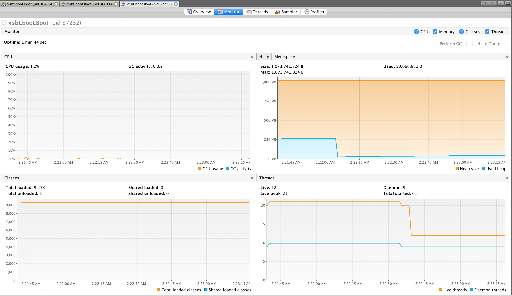
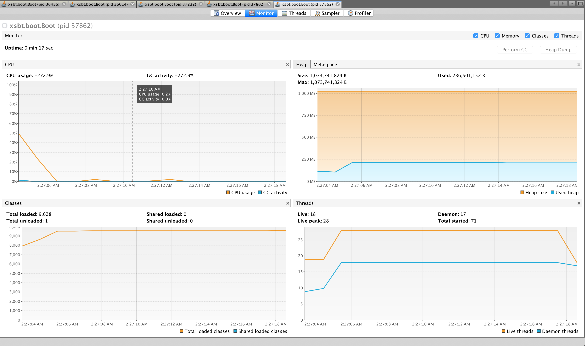

[2. Shared memory and distributed memory multiprocessor systems](https://edux.pjwstk.edu.pl/mat/264/lec/main119.html)


https://docs.scala-lang.org/overviews/core/futures.html#the-global-execution-context

- compile first to avoid CPU usage during compilation

Sequential
----------

- number of process = 10
- each process takes = 1 secs
- total time = 11 secs

```
$ sbt "runMain SequentialTasksExecution"
[info] Running SequentialTasksExecution
[Thread-run-main-0] data data1 is processed.
[Thread-run-main-0] data data2 is processed.
[Thread-run-main-0] data data3 is processed.
[Thread-run-main-0] data data4 is processed.
[Thread-run-main-0] data data5 is processed.
[Thread-run-main-0] data data6 is processed.
[Thread-run-main-0] data data7 is processed.
[Thread-run-main-0] data data8 is processed.
[Thread-run-main-0] data data9 is processed.
[Thread-run-main-0] data data10 is processed.
[success] Total time: 11 s, completed Apr 1, 2018 2:07:22 AM
```

for 100 tasks,

```
$ sbt "runMain SequentialTasksExecution"
[info] Running SequentialTasksExecution
[Thread-run-main-0] data data-1 is processed.
[Thread-run-main-0] data data-2 is processed.
[Thread-run-main-0] data data-3 is processed.
[Thread-run-main-0] data data-4 is processed.
[Thread-run-main-0] data data-5 is processed.
[Thread-run-main-0] data data-6 is processed.
[Thread-run-main-0] data data-7 is processed.
[Thread-run-main-0] data data-8 is processed.
[Thread-run-main-0] data data-9 is processed.
[Thread-run-main-0] data data-10 is processed.
[Thread-run-main-0] data data-11 is processed.
[Thread-run-main-0] data data-12 is processed.
[Thread-run-main-0] data data-13 is processed.
[Thread-run-main-0] data data-14 is processed.
[Thread-run-main-0] data data-15 is processed.
[Thread-run-main-0] data data-16 is processed.
[Thread-run-main-0] data data-17 is processed.
[Thread-run-main-0] data data-18 is processed.
[Thread-run-main-0] data data-19 is processed.
[Thread-run-main-0] data data-20 is processed.
[Thread-run-main-0] data data-21 is processed.
[Thread-run-main-0] data data-22 is processed.
[Thread-run-main-0] data data-23 is processed.
[Thread-run-main-0] data data-24 is processed.
[Thread-run-main-0] data data-25 is processed.
[Thread-run-main-0] data data-26 is processed.
[Thread-run-main-0] data data-27 is processed.
[Thread-run-main-0] data data-28 is processed.
[Thread-run-main-0] data data-29 is processed.
[Thread-run-main-0] data data-30 is processed.
[Thread-run-main-0] data data-31 is processed.
[Thread-run-main-0] data data-32 is processed.
[Thread-run-main-0] data data-33 is processed.
[Thread-run-main-0] data data-34 is processed.
[Thread-run-main-0] data data-35 is processed.
[Thread-run-main-0] data data-36 is processed.
[Thread-run-main-0] data data-37 is processed.
[Thread-run-main-0] data data-38 is processed.
[Thread-run-main-0] data data-39 is processed.
[Thread-run-main-0] data data-40 is processed.
[Thread-run-main-0] data data-41 is processed.
[Thread-run-main-0] data data-42 is processed.
[Thread-run-main-0] data data-43 is processed.
[Thread-run-main-0] data data-44 is processed.
[Thread-run-main-0] data data-45 is processed.
[Thread-run-main-0] data data-46 is processed.
[Thread-run-main-0] data data-47 is processed.
[Thread-run-main-0] data data-48 is processed.
[Thread-run-main-0] data data-49 is processed.
[Thread-run-main-0] data data-50 is processed.
[Thread-run-main-0] data data-51 is processed.
[Thread-run-main-0] data data-52 is processed.
[Thread-run-main-0] data data-53 is processed.
[Thread-run-main-0] data data-54 is processed.
[Thread-run-main-0] data data-55 is processed.
[Thread-run-main-0] data data-56 is processed.
[Thread-run-main-0] data data-57 is processed.
[Thread-run-main-0] data data-58 is processed.
[Thread-run-main-0] data data-59 is processed.
[Thread-run-main-0] data data-60 is processed.
[Thread-run-main-0] data data-61 is processed.
[Thread-run-main-0] data data-62 is processed.
[Thread-run-main-0] data data-63 is processed.
[Thread-run-main-0] data data-64 is processed.
[Thread-run-main-0] data data-65 is processed.
[Thread-run-main-0] data data-66 is processed.
[Thread-run-main-0] data data-67 is processed.
[Thread-run-main-0] data data-68 is processed.
[Thread-run-main-0] data data-69 is processed.
[Thread-run-main-0] data data-70 is processed.
[Thread-run-main-0] data data-71 is processed.
[Thread-run-main-0] data data-72 is processed.
[Thread-run-main-0] data data-73 is processed.
[Thread-run-main-0] data data-74 is processed.
[Thread-run-main-0] data data-75 is processed.
[Thread-run-main-0] data data-76 is processed.
[Thread-run-main-0] data data-77 is processed.
[Thread-run-main-0] data data-78 is processed.
[Thread-run-main-0] data data-79 is processed.
[Thread-run-main-0] data data-80 is processed.
[Thread-run-main-0] data data-81 is processed.
[Thread-run-main-0] data data-82 is processed.
[Thread-run-main-0] data data-83 is processed.
[Thread-run-main-0] data data-84 is processed.
[Thread-run-main-0] data data-85 is processed.
[Thread-run-main-0] data data-86 is processed.
[Thread-run-main-0] data data-87 is processed.
[Thread-run-main-0] data data-88 is processed.
[Thread-run-main-0] data data-89 is processed.
[Thread-run-main-0] data data-90 is processed.
[Thread-run-main-0] data data-91 is processed.
[Thread-run-main-0] data data-92 is processed.
[Thread-run-main-0] data data-93 is processed.
[Thread-run-main-0] data data-94 is processed.
[Thread-run-main-0] data data-95 is processed.
[Thread-run-main-0] data data-96 is processed.
[Thread-run-main-0] data data-97 is processed.
[Thread-run-main-0] data data-98 is processed.
[Thread-run-main-0] data data-99 is processed.
[success] Total time: 100 s, completed Apr 1, 2018 2:23:18 AM
```



Parallel
--------

- number of process = 10
- each process takes = 1 secs
- total time = 3secs

```
$ sbt "runMain ParallelTasksWithGlobalExecutionContext"
[info] Running ParallelTasksWithGlobalExecutionContext
[run-main-0]-Firing data1
[run-main-0]-Firing data2
[run-main-0]-Firing data3
[run-main-0]-Firing data4
[run-main-0]-Firing data5
[run-main-0]-Firing data6
[run-main-0]-Firing data7
[run-main-0]-Firing data8
[run-main-0]-Firing data9
[run-main-0]-Firing data10
[scala-execution-context-global-62]-[Thread-scala-execution-context-global-61] data data1 is processed.
[scala-execution-context-global-62]-[Thread-scala-execution-context-global-62] data data2 is processed.
[scala-execution-context-global-62]-[Thread-scala-execution-context-global-63] data data3 is processed.
[scala-execution-context-global-62]-[Thread-scala-execution-context-global-64] data data4 is processed.
[scala-execution-context-global-62]-[Thread-scala-execution-context-global-66] data data5 is processed.
[scala-execution-context-global-62]-[Thread-scala-execution-context-global-67] data data6 is processed.
[scala-execution-context-global-62]-[Thread-scala-execution-context-global-65] data data7 is processed.
[scala-execution-context-global-62]-[Thread-scala-execution-context-global-68] data data8 is processed.
[scala-execution-context-global-62]-[Thread-scala-execution-context-global-61] data data9 is processed.
[scala-execution-context-global-62]-[Thread-scala-execution-context-global-62] data data10 is processed.
[success] Total time: 3 s, completed Apr 1, 2018 2:09:07 AM
```

for 100 tasks

```
$ sbt "runMain ParallelTasksWithGlobalExecutionContext"
[info] Loading global plugins from /Users/a1353612/.sbt/0.13/plugins
[info] Loading project definition from /Users/a1353612/buybest/sc212/parallel-programming/1-seq-vs-parallel/project
[info] Set current project to seq-vs-parallel (in build file:/Users/a1353612/buybest/sc212/parallel-programming/1-seq-vs-parallel/)
[info] Running ParallelTasksWithGlobalExecutionContext
[run-main-0]-Firing data-1
[run-main-0]-Firing data-2
[run-main-0]-Firing data-3
[run-main-0]-Firing data-4
[run-main-0]-Firing data-5
[run-main-0]-Firing data-6
[run-main-0]-Firing data-7
[run-main-0]-Firing data-8
[run-main-0]-Firing data-9
[run-main-0]-Firing data-10
[run-main-0]-Firing data-11
[run-main-0]-Firing data-12
[run-main-0]-Firing data-13
[run-main-0]-Firing data-14
[run-main-0]-Firing data-15
[run-main-0]-Firing data-16
[run-main-0]-Firing data-17
[run-main-0]-Firing data-18
[run-main-0]-Firing data-19
[run-main-0]-Firing data-20
[run-main-0]-Firing data-21
[run-main-0]-Firing data-22
[run-main-0]-Firing data-23
[run-main-0]-Firing data-24
[run-main-0]-Firing data-25
[run-main-0]-Firing data-26
[run-main-0]-Firing data-27
[run-main-0]-Firing data-28
[run-main-0]-Firing data-29
[run-main-0]-Firing data-30
[run-main-0]-Firing data-31
[run-main-0]-Firing data-32
[run-main-0]-Firing data-33
[run-main-0]-Firing data-34
[run-main-0]-Firing data-35
[run-main-0]-Firing data-36
[run-main-0]-Firing data-37
[run-main-0]-Firing data-38
[run-main-0]-Firing data-39
[run-main-0]-Firing data-40
[run-main-0]-Firing data-41
[run-main-0]-Firing data-42
[run-main-0]-Firing data-43
[run-main-0]-Firing data-44
[run-main-0]-Firing data-45
[run-main-0]-Firing data-46
[run-main-0]-Firing data-47
[run-main-0]-Firing data-48
[run-main-0]-Firing data-49
[run-main-0]-Firing data-50
[run-main-0]-Firing data-51
[run-main-0]-Firing data-52
[run-main-0]-Firing data-53
[run-main-0]-Firing data-54
[run-main-0]-Firing data-55
[run-main-0]-Firing data-56
[run-main-0]-Firing data-57
[run-main-0]-Firing data-58
[run-main-0]-Firing data-59
[run-main-0]-Firing data-60
[run-main-0]-Firing data-61
[run-main-0]-Firing data-62
[run-main-0]-Firing data-63
[run-main-0]-Firing data-64
[run-main-0]-Firing data-65
[run-main-0]-Firing data-66
[run-main-0]-Firing data-67
[run-main-0]-Firing data-68
[run-main-0]-Firing data-69
[run-main-0]-Firing data-70
[run-main-0]-Firing data-71
[run-main-0]-Firing data-72
[run-main-0]-Firing data-73
[run-main-0]-Firing data-74
[run-main-0]-Firing data-75
[run-main-0]-Firing data-76
[run-main-0]-Firing data-77
[run-main-0]-Firing data-78
[run-main-0]-Firing data-79
[run-main-0]-Firing data-80
[run-main-0]-Firing data-81
[run-main-0]-Firing data-82
[run-main-0]-Firing data-83
[run-main-0]-Firing data-84
[run-main-0]-Firing data-85
[run-main-0]-Firing data-86
[run-main-0]-Firing data-87
[run-main-0]-Firing data-88
[run-main-0]-Firing data-89
[run-main-0]-Firing data-90
[run-main-0]-Firing data-91
[run-main-0]-Firing data-92
[run-main-0]-Firing data-93
[run-main-0]-Firing data-94
[run-main-0]-Firing data-95
[run-main-0]-Firing data-96
[run-main-0]-Firing data-97
[run-main-0]-Firing data-98
[run-main-0]-Firing data-99
[scala-execution-context-global-73]-[Thread-scala-execution-context-global-70] data data-1 is processed.
[scala-execution-context-global-73]-[Thread-scala-execution-context-global-71] data data-2 is processed.
[scala-execution-context-global-73]-[Thread-scala-execution-context-global-72] data data-3 is processed.
[scala-execution-context-global-73]-[Thread-scala-execution-context-global-73] data data-4 is processed.
[scala-execution-context-global-73]-[Thread-scala-execution-context-global-74] data data-5 is processed.
[scala-execution-context-global-73]-[Thread-scala-execution-context-global-76] data data-6 is processed.
[scala-execution-context-global-73]-[Thread-scala-execution-context-global-75] data data-7 is processed.
[scala-execution-context-global-73]-[Thread-scala-execution-context-global-77] data data-8 is processed.
[scala-execution-context-global-73]-[Thread-scala-execution-context-global-70] data data-9 is processed.
[scala-execution-context-global-73]-[Thread-scala-execution-context-global-73] data data-10 is processed.
[scala-execution-context-global-73]-[Thread-scala-execution-context-global-77] data data-11 is processed.
[scala-execution-context-global-73]-[Thread-scala-execution-context-global-75] data data-12 is processed.
[scala-execution-context-global-73]-[Thread-scala-execution-context-global-72] data data-13 is processed.
[scala-execution-context-global-73]-[Thread-scala-execution-context-global-76] data data-14 is processed.
[scala-execution-context-global-73]-[Thread-scala-execution-context-global-74] data data-15 is processed.
[scala-execution-context-global-73]-[Thread-scala-execution-context-global-71] data data-16 is processed.
[scala-execution-context-global-73]-[Thread-scala-execution-context-global-70] data data-17 is processed.
[scala-execution-context-global-73]-[Thread-scala-execution-context-global-72] data data-18 is processed.
[scala-execution-context-global-73]-[Thread-scala-execution-context-global-77] data data-19 is processed.
[scala-execution-context-global-73]-[Thread-scala-execution-context-global-73] data data-20 is processed.
[scala-execution-context-global-73]-[Thread-scala-execution-context-global-76] data data-21 is processed.
[scala-execution-context-global-73]-[Thread-scala-execution-context-global-74] data data-22 is processed.
[scala-execution-context-global-73]-[Thread-scala-execution-context-global-71] data data-23 is processed.
[scala-execution-context-global-73]-[Thread-scala-execution-context-global-75] data data-24 is processed.
[scala-execution-context-global-73]-[Thread-scala-execution-context-global-70] data data-25 is processed.
[scala-execution-context-global-73]-[Thread-scala-execution-context-global-77] data data-26 is processed.
[scala-execution-context-global-73]-[Thread-scala-execution-context-global-72] data data-27 is processed.
[scala-execution-context-global-73]-[Thread-scala-execution-context-global-76] data data-28 is processed.
[scala-execution-context-global-73]-[Thread-scala-execution-context-global-74] data data-29 is processed.
[scala-execution-context-global-73]-[Thread-scala-execution-context-global-71] data data-30 is processed.
[scala-execution-context-global-73]-[Thread-scala-execution-context-global-73] data data-31 is processed.
[scala-execution-context-global-73]-[Thread-scala-execution-context-global-75] data data-32 is processed.
[scala-execution-context-global-73]-[Thread-scala-execution-context-global-74] data data-33 is processed.
[scala-execution-context-global-73]-[Thread-scala-execution-context-global-70] data data-34 is processed.
[scala-execution-context-global-73]-[Thread-scala-execution-context-global-76] data data-35 is processed.
[scala-execution-context-global-73]-[Thread-scala-execution-context-global-71] data data-36 is processed.
[scala-execution-context-global-73]-[Thread-scala-execution-context-global-73] data data-37 is processed.
[scala-execution-context-global-73]-[Thread-scala-execution-context-global-77] data data-38 is processed.
[scala-execution-context-global-73]-[Thread-scala-execution-context-global-72] data data-39 is processed.
[scala-execution-context-global-73]-[Thread-scala-execution-context-global-75] data data-40 is processed.
[scala-execution-context-global-73]-[Thread-scala-execution-context-global-71] data data-41 is processed.
[scala-execution-context-global-73]-[Thread-scala-execution-context-global-73] data data-42 is processed.
[scala-execution-context-global-73]-[Thread-scala-execution-context-global-70] data data-43 is processed.
[scala-execution-context-global-73]-[Thread-scala-execution-context-global-76] data data-44 is processed.
[scala-execution-context-global-73]-[Thread-scala-execution-context-global-74] data data-45 is processed.
[scala-execution-context-global-73]-[Thread-scala-execution-context-global-77] data data-46 is processed.
[scala-execution-context-global-73]-[Thread-scala-execution-context-global-72] data data-47 is processed.
[scala-execution-context-global-73]-[Thread-scala-execution-context-global-75] data data-48 is processed.
[scala-execution-context-global-73]-[Thread-scala-execution-context-global-73] data data-49 is processed.
[scala-execution-context-global-73]-[Thread-scala-execution-context-global-71] data data-50 is processed.
[scala-execution-context-global-73]-[Thread-scala-execution-context-global-74] data data-51 is processed.
[scala-execution-context-global-73]-[Thread-scala-execution-context-global-76] data data-52 is processed.
[scala-execution-context-global-73]-[Thread-scala-execution-context-global-77] data data-53 is processed.
[scala-execution-context-global-73]-[Thread-scala-execution-context-global-70] data data-54 is processed.
[scala-execution-context-global-73]-[Thread-scala-execution-context-global-75] data data-55 is processed.
[scala-execution-context-global-73]-[Thread-scala-execution-context-global-72] data data-56 is processed.
[scala-execution-context-global-73]-[Thread-scala-execution-context-global-76] data data-57 is processed.
[scala-execution-context-global-73]-[Thread-scala-execution-context-global-74] data data-58 is processed.
[scala-execution-context-global-73]-[Thread-scala-execution-context-global-71] data data-59 is processed.
[scala-execution-context-global-73]-[Thread-scala-execution-context-global-77] data data-60 is processed.
[scala-execution-context-global-73]-[Thread-scala-execution-context-global-73] data data-61 is processed.
[scala-execution-context-global-73]-[Thread-scala-execution-context-global-70] data data-62 is processed.
[scala-execution-context-global-73]-[Thread-scala-execution-context-global-75] data data-63 is processed.
[scala-execution-context-global-73]-[Thread-scala-execution-context-global-72] data data-64 is processed.
[scala-execution-context-global-73]-[Thread-scala-execution-context-global-70] data data-65 is processed.
[scala-execution-context-global-73]-[Thread-scala-execution-context-global-76] data data-66 is processed.
[scala-execution-context-global-73]-[Thread-scala-execution-context-global-77] data data-67 is processed.
[scala-execution-context-global-73]-[Thread-scala-execution-context-global-71] data data-68 is processed.
[scala-execution-context-global-73]-[Thread-scala-execution-context-global-74] data data-69 is processed.
[scala-execution-context-global-73]-[Thread-scala-execution-context-global-73] data data-70 is processed.
[scala-execution-context-global-73]-[Thread-scala-execution-context-global-72] data data-71 is processed.
[scala-execution-context-global-73]-[Thread-scala-execution-context-global-75] data data-72 is processed.
[scala-execution-context-global-73]-[Thread-scala-execution-context-global-77] data data-73 is processed.
[scala-execution-context-global-73]-[Thread-scala-execution-context-global-70] data data-74 is processed.
[scala-execution-context-global-73]-[Thread-scala-execution-context-global-74] data data-75 is processed.
[scala-execution-context-global-73]-[Thread-scala-execution-context-global-76] data data-76 is processed.
[scala-execution-context-global-73]-[Thread-scala-execution-context-global-73] data data-77 is processed.
[scala-execution-context-global-73]-[Thread-scala-execution-context-global-71] data data-78 is processed.
[scala-execution-context-global-73]-[Thread-scala-execution-context-global-72] data data-79 is processed.
[scala-execution-context-global-73]-[Thread-scala-execution-context-global-75] data data-80 is processed.
[scala-execution-context-global-73]-[Thread-scala-execution-context-global-70] data data-81 is processed.
[scala-execution-context-global-73]-[Thread-scala-execution-context-global-74] data data-82 is processed.
[scala-execution-context-global-73]-[Thread-scala-execution-context-global-73] data data-83 is processed.
[scala-execution-context-global-73]-[Thread-scala-execution-context-global-76] data data-84 is processed.
[scala-execution-context-global-73]-[Thread-scala-execution-context-global-71] data data-85 is processed.
[scala-execution-context-global-73]-[Thread-scala-execution-context-global-72] data data-86 is processed.
[scala-execution-context-global-73]-[Thread-scala-execution-context-global-75] data data-87 is processed.
[scala-execution-context-global-73]-[Thread-scala-execution-context-global-77] data data-88 is processed.
[scala-execution-context-global-73]-[Thread-scala-execution-context-global-71] data data-89 is processed.
[scala-execution-context-global-73]-[Thread-scala-execution-context-global-75] data data-90 is processed.
[scala-execution-context-global-73]-[Thread-scala-execution-context-global-70] data data-91 is processed.
[scala-execution-context-global-73]-[Thread-scala-execution-context-global-73] data data-92 is processed.
[scala-execution-context-global-73]-[Thread-scala-execution-context-global-72] data data-93 is processed.
[scala-execution-context-global-73]-[Thread-scala-execution-context-global-76] data data-94 is processed.
[scala-execution-context-global-73]-[Thread-scala-execution-context-global-74] data data-95 is processed.
[scala-execution-context-global-73]-[Thread-scala-execution-context-global-77] data data-96 is processed.
[scala-execution-context-global-73]-[Thread-scala-execution-context-global-73] data data-97 is processed.
[scala-execution-context-global-73]-[Thread-scala-execution-context-global-71] data data-98 is processed.
[scala-execution-context-global-73]-[Thread-scala-execution-context-global-75] data data-99 is processed.
[success] Total time: 14 s, completed Apr 1, 2018 2:27:18 AM
```

