# Concurrency & Parallelism

> Depth of knowledge expected at Staff+ roles.  
> Covers OS internals, JVM threading model, Java Memory Model, virtual threads, and production patterns.

---

## Table of Contents

1. [Process vs Thread](#1-process-vs-thread)
2. [Thread Internals — How the OS Sees a Thread](#2-thread-internals--how-the-os-sees-a-thread)
3. [JVM Threading Model](#3-jvm-threading-model)
4. [Thread Lifecycle & State Machine](#4-thread-lifecycle--state-machine)
5. [Thread Scheduling](#5-thread-scheduling)
6. [Java Memory Model (JMM)](#6-java-memory-model-jmm)
7. [Synchronization Primitives & Hazards](#7-synchronization-primitives--hazards)
8. [CPU-Bound vs I/O-Bound Work](#8-cpu-bound-vs-io-bound-work)
9. [Concurrency Models — Thread-per-Request vs Event Loop vs Virtual Threads](#9-concurrency-models--thread-per-request-vs-event-loop-vs-virtual-threads)
10. [Platform Threads — Deep Dive](#10-platform-threads--deep-dive)
11. [Virtual Threads (Java 21) — Deep Dive](#11-virtual-threads-java-21--deep-dive)
12. [Sequential vs Parallel Execution](#12-sequential-vs-parallel-execution)
13. [Hardware — Hyper-Threading & Clock Rate](#13-hardware--hyper-threading--clock-rate)
14. [Production Patterns & Anti-Patterns](#14-production-patterns--anti-patterns)

---

## 1. Process vs Thread

### Process

A **process** is a program in execution — an isolated execution environment with its own:
- Virtual address space (code, stack, heap, data segments)
- File descriptors, sockets, signal handlers
- OS-level resources: CPU time, memory pages, I/O handles

A program can run as multiple concurrent processes (e.g. multiple JVM instances), but each process owns its resources exclusively. Context switching between processes is expensive because the OS must swap the entire address space (TLB flush, page-table reload).

```bash
$ ps
  PID TTY       TIME    CMD
 1674 ttys000   0:01.70 -bash
11378 ttys000   1:55.53 docker run -p 27017:27017 -it mongodb
34745 ttys001   8:41.88 java -agentlib:jdwp=... MyApp
50600 ttys001   3:32.81 /usr/bin/jshell
```

### Thread

A **thread** is the smallest schedulable unit inside a process.

- Threads within a process **share** heap, code segment, open file descriptors, and static data.
- Each thread has its own **private** program counter, register set, and stack.
- Inter-thread communication is cheap (shared memory) but requires careful synchronization.
- In Java, all threads are native Linux threads — **pthreads** (POSIX threads) under the hood.

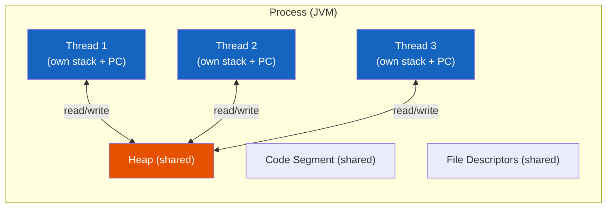
```mermaid
graph TD
    subgraph Process["Process (JVM)"]
        direction TB
        H["Heap (shared)"]
        CS["Code Segment (shared)"]
        FD["File Descriptors (shared)"]
        T1["Thread 1\n(own stack + PC)"]
        T2["Thread 2\n(own stack + PC)"]
        T3["Thread 3\n(own stack + PC)"]
    end

    T1 <-->|read/write| H
    T2 <-->|read/write| H
    T3 <-->|read/write| H

    style H fill:#E65100,color:#fff
    style T1 fill:#1565C0,color:#fff
    style T2 fill:#1565C0,color:#fff
    style T3 fill:#1565C0,color:#fff
```

### Process vs Thread — Side-by-Side

| Dimension         | Process                                       | Thread                                               |
|-------------------|-----------------------------------------------|------------------------------------------------------|
| Address space     | Isolated (own virtual memory)                 | Shared within the process                            |
| Creation cost     | High (~ms, OS syscall + copy-on-write fork)   | Lower (~µs for platform thread, ~ns for virtual)     |
| Context switch    | Expensive (TLB flush, page-table swap)        | Cheaper (same address space, register swap only)     |
| Communication     | IPC (pipes, sockets, shared memory with mmap) | Shared heap — direct but needs synchronization       |
| Failure isolation | Process crash doesn't affect others           | Thread crash can kill the entire process             |
| Scalability       | Limited by OS process limits                  | Limited by stack memory (platform) or heap (virtual) |

**References**
- [What is a multithreaded application? — stackoverflow](https://stackoverflow.com/a/1313122/432903)
- [Why do threads share the heap space? — stackoverflow](http://stackoverflow.com/a/3321554/432903)
- [Multithreading and Thread Synchronization — nakov.com](http://www.nakov.com/inetjava/lectures/part-1-sockets/InetJava-1.3-Multithreading.html)
- [Threads and threading — Microsoft docs](https://docs.microsoft.com/en-us/dotnet/standard/threading/threads-and-threading)

---

## 2. Thread Internals — How the OS Sees a Thread

### POSIX Threads (pthreads)

On Linux/macOS, Java platform threads map 1-to-1 to kernel threads via **pthreads**. The kernel scheduler sees each Java thread as a native task.


```mermaid
graph LR
    JT["java.lang.Thread\n(Java object on heap)"]
    OS["pthread_t\n(kernel task_struct)"]
    CPU["CPU Core\n(executes instructions)"]

    JT -->|"JVM calls\npthread_create()"| OS
    OS -->|"scheduled by\nLinux CFS"| CPU

    style JT fill:#2E7D32,color:#fff
    style OS fill:#6A1B9A,color:#fff
    style CPU fill:#B71C1C,color:#fff
```

### What Lives Where in Memory

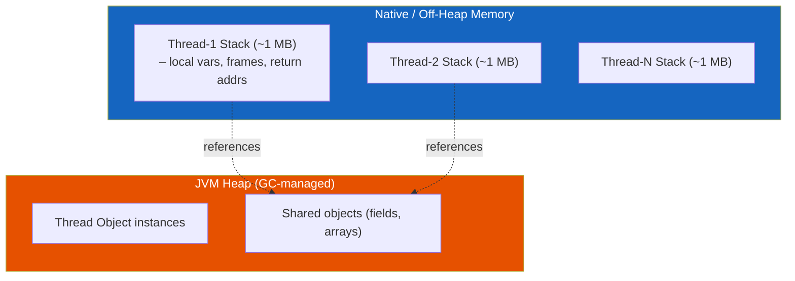
```mermaid
graph TD
    subgraph NativeMemory["Native / Off-Heap Memory"]
        NS1["Thread-1 Stack (~1 MB)\n– local vars, frames, return addrs"]
        NS2["Thread-2 Stack (~1 MB)"]
        NS3["Thread-N Stack (~1 MB)"]
    end
    subgraph JVMHeap["JVM Heap (GC-managed)"]
        TO["Thread Object instances"]
        SH["Shared objects (fields, arrays)"]
    end

    NS1 -.->|references| SH
    NS2 -.->|references| SH

    style NativeMemory fill:#1565C0,color:#fff
    style JVMHeap fill:#E65100,color:#fff
```

> **Key insight for Staff+:** The `Thread` *object* lives on the heap; the thread's *stack* lives in native memory. `new Thread()` is cheap (heap alloc), but `thread.start()` is expensive (OS syscall + stack allocation).

### Thread Stack Limits

```bash
$ ulimit -s
8192          # 8 MB default per thread on macOS

$ ulimit -a | grep "max user processes"
max user processes  (-u) 2666
```

**For JVM (64-bit HotSpot):**
```
Default stack per thread = 1 MB
1 GB RAM → ~1,024 simultaneous threads (before OOM)

Tune with: java -Xss256k   # reduce per-thread stack
```

**References**
- [POSIX Threads — Wikipedia](https://en.wikipedia.org/wiki/POSIX_Threads)
- [How many threads can OS vs JVM support? — stackoverflow](https://stackoverflow.com/a/764096/432903)
- [Where is Thread Object created? Stack or JVM Heap? — stackoverflow](http://stackoverflow.com/a/19433994/432903)
- [What is the limit of number of threads in Java? — DZone](https://dzone.com/articles/java-what-limit-number-threads)
- [Each thread gets 8192K stack — stackoverflow](https://stackoverflow.com/a/9211891/432903)

---

## 3. JVM Threading Model

### Thread Object Memory Layout

```java
// Thread object → always allocated on the JVM heap
var processor = new Thread(() -> { /* task */ });
// processor ==> Thread[Thread-1, 5, main]

// thread.start() → OS syscall, creates native pthread, allocates kernel stack
processor.start();
```

### Why Threads Share the Heap

> "Because otherwise they would be processes. That is the whole idea of threads — to share memory."

This shared heap is the root cause of virtually every concurrency bug: **data races, visibility failures, ordering violations**.

### Thread-Local Storage

Each thread has private storage via `ThreadLocal<T>`:
- Stored in a `ThreadLocalMap` held by the `Thread` object itself
- Not inherited by child threads (use `InheritableThreadLocal` if needed)
- **Danger with virtual threads:** `ThreadLocal` caches multiplied across millions of virtual threads cause significant GC pressure. Prefer `ScopedValue` (JDK 21 preview / JDK 23 final).

### UncaughtExceptionHandler — Never Lose a Thread Failure

```java
var shipOrders = new Thread(() -> {
    System.out.println("Shipping ...");
    simulateWork();
    throw new RuntimeException("Items missing in package.");
});

shipOrders.setUncaughtExceptionHandler((thread, ex) ->
    log.error("Thread {} failed: {}", thread.getName(), ex.getMessage(), ex)
);

shipOrders.start();
```

> **Production rule:** Always set a `UncaughtExceptionHandler` on threads you create manually, and on `ThreadFactory` used in `ExecutorService`.

**References**
- [How to catch an Exception from a thread — stackoverflow](http://stackoverflow.com/questions/6546193/how-to-catch-an-exception-from-a-thread)
- [Thread.UncaughtExceptionHandler — Oracle docs](http://docs.oracle.com/javase/1.5.0/docs/api/java/lang/Thread.UncaughtExceptionHandler.html)
- [Shutting down threads cleanly — javaspecialists.eu](http://www.javaspecialists.eu/archive/Issue056.html)
- [Why are Thread.stop, Thread.suspend deprecated? — Oracle](http://docs.oracle.com/javase/1.5.0/docs/guide/misc/threadPrimitiveDeprecation.html)

---

## 4. Thread Lifecycle & State Machine

### States

| State | Description | Triggered by |
|---|---|---|
| `NEW` | Created, not yet started | `new Thread()` |
| `RUNNABLE` | Executing on CPU **or** ready to run (OS scheduler decides) | `thread.start()` |
| `BLOCKED` | Waiting to acquire a monitor lock (`synchronized`) | Contended `synchronized` block |
| `WAITING` | Indefinitely waiting for notification | `Object.wait()`, `Thread.join()`, `LockSupport.park()` |
| `TIMED_WAITING` | Waiting with a timeout | `Thread.sleep(n)`, `Object.wait(n)`, `LockSupport.parkNanos()` |
| `TERMINATED` | Finished execution | `run()` returned or threw |

### State Machine

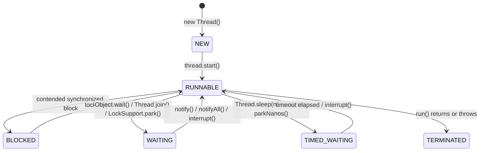
```mermaid
stateDiagram-v2
    [*] --> NEW : new Thread()
    NEW --> RUNNABLE : thread.start()
    RUNNABLE --> BLOCKED : contended synchronized block
    BLOCKED --> RUNNABLE : lock acquired
    RUNNABLE --> WAITING : Object.wait() / Thread.join() / LockSupport.park()
    WAITING --> RUNNABLE : notify() / notifyAll() / interrupt()
    RUNNABLE --> TIMED_WAITING : Thread.sleep(n) / wait(n) / parkNanos()
    TIMED_WAITING --> RUNNABLE : timeout elapsed / interrupt()
    RUNNABLE --> TERMINATED : run() returns or throws
```

### `sleep` vs `wait` — Critical Distinction

| | `Thread.sleep(n)` | `Object.wait()` |
|---|---|---|
| **Releases monitor lock?** | ❌ No — holds any locks it has | ✅ Yes — atomically releases the lock |
| **Use case** | Time-based delay | Condition-variable signalling between threads |
| **Woken by** | Timeout or `interrupt()` | `notify()` / `notifyAll()` / `interrupt()` |
| **Pattern** | Time synchronization | Multi-thread coordination (producer-consumer) |

### `LockSupport.park` / `unpark`

Low-level primitive underlying `ReentrantLock`, `Semaphore`, `CountDownLatch`:

| Action | Description |
|---|---|
| `park()` | Suspends thread until a permit is available; returns immediately if permit already held |
| `unpark(thread)` | Grants a permit to the target thread, waking it if parked |

> `park/unpark` is the mechanism behind virtual thread unmounting — when a VT blocks on I/O, the JVM calls `park()` on the virtual thread's continuation, freeing the carrier.

### `Runnable.run()` vs `Thread.start()`

```
Runnable.run()  → executes inline on the CALLING thread — no new thread created
Thread.start()  → JVM calls pthread_create(), new OS thread created, run() executes there
```

**References**
- [Thread.State — Oracle docs (JDK 7)](https://docs.oracle.com/javase/7/docs/api/java/lang/Thread.State.html)
- [sleep vs wait — stackoverflow](http://stackoverflow.com/q/1036754/432903)
- [Runnable.run vs Thread.start — stackoverflow](http://stackoverflow.com/a/8579702/432903)
- [LockSupport — Oracle docs](https://docs.oracle.com/en/java/javase/11/docs/api/java.base/java/util/concurrent/locks/LockSupport.html)
- [What is BLOCKED vs WAITING? — stackoverflow](https://stackoverflow.com/a/51788005/432903)
- [Monitor lock and synchronized — stackoverflow](https://stackoverflow.com/a/15680550/432903)

---

## 5. Thread Scheduling

### Pre-emptive vs Co-operative

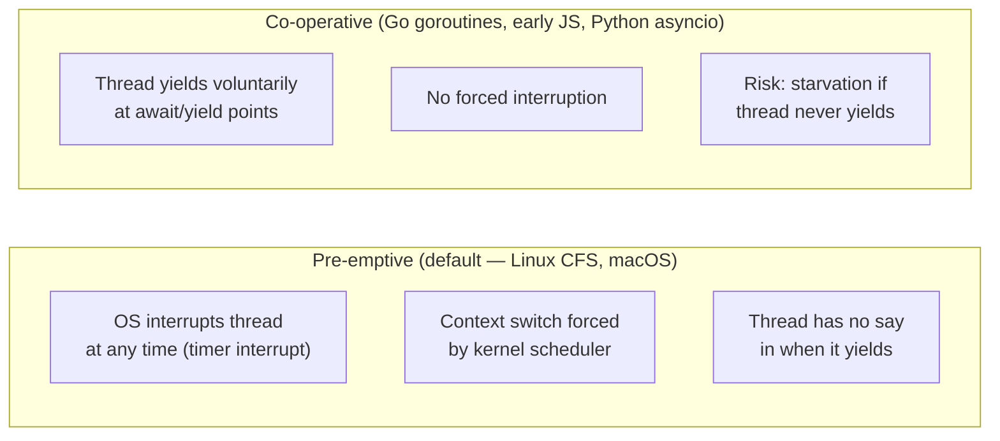
```mermaid
graph LR
    subgraph Preemptive["Pre-emptive (default — Linux CFS, macOS)"]
        P1["OS interrupts thread\nat any time (timer interrupt)"]
        P2["Context switch forced\nby kernel scheduler"]
        P3["Thread has no say\nin when it yields"]
    end
    subgraph Cooperative["Co-operative (Go goroutines, early JS, Python asyncio)"]
        C1["Thread yields voluntarily\nat await/yield points"]
        C2["No forced interruption"]
        C3["Risk: starvation if\nthread never yields"]
    end
```

> **Staff+ insight:** Java uses pre-emptive scheduling (Linux CFS — Completely Fair Scheduler). Virtual threads use *cooperative* scheduling within the JVM — they yield at blocking points. This is why you must never do CPU-spin loops in virtual threads without yielding.

### Linux CFS (Completely Fair Scheduler)

- Tracks `vruntime` (virtual runtime) per task
- Always picks the task with the lowest `vruntime`
- Fair over time but not real-time
- Java thread priority maps to `nice` values (-20 to +19)

### Loop Scheduling Strategies (OpenMP / parallel runtimes)

| Strategy    | Allocation                                    | Overhead | Load Balance | Use When |
|-------------|-----------------------------------------------|---|---|---|
| **Static**  | Iterations pre-allocated before execution     | Low | Can be unbalanced | Uniform work per iteration |
| **Dynamic** | Iterations assigned as threads complete       | Higher | Better balance | Variable work per iteration |
| **Guided**  | Large chunks initially, shrinking dynamically | Medium | Good | Mixed workloads |

**References**
- [Thread scheduling — Wikipedia](https://en.wikipedia.org/wiki/Thread_(computing)#Scheduling)
- [Pre-emptive vs co-operative multithreading — stackoverflow](https://stackoverflow.com/a/4147474/432903)
- [Thread Execution Model — 3dgep.com](https://www.3dgep.com/cuda-thread-execution-model/)
- [Static vs Dynamic scheduling — University of Washington](https://courses.cs.washington.edu/courses/cse471/02au/lectures/dyn1.pdf)
- [OpenMP Scheduling Loops — UMW](http://cs.umw.edu/~finlayson/class/fall14/cpsc425/notes/12-scheduling.html)
- [Static vs dynamic schedule in OpenMP — stackoverflow](http://stackoverflow.com/a/5864834/432903)

---

## 6. Java Memory Model (JMM)

The JMM defines when writes by one thread are **visible** to reads by another. Without synchronization, the JVM/CPU is permitted to reorder reads and writes for performance.

### Happens-Before Relationships

A write **happens-before** a read if one of these holds:

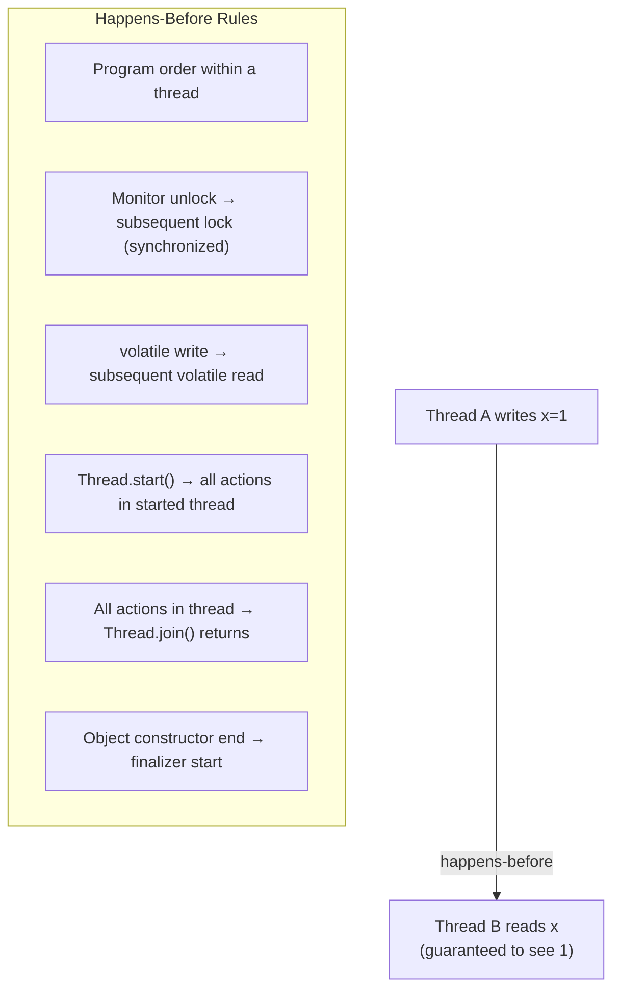
```mermaid
graph TD
    A["Thread A writes x=1"] -->|"happens-before"| B["Thread B reads x\n(guaranteed to see 1)"]

    subgraph Guarantees["Happens-Before Rules"]
        R1["Program order within a thread"]
        R2["Monitor unlock → subsequent lock (synchronized)"]
        R3["volatile write → subsequent volatile read"]
        R4["Thread.start() → all actions in started thread"]
        R5["All actions in thread → Thread.join() returns"]
        R6["Object constructor end → finalizer start"]
    end
```

### Reordering Hazards

```java
// Thread A
result = compute();    // (1)
ready = true;          // (2) — CPU may reorder (2) before (1)!

// Thread B
if (ready) {
    use(result);       // may see ready=true but result=0 !!
}
```

**Fix with `volatile`:**
```java
volatile boolean ready = false;
// volatile write establishes happens-before with subsequent volatile read
```

### `volatile` vs `synchronized` vs `Atomic*`

| Primitive | Guarantees | Use Case |
|---|---|---|
| `volatile` | Visibility + ordering (no atomicity for compound ops) | Single-writer flags, status fields |
| `synchronized` | Mutual exclusion + visibility + ordering | Critical sections, condition signalling |
| `AtomicInteger` etc. | Lock-free atomicity via CAS (Compare-And-Swap) | Counters, accumulators without full lock |
| `VarHandle` (JDK 9+) | Fine-grained memory fence control | Library internals, off-heap access |

**References**
- [Java Memory Model — JSR-133](https://www.cs.umd.edu/~pugh/java/memoryModel/)
- [Java Memory Model — Oracle docs](https://docs.oracle.com/javase/specs/jls/se21/html/jls-17.html#jls-17.4)
- [java.util.concurrent — Oracle docs](https://docs.oracle.com/en/java/javase/21/docs/api/java.base/java/util/concurrent/package-summary.html)
- [In Java threading is supported at the language level — stackoverflow](http://stackoverflow.com/a/3306752/432903)

---

## 7. Synchronization Primitives & Hazards

### Deadlock

Occurs when thread A holds lock L1 and waits for L2, while thread B holds L2 and waits for L1.

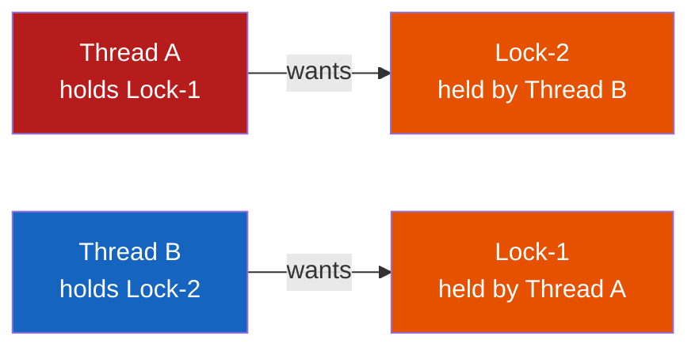
```mermaid
graph LR
    A["Thread A\nholds Lock-1"] -->|"wants"| L2["Lock-2\nheld by Thread B"]
    B["Thread B\nholds Lock-2"] -->|"wants"| L1["Lock-1\nheld by Thread A"]

    style A fill:#B71C1C,color:#fff
    style B fill:#1565C0,color:#fff
    style L1 fill:#E65100,color:#fff
    style L2 fill:#E65100,color:#fff
```

**Prevention strategies:**
1. **Lock ordering** — always acquire locks in a globally consistent order
2. **Timeout** — `tryLock(timeout)` from `ReentrantLock`
3. **Lock-free structures** — `ConcurrentHashMap`, `AtomicReference`
4. **Single-lock design** — reduce lock granularity

### Livelock

Threads are not blocked but keep reacting to each other, making no progress (e.g., two threads repeatedly backing off and retrying).

### Starvation

A thread never gets CPU time because higher-priority or luckier threads always win the scheduler. Mitigated by fair locks: `new ReentrantLock(true)` (uses a FIFO queue).

### Priority Inversion

High-priority thread H waits for lock held by low-priority thread L. Medium-priority thread M prevents L from running. Result: H is effectively demoted below M.

> **Real-world example:** Mars Pathfinder (1997) — priority inversion in VxWorks caused system resets. Fixed with priority inheritance.

### `synchronized` vs `ReentrantLock`

| | `synchronized` | `ReentrantLock` |
|---|---|---|
| Interruptible wait | ❌ | ✅ `lockInterruptibly()` |
| Timed try-lock | ❌ | ✅ `tryLock(n, unit)` |
| Fair ordering | ❌ | ✅ `new ReentrantLock(true)` |
| Multiple conditions | ❌ (one per object) | ✅ `lock.newCondition()` |
| Virtual thread pinning | ✅ Pins carrier | ❌ Does NOT pin carrier |
| Readability | Higher (implicit) | More explicit |

> **Staff+ rule:** Prefer `ReentrantLock` in any code that runs on virtual threads or needs non-trivial locking semantics. 
> Use `synchronized` only for simple, short critical sections.

**References**
- [Deadlock — Wikipedia](https://en.wikipedia.org/wiki/Deadlock)
- [Deadlock example — stackoverflow](http://stackoverflow.com/a/34520/432903)
- [Thread Deadlock — Oracle docs](https://docs.oracle.com/javase/tutorial/essential/concurrency/deadlock.html)
- [Priority inversion — Wikipedia](https://en.wikipedia.org/wiki/Priority_inversion)

---

## 8. CPU-Bound vs I/O-Bound Work

### CPU-Bound

> "A program is CPU-bound if it would go faster if the CPU were faster."

- Spends majority of time on computation: encryption, image processing, ML inference, matrix multiply, π digits
- CPU bursts are long and few
- **Thread pool sizing:** `N_cpu` threads = `Runtime.getRuntime().availableProcessors()`
- More threads than cores → context-switch overhead, no gain
- Virtual threads give **zero benefit** here


```mermaid
graph LR
    T["CPU-Bound Task"] -->|"100% CPU"| C["CPU Core\n(always busy)"]
    C -->|"no blocking"| T
    style T fill:#B71C1C,color:#fff
    style C fill:#1565C0,color:#fff
```

### I/O-Bound

> "A program is I/O-bound if it would go faster if the I/O subsystem were faster."

- Spends majority of time waiting: DB queries, HTTP calls, disk reads, message queue polls
- CPU bursts are short and many
- **Thread pool sizing (platform):** `N_cpu × (1 + wait_time / compute_time)` — Little's Law
- Virtual threads are purpose-built for this: unmount on every blocking point, carriers stay busy

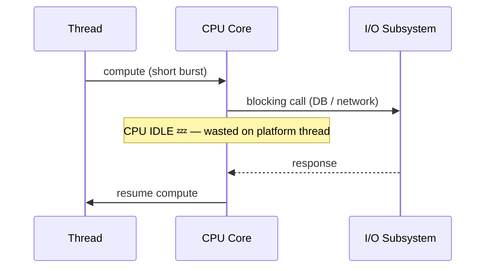
```mermaid
sequenceDiagram
    participant T as Thread
    participant CPU as CPU Core
    participant IO as I/O Subsystem

    T->>CPU: compute (short burst)
    CPU->>IO: blocking call (DB / network)
    Note over CPU: CPU IDLE 💤 — wasted on platform thread
    IO-->>CPU: response
    CPU->>T: resume compute
```

### How to Diagnose

```bash
# CPU-bound: one or more cores pegged at 100%
top -pid <PID>

# I/O-bound: CPU mostly idle, high iowait
iostat -x 1

# JVM thread CPU usage
jcmd <PID> Thread.print
```

**References**
- [CPU intensive vs IO intensive? — stackoverflow](https://stackoverflow.com/a/868577/432903)
- [How to check if an API is CPU-bound? — stackoverflow](https://stackoverflow.com/q/3156334/432903)
- [CPU Scheduling — jbell CourseNotes](https://www2.cs.uic.edu/~jbell/CourseNotes/OperatingSystems/6_CPU_Scheduling.html)

---

## 9. Concurrency Models — Thread-per-Request vs Event Loop vs Virtual Threads

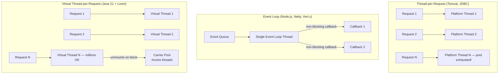
```mermaid
graph TD
    subgraph TPR["Thread-per-Request (Tomcat, JDBC)"]
        R1[Request 1] --> PT1[Platform Thread 1]
        R2[Request 2] --> PT2[Platform Thread 2]
        RN[Request N] --> PTN[Platform Thread N — pool exhausted!]
    end

    subgraph EL["Event Loop (Node.js, Netty, Vert.x)"]
        EQ[Event Queue] --> Loop[Single Event Loop Thread]
        Loop -->|non-blocking callback| CB1[Callback 1]
        Loop -->|non-blocking callback| CB2[Callback 2]
    end

    subgraph VT["Virtual Thread-per-Request (Java 21 + Loom)"]
        VR1[Request 1] --> VTH1[Virtual Thread 1]
        VR2[Request 2] --> VTH2[Virtual Thread 2]
        VRN[Request N] --> VTHN[Virtual Thread N — millions OK]
        VTHN -->|unmounts on block| CT[Carrier Pool\n#cores threads]
    end
```

| Model | Throughput (I/O) | Latency | Code Style | Complexity |
|---|---|---|---|---|
| Thread-per-Request (platform) | Limited by pool size | Low per-request | Imperative, simple | Low |
| Event Loop (reactive) | Very high | Low | Callback / reactive chains | High (callback hell) |
| Virtual Thread-per-Request | Very high | Low | Imperative, simple | Low |

> **Staff+ verdict:** Java 21 virtual threads achieve event-loop-level throughput with thread-per-request simplicity. Reactive frameworks (Reactor, RxJava) solve the same problem with higher complexity — evaluate migration if your codebase is already reactive.

**References**
- [Why is Node.js single threaded? — stackoverflow](http://stackoverflow.com/a/17959746/432903)
- [The JavaScript Event Loop: Explained — carbonfive.com](http://blog.carbonfive.com/2013/10/27/the-javascript-event-loop-explained/)
- [Event loop — MDN Web Docs](https://developer.mozilla.org/en-US/docs/Web/JavaScript/EventLoop)
- [Event loop — Wikipedia](https://en.wikipedia.org/wiki/Event_loop)
- [Event-based Actor model — stackoverflow](https://stackoverflow.com/a/7458958/432903)

---

## 10. Platform Threads — Deep Dive

### 1-to-1 Kernel Thread Mapping

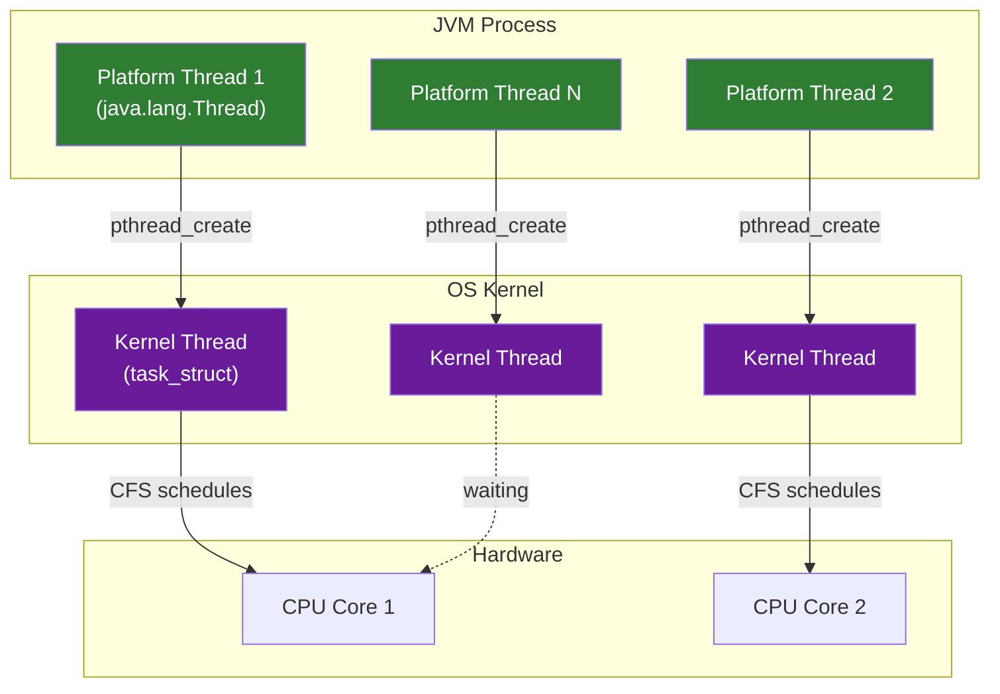
```mermaid
graph TD
    subgraph JVM["JVM Process"]
        JT1["Platform Thread 1\n(java.lang.Thread)"]
        JT2["Platform Thread 2"]
        JTN["Platform Thread N"]
    end
    subgraph Kernel["OS Kernel"]
        KT1["Kernel Thread\n(task_struct)"]
        KT2["Kernel Thread"]
        KTN["Kernel Thread"]
    end
    subgraph HW["Hardware"]
        C1["CPU Core 1"]
        C2["CPU Core 2"]
    end

    JT1 -->|pthread_create| KT1
    JT2 -->|pthread_create| KT2
    JTN -->|pthread_create| KTN
    KT1 -->|CFS schedules| C1
    KT2 -->|CFS schedules| C2
    KTN -.->|waiting| C1

    style JT1 fill:#2E7D32,color:#fff
    style JT2 fill:#2E7D32,color:#fff
    style JTN fill:#2E7D32,color:#fff
    style KT1 fill:#6A1B9A,color:#fff
    style KT2 fill:#6A1B9A,color:#fff
    style KTN fill:#6A1B9A,color:#fff
```

### Cost Profile

| Property | Value |
|---|---|
| Stack size | ~1 MB (native, off-heap) |
| Creation time | ~1 ms (OS syscall) |
| Context switch | ~1–10 µs (full register save/restore, possible TLB impact) |
| Practical max | ~10,000 (memory + scheduler pressure) |
| Blocking behaviour | OS thread parked — slot consumed, carrier wasted |

### Blocking Under a Platform Thread

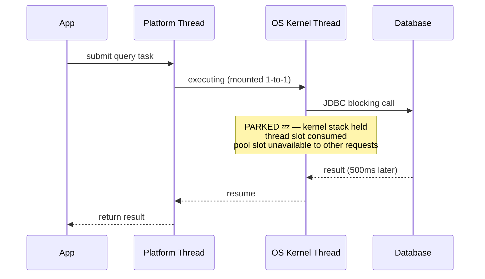
```mermaid
sequenceDiagram
    participant App
    participant PT as Platform Thread
    participant OS as OS Kernel Thread
    participant DB as Database

    App->>PT: submit query task
    PT->>OS: executing (mounted 1-to-1)
    OS->>DB: JDBC blocking call
    Note over OS: PARKED 💤 — kernel stack held<br/>thread slot consumed<br/>pool slot unavailable to other requests
    DB-->>OS: result (500ms later)
    OS-->>PT: resume
    PT-->>App: return result
```

---

## 11. Virtual Threads (Java 21) — Deep Dive

See [`src/main/java/vthreads/README.md`](src/main/java/vthreads/README.md) for full internals, diagrams, and benchmark results.

### Quick Summary

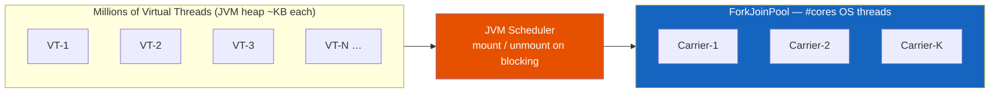
```mermaid
graph LR
    subgraph VThreads["Millions of Virtual Threads (JVM heap ~KB each)"]
        VT1["VT-1"] & VT2["VT-2"] & VT3["VT-3"] & VTN["VT-N …"]
    end
    JVMS["JVM Scheduler\nmount / unmount on blocking"]
    subgraph Carriers["ForkJoinPool — #cores OS threads"]
        C1["Carrier-1"] & C2["Carrier-2"] & CK["Carrier-K"]
    end

    VThreads --> JVMS --> Carriers

    style JVMS fill:#E65100,color:#fff
    style Carriers fill:#1565C0,color:#fff
```

### Benchmark Results (Java 21, Apple M-series, 10 cores)

| Scenario | Platform Threads | Virtual Threads | Speedup |
|---|---|---|---|
| 100 tasks, 500ms block, pool=100 | 525 ms | 516 ms | 1.0× |
| 1,000 tasks, 200ms block, pool=20 | 10,176 ms | 208 ms | **48.9×** |
| 100,000 tasks, 50ms block, pool=200 | 26,536 ms | 370 ms | **71.7×** |

### Creation API

```java
// Direct creation
Thread vt = Thread.ofVirtual().name("order-processor").start(task);

// Recommended: virtual-thread-per-task executor
try (var exec = Executors.newVirtualThreadPerTaskExecutor()) {
    exec.submit(task);
} // auto shutdown + await

// Spring Boot 3.2+ — enable globally
@Bean
TomcatProtocolHandlerCustomizer<?> virtualThreads() {
    return h -> h.setExecutor(Executors.newVirtualThreadPerTaskExecutor());
}
```

### Pinning — The Critical Pitfall

```java
// ❌ Pins carrier — synchronized holds carrier even during blocking
synchronized (this) {
    dbCall(); // carrier thread blocked for full duration
}

// ✅ ReentrantLock allows unmount during blocking
private final ReentrantLock lock = new ReentrantLock();
lock.lock();
try {
    dbCall(); // carrier freed while waiting for DB
} finally {
    lock.unlock();
}
```

> Detect pinning: `java -Djdk.tracePinnedThreads=full -jar app.jar`

**References**
- [JEP 444 — Virtual Threads (Java 21 GA)](https://openjdk.org/jeps/444)
- [Virtual Threads deep dive — Inside Java](https://inside.java/2021/11/30/on-parallelism-and-concurrency/)
- [Virtual Threads migration guide — Spring Blog](https://spring.io/blog/2022/10/11/embracing-virtual-threads)

---

## 12. Sequential vs Parallel Execution

### Sequential — Single Threaded

All work processed by one thread, one task at a time.


```mermaid
gantt
    title Sequential Execution (10 tasks × 1s = 10s total)
    dateFormat  X
    axisFormat %s s

    section Thread-main
    Task 1 :0, 1
    Task 2 :1, 2
    Task 3 :2, 3
    Task 4 :3, 4
    Task 5 :4, 5
    Task 6 :5, 6
    Task 7 :6, 7
    Task 8 :7, 8
    Task 9 :8, 9
    Task 10 :9, 10
```

```bash
$ ./gradlew run -PmainClass=blocking.SequentialSingleThreadedApp

[Thread-main] data data1 is processed.
...
[Thread-main] data data10 is processed.

numberOfProcesses=10
timeTakenMills=10,074 ms
```

### Parallel — Multi-Threaded

Tasks distributed across a thread pool, executing concurrently.


```mermaid
gantt
    title Parallel Execution (10 tasks × 1s, 4 threads ≈ 3s total)
    dateFormat  X
    axisFormat %s s

    section Thread-1
    Task 1 :0, 1
    Task 5 :1, 2
    Task 9 :2, 3

    section Thread-2
    Task 2 :0, 1
    Task 6 :1, 2
    Task 10 :2, 3

    section Thread-3
    Task 3 :0, 1
    Task 7 :1, 2

    section Thread-4
    Task 4 :0, 1
    Task 8 :1, 2
```

### Load Balancing

> "Load balancing refers to the practice of distributing approximately equal amounts of work among tasks so that all tasks are kept busy all of the time. The slowest task at a barrier synchronization determines overall performance." — Lawrence Livermore National Laboratory

**Amdahl's Law** — theoretical speedup limit:

```
Speedup = 1 / (S + (1 - S) / N)

S = serial fraction of the program
N = number of parallel threads/processors

If 20% of your program is serial:
  N=4  → max 2.5×
  N=∞  → max 5×       (not 4× or ∞×!)
```

**References**
- [Introduction to Parallel Computing — Lawrence Livermore National Laboratory](https://computing.llnl.gov/tutorials/parallel_comp/)
- [Shared memory and distributed memory multiprocessor systems](https://edux.pjwstk.edu.pl/mat/264/lec/main119.html)
- [Scala Futures and the Global ExecutionContext](https://docs.scala-lang.org/overviews/core/futures.html#the-global-execution-context)

---

## 13. Hardware — Hyper-Threading & Clock Rate

### Hyper-Threading (Intel SMT)

A single physical core presents **2 logical CPUs** to the OS. 
Both logical cores share the same execution units but have independent register sets and program counters.

```bash
sysctl -a | grep hw
#hw.physicalcpu:     4     # physical cores
#hw.logicalcpu:      8     # logical cores (HT enabled)
#hw.memsize:   17179869184
```

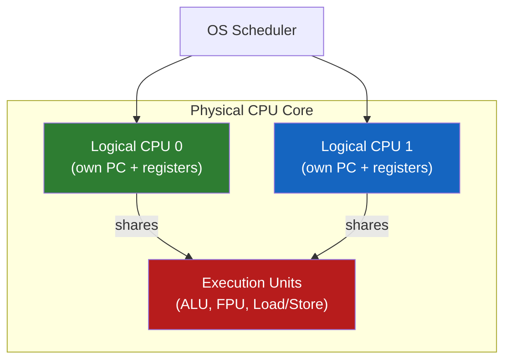
```mermaid
graph TD
    subgraph Core["Physical CPU Core"]
        EU["Execution Units\n(ALU, FPU, Load/Store)"]
        LC1["Logical CPU 0\n(own PC + registers)"]
        LC2["Logical CPU 1\n(own PC + registers)"]
    end

    LC1 -->|shares| EU
    LC2 -->|shares| EU

    OS["OS Scheduler"] --> LC1
    OS --> LC2

    style EU fill:#B71C1C,color:#fff
    style LC1 fill:#2E7D32,color:#fff
    style LC2 fill:#1565C0,color:#fff
```

> **Staff+ implication:** `availableProcessors()` returns logical CPUs. For CPU-bound work, a pool sized to *physical* cores may outperform one sized to logical cores if workload is compute-dense (avoids resource contention on shared execution units).

### Clock Rate

The frequency at which the CPU executes clock cycles, measured in Hz (GHz).

```bash
sysctl -n machdep.cpu.brand_string
#Apple M3 Pro
```

> Modern CPUs use **dynamic frequency scaling** (Turbo Boost / Boost): cores run faster when thermal/power budget allows, 
> and slower under sustained load or thermal throttling. 
> This is why microbenchmarks must warm up the JVM *and* let the CPU reach steady-state frequency.

**References**
- [Hyper-threading technology — Wikipedia](https://en.wikipedia.org/wiki/Hyper-threading)
- [Clock rate — Wikipedia](https://en.wikipedia.org/wiki/Clock_rate)

---

## 14. Production Patterns & Anti-Patterns

### Thread Pool Sizing

| Workload                     | Formula                                               | Example                      |
|------------------------------|-------------------------------------------------------|------------------------------|
| CPU-bound                    | `N_cpu` (= `availableProcessors()`)                   | Image encoding pipeline      |
| I/O-bound (platform threads) | `N_cpu × (1 + W/C)` where W=wait time, C=compute time | DB query handlers            |
| I/O-bound (virtual threads)  | Unbounded — `newVirtualThreadPerTaskExecutor()`       | REST handlers, gRPC services |

### User vs Daemon Threads

- **User threads** keep the JVM alive (e.g., `main` thread, request-handling threads)
- **Daemon threads** are killed when all user threads finish (e.g., GC, background monitors)

```java
Thread monitor = new Thread(this::pollMetrics);
monitor.setDaemon(true);   // JVM won't wait for this thread on shutdown
monitor.start();
```

### Graceful Interruption

```java
// Never swallow InterruptedException
try {
    Thread.sleep(1000);
} catch (InterruptedException e) {
    Thread.currentThread().interrupt(); // restore interrupt flag
    throw new RuntimeException("Task interrupted", e);
}
```

See [`src/main/java/blocking/GracefulInterruptionExample.java`](src/main/java/blocking/GracefulInterruptionExample.java)

### Deprecated Thread Primitives

| Method             | Why Deprecated                                     | Alternative                                     |
|--------------------|----------------------------------------------------|-------------------------------------------------|
| `Thread.stop()`    | Unlocks all monitors — leaves shared state corrupt | Cooperative interruption via `interrupt()` flag |
| `Thread.suspend()` | Holds locks while suspended — deadlock-prone       | `wait()` / `LockSupport.park()`                 |
| `Thread.resume()`  | Only meaningful with `suspend()`                   | `notify()` / `LockSupport.unpark()`             |

### Anti-Patterns

| Anti-Pattern                                  | Problem                                                                 | Fix                                                              |
|-----------------------------------------------|-------------------------------------------------------------------------|------------------------------------------------------------------|
| Unbounded platform thread creation            | OOM from stack allocation                                               | Use `ExecutorService` with bounded pool                          |
| `synchronized` + long I/O                     | Pins carrier in virtual threads; reduces throughput in platform threads | Use `ReentrantLock`, move I/O outside critical section           |
| Large `ThreadLocal` caches on virtual threads | Millions of VTs × cache size = heap OOM                                 | Use `ScopedValue`, or scope the `ThreadLocal` narrowly           |
| `Thread.sleep()` for coordination             | Brittle, wastes time, misses notify                                     | Use `Condition.await()` / `CountDownLatch` / `CompletableFuture` |
| Ignoring `InterruptedException`               | Thread never stops cleanly                                              | Always restore interrupt flag or rethrow                         |
| Pool sized by guess                           | Under/over provisioning                                                 | Profile with `async-profiler`, tune with Little's Law            |

---

## Running the Examples

```bash
# Sequential single-threaded
./gradlew run -PmainClass=blocking.SequentialSingleThreadedApp

# Virtual thread demos
./gradlew run -PmainClass=vthreads.VirtualThreadExample

# Platform vs virtual thread benchmark
./gradlew run -PmainClass=vthreads.ThreadComparison
```

## Further Reading

- [JEP 444 — Virtual Threads (Java 21 GA)](https://openjdk.org/jeps/444)
- [Java Memory Model — JSR-133](https://www.cs.umd.edu/~pugh/java/memoryModel/)
- [Linux CFS Scheduler](https://www.kernel.org/doc/html/latest/scheduler/sched-design-CFS.html)
- [Amdahl's Law — LLNL Parallel Computing Tutorial](https://computing.llnl.gov/tutorials/parallel_comp/)
- [POSIX Threads Programming](https://hpc-tutorials.llnl.gov/posix/)
- [Java Concurrency in Practice — Goetz et al.](https://jcip.net/)
- [The Art of Multiprocessor Programming — Herlihy & Shavit](https://www.elsevier.com/books/the-art-of-multiprocessor-programming/herlihy/978-0-12-397337-5)
