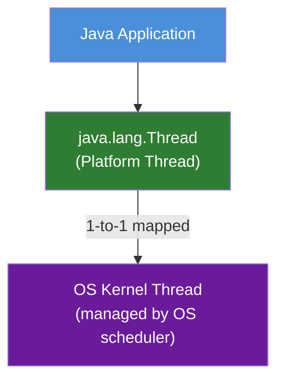
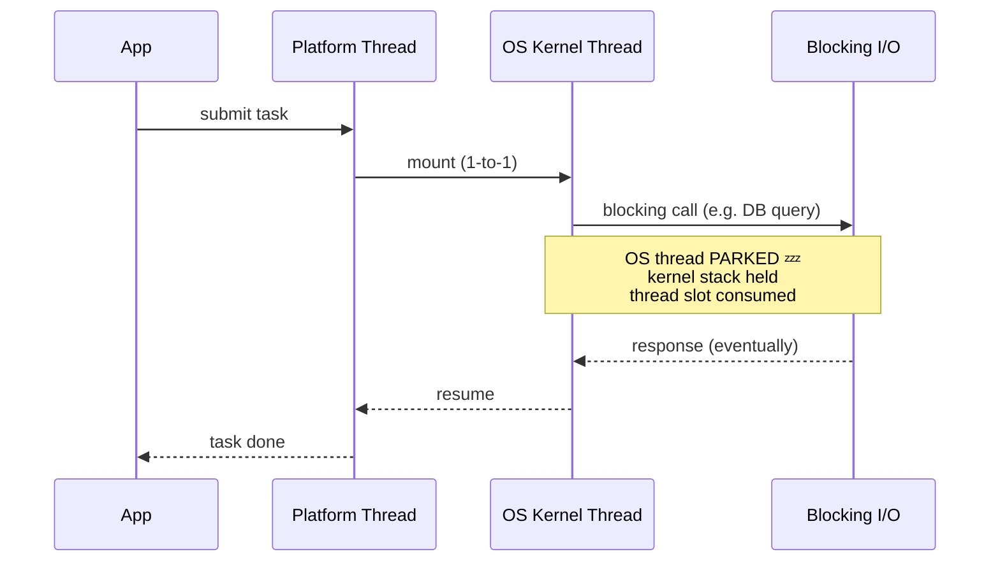
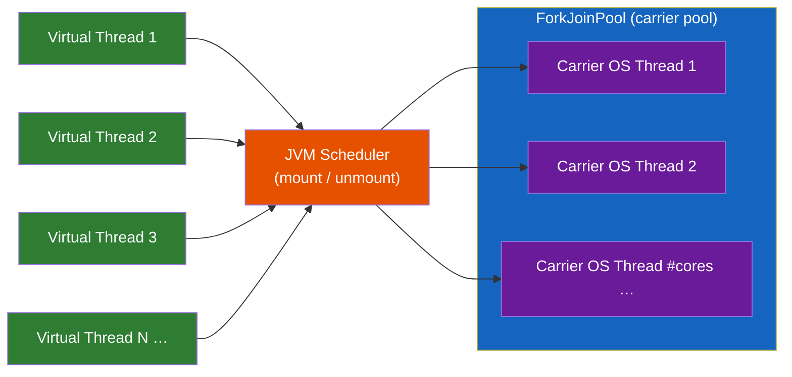
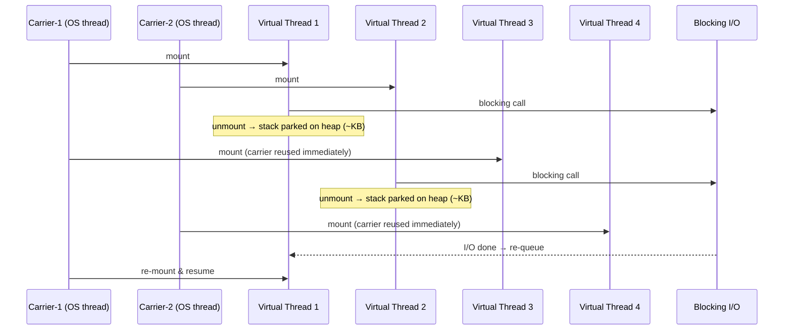

# Virtual Threads in Java 21

## Table of Contents
1. [Platform Threads — Internal Working](#1-platform-threads--internal-working)
2. [Virtual Threads — Internal Working](#2-virtual-threads--internal-working)
3. [Platform vs Virtual — Side-by-Side](#3-platform-vs-virtual--side-by-side)
4. [When to Use Virtual Threads](#4-when-to-use-virtual-threads)
5. [When NOT to Use Virtual Threads](#5-when-not-to-use-virtual-threads)
6. [Benchmark](#6-benchmark)
7. [Code Examples](#7-code-examples)

---

## 1. Platform Threads — Internal Working

A **platform thread** is a thin Java wrapper around a native OS thread.



### Lifecycle & Cost
| Property                  | Detail                                                   |
|---------------------------|----------------------------------------------------------|
| **Stack size**            | ~1 MB reserved per thread (configurable via `-Xss`)      |
| **Creation cost**         | ~1 ms OS syscall + memory allocation                     |
| **Context switch**        | OS-level, ~1–10 µs, saves/restores full CPU register set |
| **Max practical threads** | ~10,000 before memory/scheduling pressure                |
| **Blocking behaviour**    | Blocks the OS thread — carrier is idle, CPU wasted       |

### What happens on a blocking call (platform thread)



The OS thread is **suspended** but still occupies a thread slot in the thread pool. With a fixed pool of N threads and N+ blocking tasks, tasks queue up — throughput collapses.

---

## 2. Virtual Threads — Internal Working

A **virtual thread** is a lightweight thread managed entirely by the JVM. Many virtual threads are **multiplexed** onto a small pool of OS carrier threads (ForkJoinPool, default size = number of CPU cores).



### Key Concepts

#### Mount / Unmount
- When a virtual thread is **scheduled**, the JVM **mounts** it onto a carrier OS thread.
- When it hits a **blocking point** (I/O, `sleep`, `lock`), the JVM **unmounts** it — the carrier is freed immediately to run another virtual thread.
- The virtual thread's stack is stored on the Java **heap** (~few KB, grows as needed).



#### Stack Storage
|                | Platform Thread          | Virtual Thread             |
|----------------|--------------------------|----------------------------|
| Stack location | Native memory (off-heap) | Java heap                  |
| Stack size     | ~1 MB fixed              | ~few KB, grows dynamically |
| GC managed     | ❌ No                     | ✅ Yes                      |

#### Scheduler
- Built on `ForkJoinPool` in FIFO mode (not work-stealing for virtual threads).
- Configurable via system property: `-Djdk.virtualThreadScheduler.parallelism=N`

#### Pinning (watch out!)
A virtual thread becomes **pinned** to its carrier and cannot be unmounted when:
- Inside a `synchronized` block/method (use `ReentrantLock` instead)
- Calling a native method or foreign function

```java
// ❌ Pins the carrier — avoid for long blocking ops
synchronized (lock) {
    Thread.sleep(1000); // carrier blocked!
}

// ✅ Does not pin
ReentrantLock lock = new ReentrantLock();
lock.lock();
try {
    Thread.sleep(1000); // carrier freed during sleep
} finally {
    lock.unlock();
}
```

---

## 3. Platform vs Virtual — Side-by-Side

| Aspect              | Platform Thread             | Virtual Thread                             |
|---------------------|-----------------------------|--------------------------------------------|
| Mapping             | 1 Java thread = 1 OS thread | N Java threads = ~#cores OS threads        |
| Stack memory        | ~1 MB/thread (native)       | ~few KB/thread (heap)                      |
| Creation cost       | High (OS syscall)           | Very low (heap allocation)                 |
| Context switch      | OS-level (~µs)              | JVM-level (cheaper)                        |
| Max practical count | ~10 K                       | Millions                                   |
| Blocking behaviour  | Parks OS thread             | Unmounts, frees carrier                    |
| Best for            | CPU-bound tasks             | I/O-bound / blocking tasks                 |
| `synchronized`      | Fine                        | Causes pinning — prefer `ReentrantLock`    |
| Thread locals       | Supported                   | Supported (prefer `ScopedValue` in future) |
| Debugging           | Mature tooling              | Improving (JDK 21+)                        |

---

## 4. When to Use Virtual Threads

✅ **Use virtual threads when your tasks spend most time blocking:**

| Use Case                                | Why Virtual Threads Help                                            |
|-----------------------------------------|---------------------------------------------------------------------|
| HTTP servers (many concurrent requests) | Each request can block on DB/API without consuming an OS thread     |
| Database query handlers                 | JDBC calls block; virtual threads unmount while waiting             |
| REST/gRPC clients                       | Network I/O dominates; thousands of concurrent calls become trivial |
| File I/O pipelines                      | Reading/writing files blocks; virtual threads handle fan-out easily |
| Message queue consumers                 | Blocking poll/consume operations park cheaply                       |
| Scheduled/batch jobs                    | Thousands of small tasks with sleep/wait intervals                  |

### Rule of Thumb
> **If your thread spends more time waiting than computing, virtual threads are the right tool.**

---

## 5. When NOT to Use Virtual Threads

❌ **Avoid virtual threads when:**

| Scenario                                                | Reason                                                                                                                        |
|---------------------------------------------------------|-------------------------------------------------------------------------------------------------------------------------------|
| CPU-intensive tasks (encryption, image processing, ML)  | Blocking frees the carrier — but if you never block, there's no benefit. Use a fixed platform thread pool sized to CPU cores. |
| Heavy use of `synchronized` with long critical sections | Pinning prevents unmount; defeats the purpose                                                                                 |
| Code that relies on `ThreadLocal` for large caches      | Each virtual thread can have its own `ThreadLocal`; millions of threads = memory pressure                                     |
| Real-time / latency-sensitive code                      | JVM scheduling adds non-determinism                                                                                           |

---

## 6. Benchmark

Results from [`PthreadVthreadComparison.java`](PthreadVthreadComparison.java) — Java 21, Apple M-series, 10 CPU cores.

### Scenario 1 — Equal Pool Size (100 tasks, 500 ms blocking, pool = 100)

| Thread Type      | Time     |
|------------------|----------|
| Platform threads | 525 ms   |
| Virtual threads  | 516 ms   |
| **Speedup**      | **1.0×** |

> Pool is sized equal to task count so all platform threads run in parallel — parity is expected. The gap only opens when the pool is **constrained**.

### Scenario 2 — Constrained Platform Pool (1,000 tasks, 200 ms blocking, pool = 20)

| Thread Type      | Time                                  |
|------------------|---------------------------------------|
| Platform threads | 10,176 ms                             |
| Virtual threads  | 208 ms                                |
| **Speedup**      | **48.9× faster with virtual threads** |

> Platform threads must process 1,000 tasks in batches of 20 (50 rounds × 200 ms = ~10 s). Virtual threads unmount on every block, completing all tasks in a single ~200 ms wave.

### Scenario 3 — Massive Load (100,000 tasks, 50 ms blocking, pool = 200)

| Thread Type      | Time                                  |
|------------------|---------------------------------------|
| Platform threads | 26,536 ms                             |
| Virtual threads  | 370 ms                                |
| **Speedup**      | **71.7× faster with virtual threads** |

> 100k tasks processed in 500 rounds of 200 by platform threads (~26 s total). Virtual threads handle all 100k concurrently with trivial overhead.

```mermaid
xychart-beta
    title "Execution Time: Platform vs Virtual Threads (ms, lower is better)"
    x-axis ["Scenario 1 (equal pool)", "Scenario 2 (constrained)", "Scenario 3 (massive load)"]
    y-axis "Time (ms)" 0 --> 27000
    bar [525, 10176, 26536]
    bar [516, 208, 370]
```



### Memory Footprint

| Thread Count | Platform Threads   | Virtual Threads |
|--------------|--------------------|-----------------|
| 1,000        | ~1 GB native stack | ~10 MB heap     |
| 10,000       | OOM / OS limit     | ~100 MB heap    |
| 100,000      | Not feasible       | ~1 GB heap      |

---

## 7. Code Examples

See [`VirtualThreadExample.java`](VirtualThreadExample.java) and [`PthreadVthreadComparison.java`](PthreadVthreadComparison.java)

### Quick Start

```bash
# Virtual thread demos
./gradlew run --args="vthreads.VirtualThreadExample"

# Platform vs virtual benchmark
./gradlew run --args="vthreads.PthreadVthreadComparison"
```

### Minimum Requirements
- Java 21+ (virtual threads are GA since JDK 21)
- Gradle 8+

