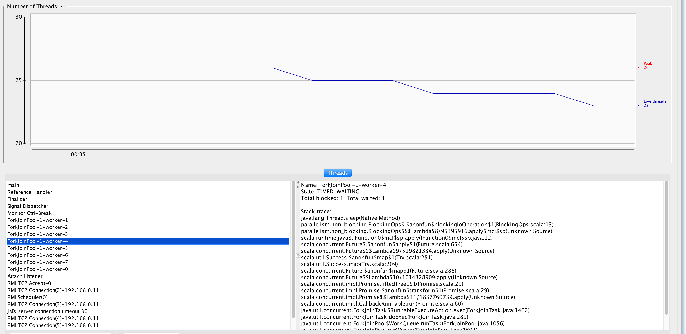
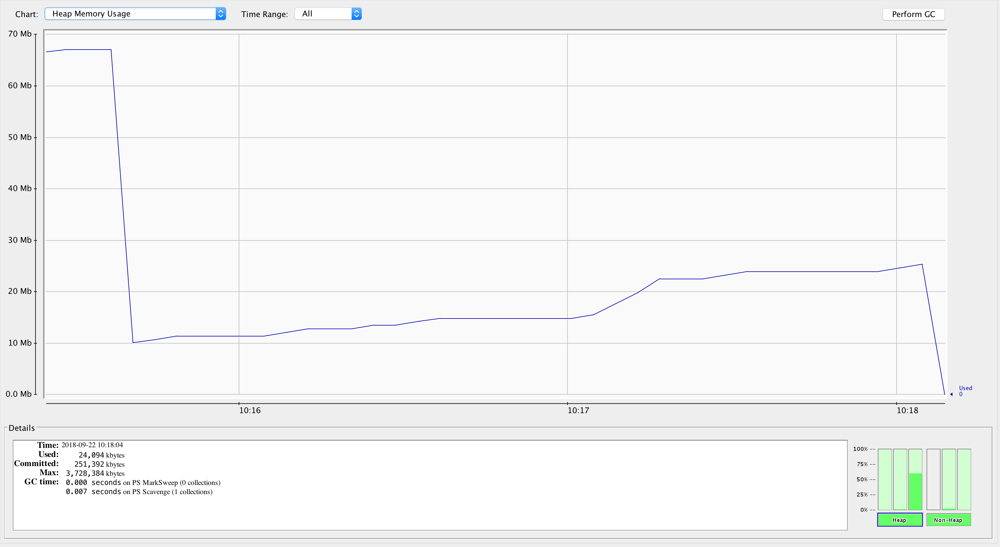

Non blocking threads/ with blocking threads
-------------------------------------------

The application has;
- fj-Pool1 is blocking threads. Has 8 threads. The application asks it to
process 9 operations. So 1 has to WAIT until some thread is free

- fj-Pool2 is non-blocking threads. Has 8 threads in it. I ask to process
9 operations. It should not affected by the above blocking threads as
this pool is free.

```
blocking operation:3, name: blocking-thread-7/7/0/7
blocking operation:2, name: blocking-thread-0/8/1/8
blocking operation:9, name: blocking-thread-1/1/1/1
blocking operation:7, name: blocking-thread-3/3/1/3
blocking operation:4, name: blocking-thread-6/6/1/6
blocking operation:8, name: blocking-thread-2/2/2/2
blocking operation:6, name: blocking-thread-4/5/1/5
blocking operation:5, name: blocking-thread-5/5/1/5
non-blocking operation:1, name: non-blocking-thread-1/1/1/1
non-blocking operation:4, name: non-blocking-thread-1/1/1/1
non-blocking operation:2, name: non-blocking-thread-2/2/2/2
non-blocking operation:3, name: non-blocking-thread-3/3/1/3
non-blocking operation:5, name: non-blocking-thread-3/3/1/3
non-blocking operation:8, name: non-blocking-thread-2/2/2/2
non-blocking operation:7, name: non-blocking-thread-5/5/1/5
non-blocking operation:6, name: non-blocking-thread-6/7/0/5
non-blocking operation:9, name: non-blocking-thread-3/3/1/3
blocking operation:1, name: blocking-thread-0/8/1/8
```

[Each thread has](https://stackoverflow.com/a/16128515/432903)
- its own stack memory,
- program counter (like a pointer to what instruction executes next) and
- other local resources.

Swapping them out hurts latency for a single task.
The benefit is that while one thread is idle (usually when waiting for i/o)
another thread can get work done.
Also if there are multiple processors available, they can run in parallel
if there is no resource and/or locking contention between the tasks.




Memory
------

