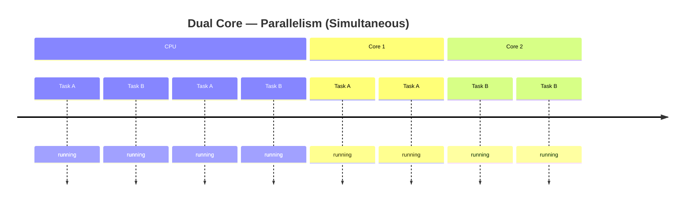
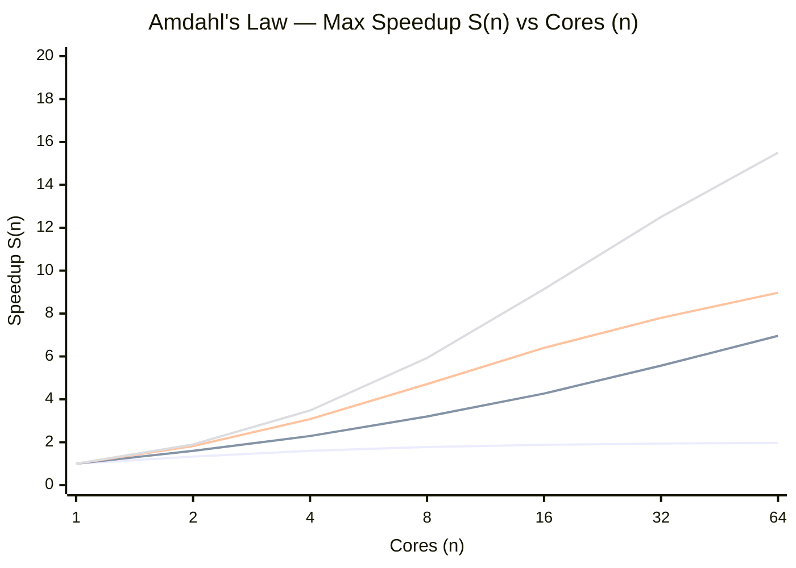
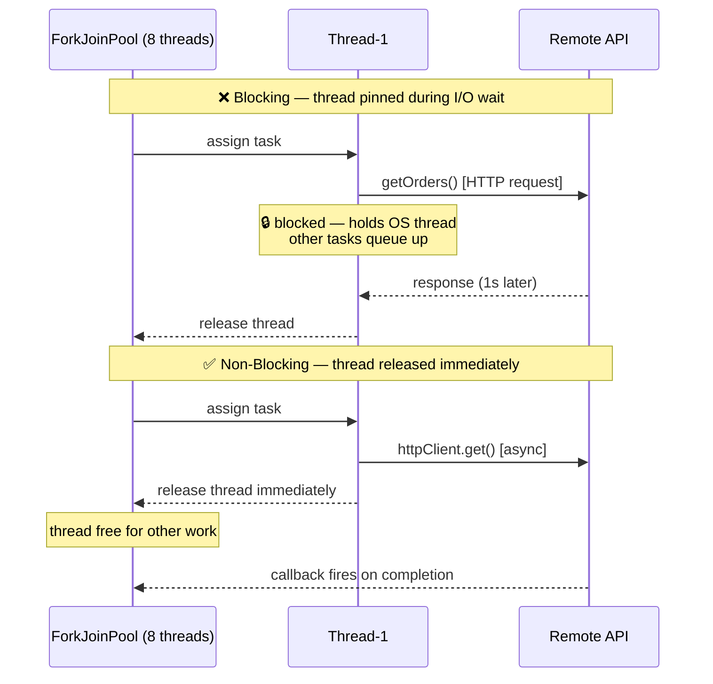
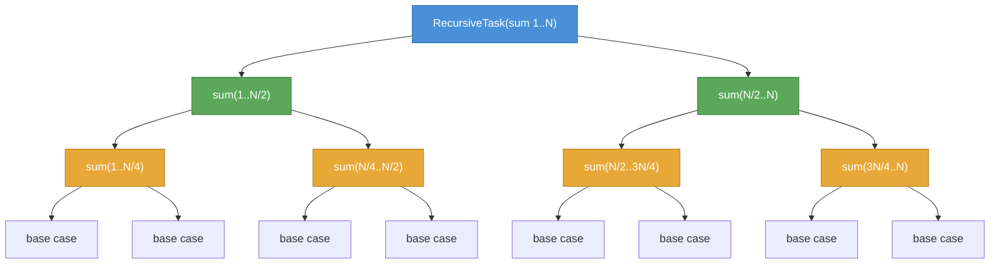
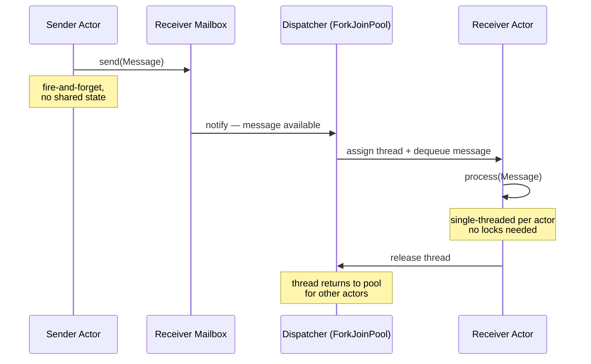
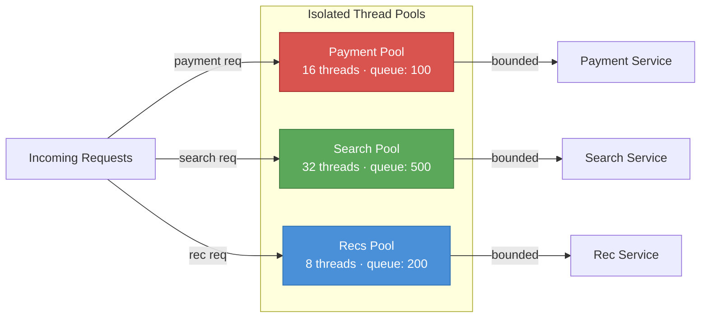
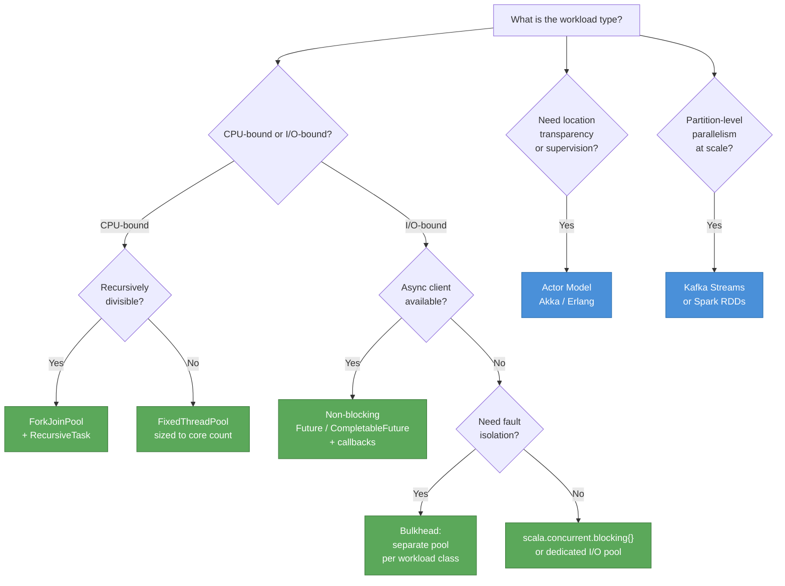

# Data Parallelism & Fork/Join

> **Audience:** Engineers reasoning about throughput, latency, and thread-model trade-offs at scale.

---

## Table of Contents

1. [What is Parallelism?](#1-what-is-parallelism)
2. [Theoretical Limits — Amdahl's Law](#2-theoretical-limits--amdahls-law)
3. [Data Partitioning as the Unit of Parallelism](#3-data-partitioning-as-the-unit-of-parallelism)
4. [Execution Models: Blocking vs. Non-Blocking Threads](#4-execution-models-blocking-vs-non-blocking-threads)
5. [Thread Pool Strategies](#5-thread-pool-strategies)
6. [Fork/Join Framework — Deep Dive](#6-forkjoin-framework--deep-dive)
7. [Actor Model — Shared-Nothing Parallelism](#7-actor-model--shared-nothing-parallelism)
8. [Bulkhead Pattern — Fault Isolation](#8-bulkhead-pattern--fault-isolation)
9. [Benchmark: Blocking Tasks on ForkJoinPool](#9-benchmark-blocking-tasks-on-forkjoinpool)
10. [Key Decision Framework](#10-key-decision-framework)
11. [Further Reading](#11-further-reading)

---

## 1. What is Parallelism?

A **parallel system** can execute multiple computations *simultaneously*, typically backed by:

- **Multi-core CPUs** — intra-machine parallelism
- **Compute clusters** — inter-machine parallelism, where independent sub-problems run on separate nodes

Parallelism is *not* the same as concurrency:

| | Concurrency | Parallelism |
|---|---|---|
| **Goal** | Structure | Speed |
| **Mechanism** | Task interleaving | Simultaneous execution |
| **Requires multi-core?** | No | Yes |



---

## 2. Theoretical Limits — Amdahl's Law

Before throwing more cores at a problem, quantify the ceiling:

```
S(n) = 1 / ((1 - P) + P/n)

  P = fraction of work that is parallelizable
  n = number of cores / threads
```

**Practical implications for system design:**

- If only **50%** of work is parallelizable, max speedup is **2×** regardless of cores.
- At **95%** parallelizable, 20 cores yield ~10× speedup; 2000 cores yield ~20×.
- The serial fraction `(1 - P)` is the dominant cost at scale — identify and eliminate it early.
- This is why **partitioning strategy** (see §3) and **coordination overhead** matter more than raw core count.



---

## 3. Data Partitioning as the Unit of Parallelism

**Partitions are the unit of parallelism.** The number of effective parallel workers is bounded by `min(partitions, cores)`.

This principle manifests across the stack:

| System | Partition Concept |
|---|---|
| Kafka | [Stream partitions → tasks](http://docs.confluent.io/current/streams/architecture.html#stream-partitions-and-tasks) assigned to stream threads |
| Akka | Actor mailboxes dispatched to thread pool workers |
| ForkJoinPool | Recursively split sub-tasks scheduled across worker threads |
| HDFS/Spark | HDFS blocks / RDD partitions mapped to executor slots |

**Design rule:** partition count should be a multiple of the worker count to prevent stragglers and ensure balanced load.

See: [How does Kafka handle concurrency?](https://stackoverflow.com/a/39992430/432903)

---

## 4. Execution Models: Blocking vs. Non-Blocking Threads

### The Core Problem

A blocking thread holds a JVM/OS thread while waiting for I/O. With `ForkJoinPool.commonPool()` sized to `availableProcessors`, even a handful of blocking tasks saturates the pool — all other tasks queue.



```scala
// ❌ Naive: blocks a ForkJoinPool thread during HTTP wait
val f: Future[List[Order]] = Future {
  session.getOrders()   // thread pinned here waiting for network I/O
}
```

```scala
// ✅ Better: non-blocking — registers a callback, releases the thread immediately
httpClient.get("/orders").thenAccept { orders =>
  // runs on a callback thread when response arrives
}
```

### Key Combinators (Java `CompletableFuture` / Scala `Future`)

| Combinator | Use |
|---|---|
| `thenApply` / `map` | Transform result (non-blocking) |
| `thenCompose` / `flatMap` | Chain dependent async calls |
| `thenAccept` / `foreach` | Side-effecting terminal (non-blocking) |
| `thenCombine` / `zip` | Merge two independent futures |

### Scala ForkJoinPool & Blocking Compensation

In Scala, `ForkJoinPool` can *expand* its thread count beyond `parallelismLevel` when tasks declare `scala.concurrent.blocking { ... }`. This prevents pool starvation at the cost of higher thread count:

```scala
import scala.concurrent.blocking

Future {
  blocking {
    session.getOrders()   // pool spawns a compensating thread — won't starve others
  }
}
```

**Use this only when you cannot refactor to a truly async client.** Unbounded thread expansion under high load leads to context-switch storms and heap pressure.

---

## 5. Thread Pool Strategies

Three common pool types and when to choose each:

| Pool | Behaviour | Best For |
|---|---|---|
| `FixedThreadPool` | Fixed N threads, unbounded queue | CPU-bound work with predictable load |
| `CachedThreadPool` | Unbounded threads, 60s keepalive | Short-lived, bursty I/O tasks (risk: thread explosion) |
| `ForkJoinPool` | Work-stealing, configurable parallelism | Recursive divide-and-conquer; mixed CPU+blocking with compensation |

Reference: [FixedThreadPool vs CachedThreadPool vs ForkJoinPool](https://zeroturnaround.com/rebellabs/fixedthreadpool-cachedthreadpool-or-forkjoinpool-picking-correct-java-executors-for-background-tasks/)

### Akka Dispatcher Configuration

Akka lets you tune per-actor-system or per-actor dispatcher:

```hocon
default-dispatcher {
  type = "Dispatcher"

  # Work-stealing pool — static bounds, good for CPU-bound actors
  executor = "fork-join-executor"
  fork-join-executor {
    parallelism-min    = 8
    parallelism-factor = 3.0   # threads = factor × cores, clamped to [min, max]
    parallelism-max    = 64
  }

  # Use thread-pool-executor for I/O-heavy actors needing dynamic sizing
  # executor = "thread-pool-executor"
  # thread-pool-executor { fixed-pool-size = 32 }

  throughput     = 5       # messages processed per thread before yielding
  shutdown-timeout = 1s
}
```

**Rule of thumb:**
- `fork-join-executor` → CPU-bound / compute actors with known concurrency bounds
- `thread-pool-executor` → I/O-bound actors where dynamic sizing is needed

---

## 6. Fork/Join Framework — Deep Dive

`ForkJoinPool` ([JDK docs](https://docs.oracle.com/javase/tutorial/essential/concurrency/forkjoin.html)) implements `ExecutorService` with a **work-stealing** scheduler:

1. **Fork** — split a large task into independent sub-tasks, push to own deque.
2. **Join** — wait for sub-tasks to complete, combine results.
3. **Work-steal** — idle workers steal tasks from the *tail* of busy workers' deques, minimising lock contention.



**When Fork/Join wins:**
- Recursive algorithms: merge sort, tree traversal, matrix multiply
- Tasks have roughly equal cost (imbalanced trees degrade to sequential)
- N >> cores (enough granularity for work-stealing to matter)

**When it doesn't:**
- Tasks with heavy I/O (blocking pollutes the pool — see §4)
- Tasks with significant coordination / shared mutable state

See: [How is Fork/Join better than a thread pool?](https://stackoverflow.com/a/7928815/432903)

---

## 7. Actor Model — Shared-Nothing Parallelism

The Actor model achieves parallelism through **message-passing** with no shared mutable state:

> *"Individual processes (actors) send messages asynchronously to each other. There is (in theory) no shared state. If shared state is the root of all evil, the actor model becomes very attractive."*
> — [Stack Overflow](https://stackoverflow.com/a/3587250/432903)

Key properties relevant to L6+ design decisions:

| Property | Implication |
|---|---|
| Mailbox per actor | Natural backpressure point; bounded mailboxes prevent OOM |
| Location transparency | Same code works local or distributed (Akka Cluster, Erlang distribution) |
| Supervision trees | Fault isolation without `try/catch` scattered across callsites |
| No shared state | Eliminates lock contention — scales linearly with partition count |

**Erlang/JVM mapping:** Erlang processes are green threads scheduled by the BEAM VM, not OS threads. JVM actors (Akka) are multiplexed onto a ForkJoinPool. The dispatcher assigns a thread from the pool to an actor only while it has messages — then releases it.



References:
- [Erlang processes vs kernel threads](https://stackoverflow.com/a/605631/432903)
- [Akka JVM threads vs OS threads during I/O](https://stackoverflow.com/a/7458958/432903)
- [Project Loom — JVM virtual threads](https://cr.openjdk.java.net/~rpressler/loom/Loom-Proposal.html)

---

## 8. Bulkhead Pattern — Fault Isolation

Named after watertight compartments in a ship's hull: **isolate failures so one overloaded subsystem cannot sink others**.

In thread-pool terms: assign separate, bounded pools to distinct workload classes (e.g., payment processing vs. recommendation engine). A spike in one doesn't exhaust threads for the other.



Reference: [Azure Bulkhead Pattern](https://docs.microsoft.com/en-us/azure/architecture/patterns/bulkhead)

---

## 9. Benchmark: Blocking Tasks on ForkJoinPool

**Setup:** 8-core machine, 4 GB heap, `ExecutionContext.Implicits.global` (backed by `ForkJoinPool(parallelism=8)`), each task sleeps 1 second.

| Tasks | Expected Wall Time | Observed |
|---|---|---|
| 10 | ⌈10/8⌉ × 1s = **2s** | **3s** |
| 100 | ⌈100/8⌉ × 1s = **13s** | **14s** |

**Interpretation:**

- Wall time ≈ `ceil(N / cores) × task_duration` — confirms true parallel batching.
- The extra ~1s overhead is scheduling latency + JVM warm-up, not a concurrency bug.
- 8 threads consumed in parallel per batch; remaining tasks queue until a thread frees.
- At 100 tasks: 12 full batches of 8 (96 tasks, 12s) + 1 batch of 4 (1s) + overhead ≈ 14s. ✓

**Scale-out signal:** If observed time exceeds `ceil(N/cores) × task_duration` by more than ~10%, investigate: lock contention, GC pressure, or pool starvation from unguarded blocking calls.

---

## 10. Key Decision Framework



---

## 11. Further Reading

| Topic | Link |
|---|---|
| Parallelism vs. Concurrency (Haskell wiki) | https://wiki.haskell.org/Parallelism |
| Cats Effect concurrency basics | https://typelevel.org/cats-effect/concurrency/basics.html |
| ForkJoinPool deep dive | https://docs.oracle.com/javase/tutorial/essential/concurrency/forkjoin.html |
| Choosing the right Java executor | https://zeroturnaround.com/rebellabs/fixedthreadpool-cachedthreadpool-or-forkjoinpool-picking-correct-java-executors-for-background-tasks/ |
| Akka default dispatcher internals | https://github.com/shekhargulati/52-technologies-in-2016/blob/master/41-akka-dispatcher/README.md#the-default-dispatcher |
| Project Loom (JVM virtual threads) | https://cr.openjdk.java.net/~rpressler/loom/Loom-Proposal.html |
| Azure Bulkhead pattern | https://docs.microsoft.com/en-us/azure/architecture/patterns/bulkhead |
| Kafka Streams architecture | http://docs.confluent.io/current/streams/architecture.html#stream-partitions-and-tasks |
