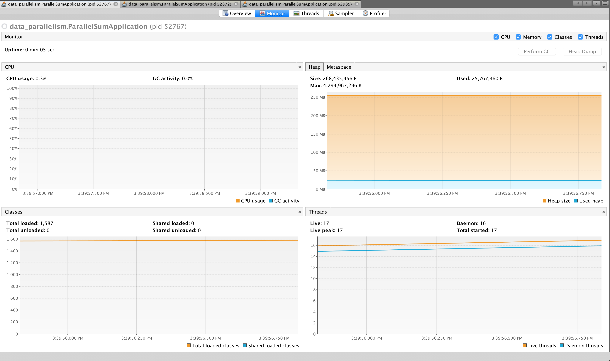

granularity = 100
number of processes =
[0-500],                                 [500-1000],
[0-250], [250-500],                      [500-750] [750-1000]
[0-125], [125-250], [250-375], [375-500] []

```
$ gradle compileKotlin
$ gradle run

> Task :run
[main]
[main] creating new process for ([0-500] [500-1001])
[main] creating new process for ([500-750] [750-1001])
[ForkJoinPool.commonPool-worker-1] creating new process for ([0-250] [250-500])
[main] creating new process for ([750-875] [875-1001])
[ForkJoinPool.commonPool-worker-1] creating new process for ([250-375] [375-500])
[ForkJoinPool.commonPool-worker-2] creating new process for ([0-125] [125-250])
[ForkJoinPool.commonPool-worker-3] creating new process for ([500-625] [625-750])
[ForkJoinPool.commonPool-worker-5] creating new process for ([250-312] [312-375])
[ForkJoinPool.commonPool-worker-7] creating new process for ([750-812] [812-875])
[ForkJoinPool.commonPool-worker-1] creating new process for ([375-437] [437-500])
[ForkJoinPool.commonPool-worker-4] creating new process for ([0-62] [62-125])
[main] creating new process for ([875-938] [938-1001])
[ForkJoinPool.commonPool-worker-2] creating new process for ([125-187] [187-250])
[ForkJoinPool.commonPool-worker-6] creating new process for ([500-562] [562-625])
[ForkJoinPool.commonPool-worker-3] creating new process for ([625-687] [687-750])
500500


BUILD SUCCESSFUL in 6s
2 actionable tasks: 1 executed, 1 up-to-date
```



Refs
----

 [fork Join Framework](http://homes.cs.washington.edu/~djg/teachingMaterials/grossmanSPAC_forkJoinFramework.html)

 [fj](http://gee.cs.oswego.edu/dl/papers/fj.pdf)

 [Stream Parallel](http://gee.cs.oswego.edu/dl/html/StreamParallelGuidance.html)

 [Calamity](http://coopsoft.com/ar/Calamity2Article.html)

 [functional style callbacks - java8](http://www.infoq.com/articles/Functional-Style-Callbacks-Using-CompletableFuture)

 [par streams bad for health](http://zeroturnaround.com/rebellabs/java-parallel-streams-are-bad-for-your-health/)

 [spark](https://www.mapr.com/blog/parallel-and-iterative-processing-machine-learning-recommendations-spark)
 