# Multicomputer Architecture

> **Audience:** L6+ engineers designing distributed systems, ML infrastructure, or large-scale data platforms.  
> **Context:** Chapter 7 of the parallel programming series — distributed-memory systems where processors do **not** share RAM.

---

## Table of Contents

1. [What is a Multicomputer?](#1-what-is-a-multicomputer)
2. [Multicomputer vs. Multiprocessor](#2-multicomputer-vs-multiprocessor)
3. [Interconnect Topologies](#3-interconnect-topologies)
4. [Communication Primitives: Send & Receive](#4-communication-primitives-send--receive)
5. [Message Latency & Bandwidth Model](#5-message-latency--bandwidth-model)
6. [Collective Communication Patterns](#6-collective-communication-patterns)
7. [Data Partitioning Across Nodes](#7-data-partitioning-across-nodes)
8. [Modern Multicomputers — The LLM Era](#8-modern-multicomputers--the-llm-era)
9. [L6+ Design Trade-offs](#9-staff-design-trade-offs)
10. [Key Decision Framework](#10-key-decision-framework)
11. [Further Reading](#11-further-reading)

---

## 1. What is a Multicomputer?

A **multicomputer** is a parallel system consisting of multiple independent computers (nodes), each with its own private CPU and memory, connected by a high-speed **interconnect network**. There is **no shared global address space** — all coordination happens through explicit **message passing**.

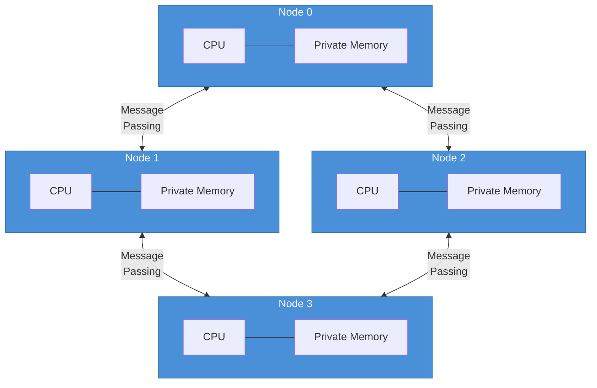
```mermaid
graph TD
    subgraph Node0["Node 0"]
        CPU0["CPU"] --- MEM0["Private Memory"]
    end
    subgraph Node1["Node 1"]
        CPU1["CPU"] --- MEM1["Private Memory"]
    end
    subgraph Node2["Node 2"]
        CPU2["CPU"] --- MEM2["Private Memory"]
    end
    subgraph Node3["Node 3"]
        CPU3["CPU"] --- MEM3["Private Memory"]
    end

    Node0 <-->|"Message\nPassing"| Node1
    Node1 <-->|"Message\nPassing"| Node3
    Node0 <-->|"Message\nPassing"| Node2
    Node2 <-->|"Message\nPassing"| Node3

    style Node0 fill:#4a90d9,color:#fff,stroke:#2c6fad
    style Node1 fill:#4a90d9,color:#fff,stroke:#2c6fad
    style Node2 fill:#4a90d9,color:#fff,stroke:#2c6fad
    style Node3 fill:#4a90d9,color:#fff,stroke:#2c6fad
```

**Defining characteristics:**

| Property | Value |
|---|---|
| Memory model | Distributed — each node owns its memory exclusively |
| Communication | Explicit `send` / `receive` — no implicit sharing |
| Scalability | Near-linear — add nodes without memory bus contention |
| Fault model | Partial failure — a node crash does not corrupt others |
| Programming model | MPI, actor model, CSP, distributed futures, gRPC |

---

## 2. Multicomputer vs. Multiprocessor

Understanding the boundary between these two models is a foundational L6+ decision:

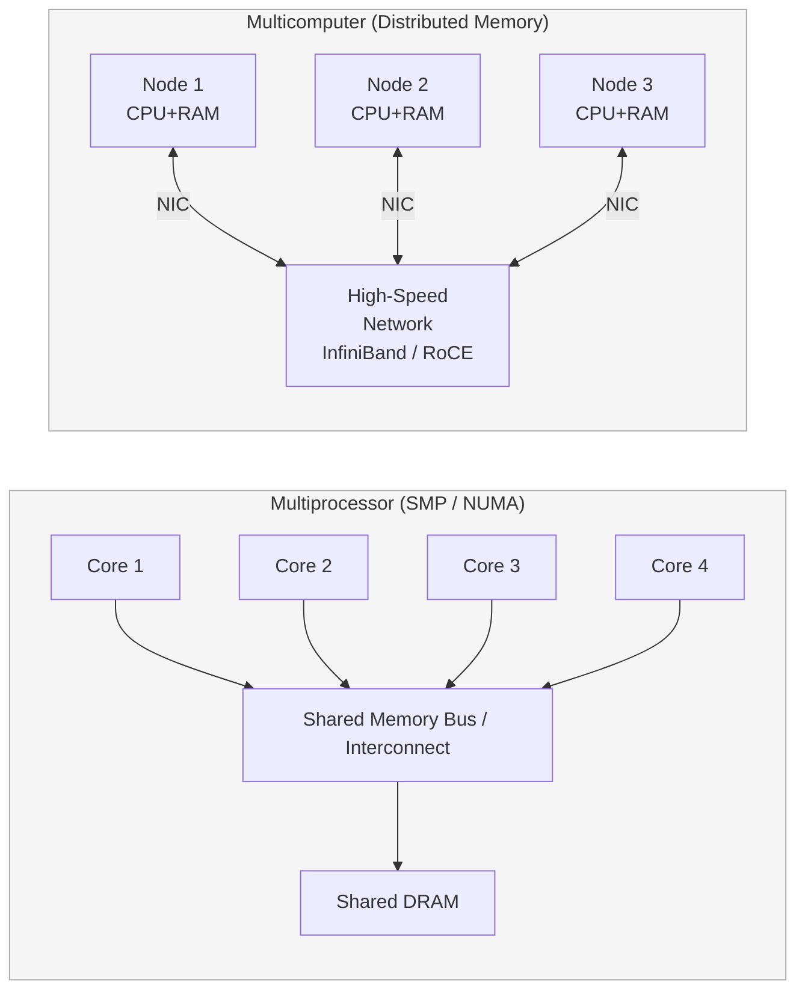
```mermaid
graph LR
    subgraph SMP["Multiprocessor (SMP / NUMA)"]
        direction TB
        P1["Core 1"] --> SM["Shared Memory Bus / Interconnect"]
        P2["Core 2"] --> SM
        P3["Core 3"] --> SM
        P4["Core 4"] --> SM
        SM --> RAM["Shared DRAM"]
    end

    subgraph MC["Multicomputer (Distributed Memory)"]
        direction TB
        N1["Node 1\nCPU+RAM"] <-->|NIC| NET["High-Speed\nNetwork\nInfiniBand / RoCE"]
        N2["Node 2\nCPU+RAM"] <-->|NIC| NET
        N3["Node 3\nCPU+RAM"] <-->|NIC| NET
    end

    style SMP fill:#f5f5f5,stroke:#aaa
    style MC fill:#f5f5f5,stroke:#aaa
```

| Dimension | Multiprocessor (SMP/NUMA) | Multicomputer |
|---|---|---|
| Memory access | Uniform (SMP) or NUMA (rack-scale) | Always remote = explicit message |
| Max scale | ~100s of cores per machine | Millions of cores (supercomputers, cloud) |
| Latency | ns (cache coherence) | µs–ms (network) |
| Bandwidth | TB/s (memory bus) | GB/s (NIC) |
| Fault isolation | None — one bad core can corrupt shared state | Strong — node-level blast radius |
| Programming complexity | Lower (shared variables, locks) | Higher (explicit message passing) |

> **Rule of thumb:** scale-up (SMP) until the cost of memory bandwidth or the blast-radius risk outweighs the operational simplicity benefit, then scale-out (multicomputer).

---

## 3. Interconnect Topologies

The topology governs **diameter** (max hops between nodes), **bisection bandwidth** (throughput when the network splits in half), and **fault tolerance**.

### 3.1 Linear Array & Ring

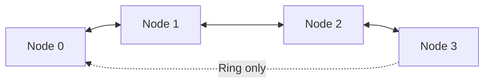
```mermaid
graph LR
    A["Node 0"] <--> B["Node 1"] <--> C["Node 2"] <--> D["Node 3"]
    D -.->|"Ring only"| A
```

- **Diameter:** O(N) — bad for large N
- **Use case:** pipeline parallelism (each stage sends to the next)

### 3.2 2D Mesh & Torus

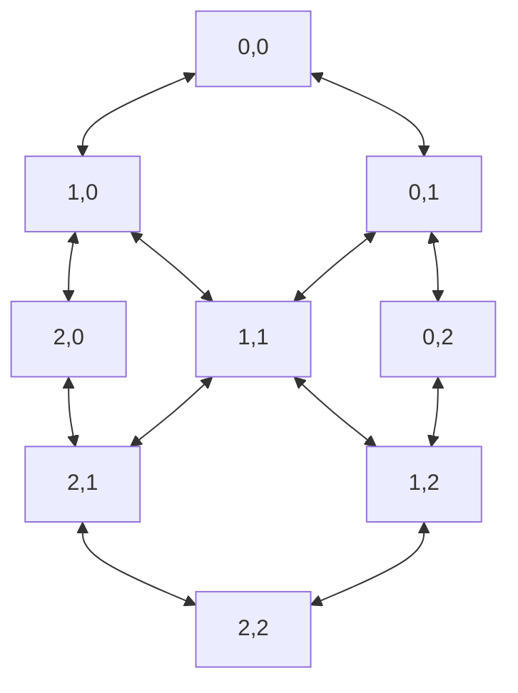
```mermaid
graph TD
    N00["0,0"] <--> N01["0,1"] <--> N02["0,2"]
    N10["1,0"] <--> N11["1,1"] <--> N12["1,2"]
    N20["2,0"] <--> N21["2,1"] <--> N22["2,2"]

    N00 <--> N10 <--> N20
    N01 <--> N11 <--> N21
    N02 <--> N12 <--> N22
```

- **Diameter:** O(√N) — manageable for moderate N
- **Bisection bandwidth:** O(√N) — can be a bottleneck
- **Torus:** wraps edges, halves diameter
- **Use case:** Google TPU pods, NVIDIA DGX H100 nodes in fat-tree clusters use mesh-inspired layouts

### 3.3 Hypercube

Each node has `log₂N` neighbours; address differs by 1 bit per link.

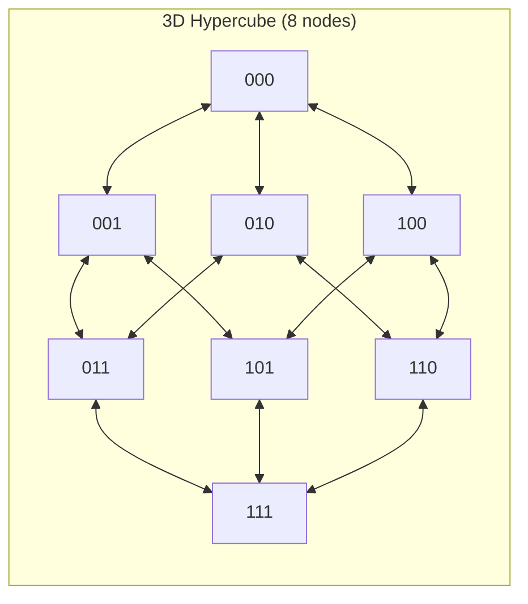
```mermaid
graph LR
    subgraph d3["3D Hypercube (8 nodes)"]
        N000["000"] <--> N001["001"]
        N000 <--> N010["010"]
        N000 <--> N100["100"]
        N001 <--> N011["011"]
        N001 <--> N101["101"]
        N010 <--> N011
        N010 <--> N110["110"]
        N100 <--> N101
        N100 <--> N110
        N011 <--> N111["111"]
        N101 <--> N111
        N110 <--> N111
    end
```

- **Diameter:** O(log N) — excellent
- **Bisection bandwidth:** O(N/2) — excellent
- **Cost:** each node needs `log₂N` ports — wiring complexity grows
- **Use case:** inspiration for Clos / fat-tree networks used in modern datacenters

### 3.4 Fat-Tree (Modern Datacenter Reality)

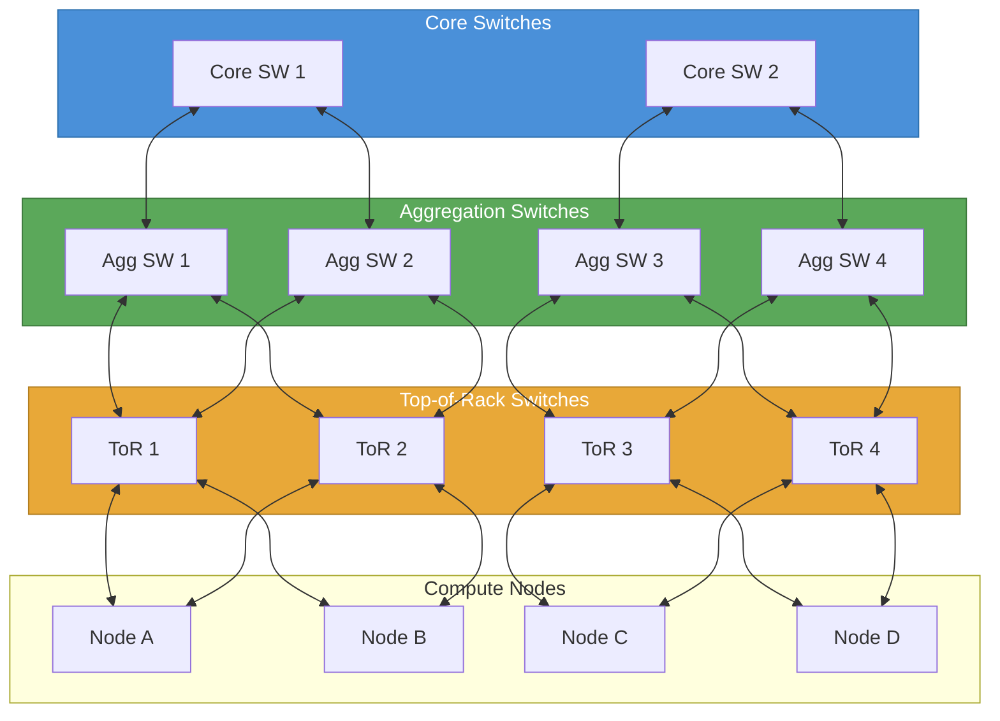
```mermaid
graph TD
    subgraph Core["Core Switches"]
        CS1["Core SW 1"]
        CS2["Core SW 2"]
    end
    subgraph Agg["Aggregation Switches"]
        AS1["Agg SW 1"]
        AS2["Agg SW 2"]
        AS3["Agg SW 3"]
        AS4["Agg SW 4"]
    end
    subgraph ToR["Top-of-Rack Switches"]
        T1["ToR 1"] & T2["ToR 2"] & T3["ToR 3"] & T4["ToR 4"]
    end
    subgraph Nodes["Compute Nodes"]
        N1["Node A"] & N2["Node B"] & N3["Node C"] & N4["Node D"]
    end

    CS1 <--> AS1 & AS2
    CS2 <--> AS3 & AS4
    AS1 <--> T1 & T2
    AS2 <--> T1 & T2
    AS3 <--> T3 & T4
    AS4 <--> T3 & T4
    T1 <--> N1 & N2
    T2 <--> N1 & N2
    T3 <--> N3 & N4
    T4 <--> N3 & N4

    style Core fill:#4a90d9,color:#fff,stroke:#2c6fad
    style Agg fill:#5ba85a,color:#fff,stroke:#3d7a3c
    style ToR fill:#e8a838,color:#fff,stroke:#b07d20
```

- **Bisection bandwidth:** O(N) — full bisection when over-subscribed 1:1
- **Fault tolerance:** multiple redundant paths
- **Use case:** AWS, Google, Meta, Azure datacenter fabric; InfiniBand HDR/NDR clusters for LLM training

---

## 4. Communication Primitives: Send & Receive

All multicomputer communication reduces to two primitives:

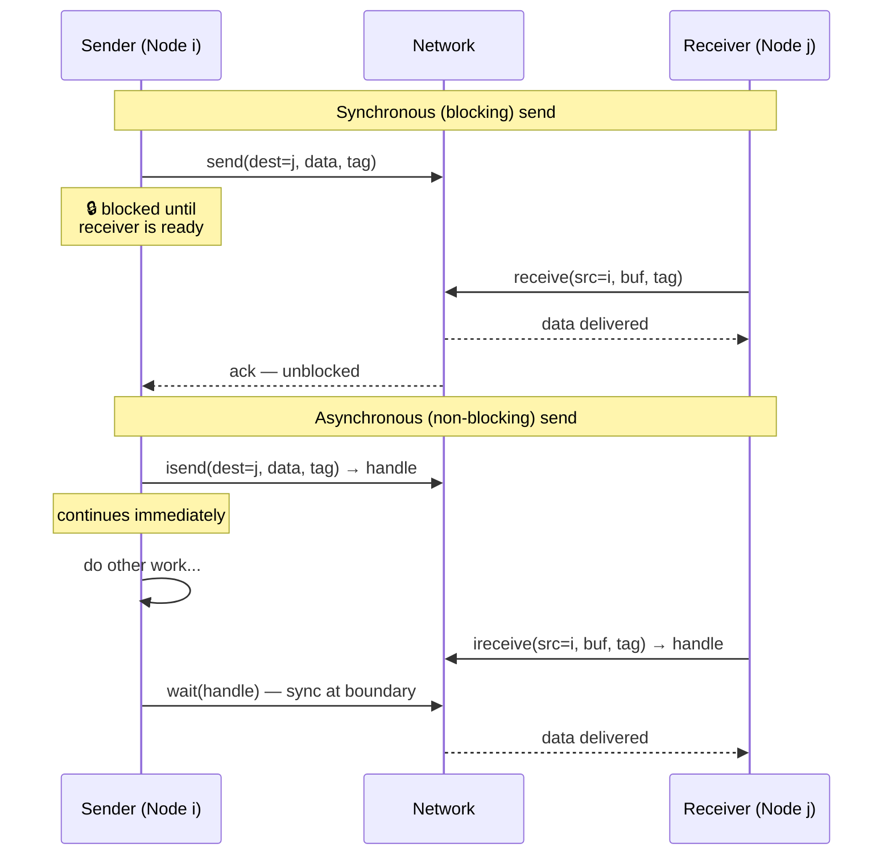
```mermaid
sequenceDiagram
    participant S as Sender (Node i)
    participant NET as Network
    participant R as Receiver (Node j)

    Note over S,R: Synchronous (blocking) send
    S->>NET: send(dest=j, data, tag)
    Note over S: 🔒 blocked until<br/>receiver is ready
    R->>NET: receive(src=i, buf, tag)
    NET-->>R: data delivered
    NET-->>S: ack — unblocked

    Note over S,R: Asynchronous (non-blocking) send
    S->>NET: isend(dest=j, data, tag) → handle
    Note over S: continues immediately
    S->>S: do other work...
    R->>NET: ireceive(src=i, buf, tag) → handle
    S->>NET: wait(handle) — sync at boundary
    NET-->>R: data delivered
```

| Mode | Sender blocks? | Receiver buffers? | Risk |
|---|---|---|---|
| **Synchronous send** | Until recv posted | No | Deadlock if both sides block |
| **Buffered send** | Until copied to system buffer | Yes | Buffer exhaustion under load |
| **Non-blocking (isend/irecv)** | No | Yes | Must not touch buffer until `wait()` |
| **Ready send** | No | No | UB if recv not already posted |

> **Deadlock pattern to avoid:** two nodes each doing `send` before `receive` on the same channel — both block forever. Always order operations or use non-blocking variants.

---

## 5. Message Latency & Bandwidth Model

The **α-β model** (also called the linear cost model) is the standard mental model for predicting message cost:

```
T(n) = α + β × n

  α  = latency    (fixed per-message overhead, µs)
  β  = inverse bandwidth (time per byte, = 1/BW)
  n  = message size in bytes
```

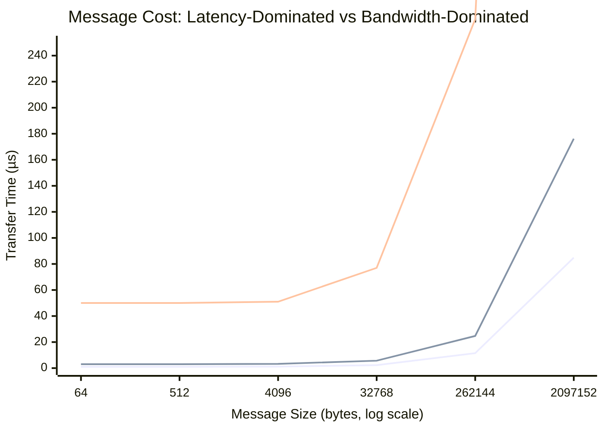
```mermaid
xychart-beta
    title "Message Cost: Latency-Dominated vs Bandwidth-Dominated"
    x-axis "Message Size (bytes, log scale)" [64, 512, 4096, 32768, 262144, 2097152]
    y-axis "Transfer Time (µs)" 0 --> 250
    line "InfiniBand HDR (α=1µs, BW=25GB/s)"  [1.0, 1.0, 1.2, 2.3, 11.5, 84.8]
    line "100GbE RoCE (α=3µs, BW=12GB/s)"     [3.0, 3.0, 3.3, 5.7, 24.7, 176.2]
    line "TCP/IP 10GbE (α=50µs, BW=1.2GB/s)"  [50, 50, 51, 77, 268, 1797]
```

**Design implications:**

- For **small messages** (< 4 KB): latency `α` dominates — batch messages, avoid chatty protocols
- For **large messages** (> 1 MB): bandwidth `β×n` dominates — optimise for throughput (pipelining, RDMA)
- **RDMA** (Remote Direct Memory Access) bypasses the kernel entirely, reducing α to < 1 µs — critical for LLM gradient all-reduce

---

## 6. Collective Communication Patterns

Multicomputer algorithms are built on collective operations that the MPI standard formalises. Understanding their complexity is essential for reasoning about distributed training performance.

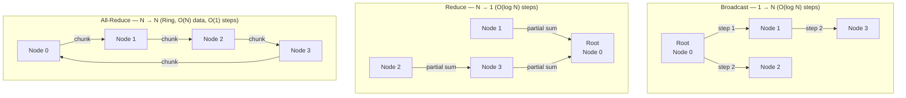
```mermaid
graph TD
    subgraph Broadcast["Broadcast — 1 → N (O(log N) steps)"]
        B0["Root\nNode 0"] -->|step 1| B1["Node 1"]
        B0 -->|step 2| B2["Node 2"]
        B1 -->|step 2| B3["Node 3"]
    end

    subgraph Reduce["Reduce — N → 1 (O(log N) steps)"]
        R1["Node 1"] -->|partial sum| R0["Root\nNode 0"]
        R2["Node 2"] -->|partial sum| R3["Node 3"]
        R3 -->|partial sum| R0
    end

    subgraph AllReduce["All-Reduce — N → N (Ring, O(N) data, O(1) steps)"]
        AR0["Node 0"] -->|chunk| AR1["Node 1"]
        AR1 -->|chunk| AR2["Node 2"]
        AR2 -->|chunk| AR3["Node 3"]
        AR3 -->|chunk| AR0
    end
```

| Operation | Description | Time Complexity | Key Usage |
|---|---|---|---|
| **Broadcast** | Root sends same data to all | O(α log N + β M) | Parameter server push |
| **Scatter** | Root sends different chunk to each | O(α log N + β M) | Data sharding |
| **Gather** | All send chunks to root | O(α log N + β M) | Gradient collection |
| **Reduce** | All contribute, root gets aggregate | O(α log N + β M) | Loss aggregation |
| **All-Reduce** | All contribute, **all** get aggregate | O(α log N + 2β M) | **DDP gradient sync** |
| **All-to-All** | Each node sends unique data to every other | O(α N + β M) | Expert routing in MoE |

> **All-Reduce is the hot path in distributed DNN training.** Horovod, PyTorch DDP, and NCCL all implement ring-all-reduce or tree-all-reduce. Optimising its latency = directly improving training step time.

---

## 7. Data Partitioning Across Nodes

How you partition data across nodes determines load balance, communication volume, and fault blast radius.

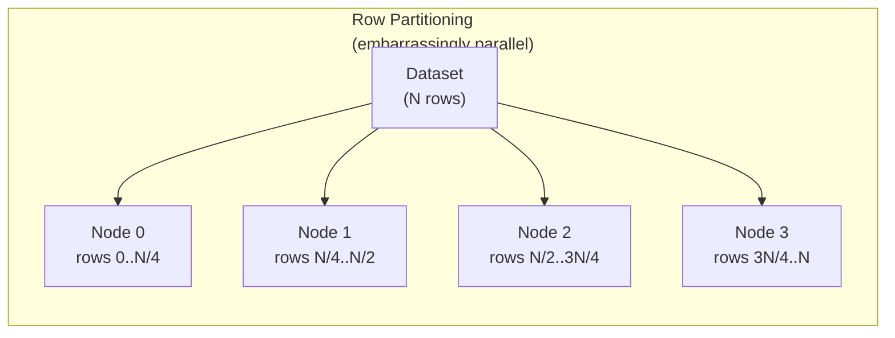
```mermaid
graph LR
    subgraph RowPart["Row Partitioning\n(embarrassingly parallel)"]
        D["Dataset\n(N rows)"] --> R1["Node 0\nrows 0..N/4"]
        D --> R2["Node 1\nrows N/4..N/2"]
        D --> R3["Node 2\nrows N/2..3N/4"]
        D --> R4["Node 3\nrows 3N/4..N"]
    end
```

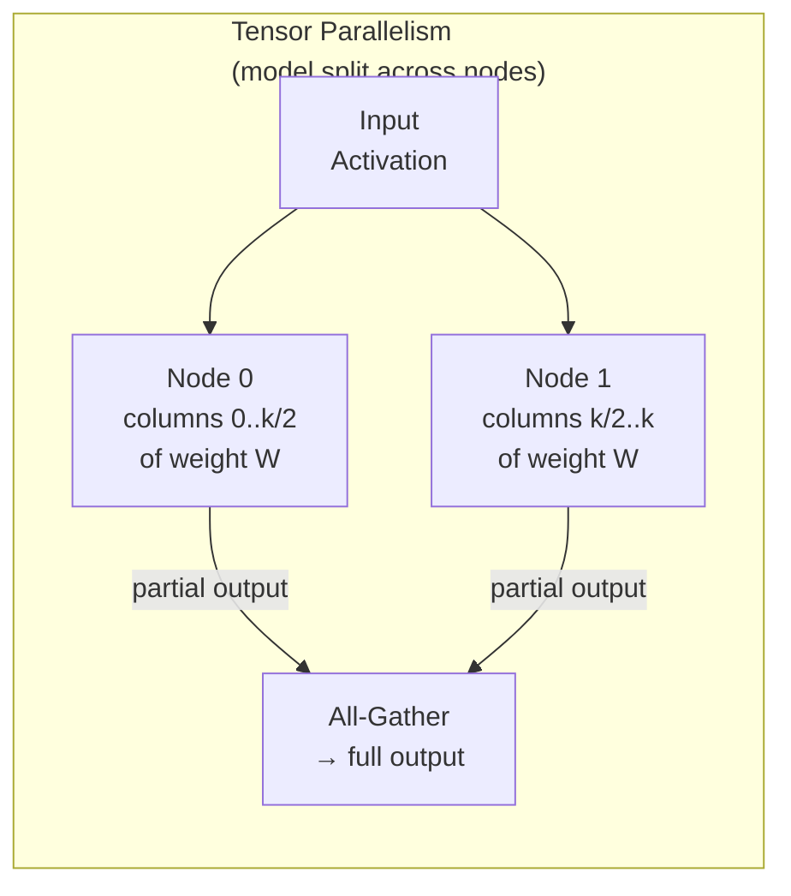
```mermaid
graph LR
    subgraph TP["Tensor Parallelism\n(model split across nodes)"]
        IN["Input\nActivation"] --> S1["Node 0\ncolumns 0..k/2\nof weight W"]
        IN --> S2["Node 1\ncolumns k/2..k\nof weight W"]
        S1 -->|partial output| AG["All-Gather\n→ full output"]
        S2 -->|partial output| AG
    end
```

| Strategy | What is partitioned | Communication | Best for |
|---|---|---|---|
| **Data Parallelism** | Input batch | All-Reduce gradients | Training with models that fit on 1 GPU |
| **Tensor Parallelism** | Weight matrices (column/row) | All-Gather / Reduce-Scatter per layer | Large layers (attention, FFN) |
| **Pipeline Parallelism** | Model layers across stages | Point-to-point activations/gradients | Very deep models |
| **Expert Parallelism** | MoE expert weights | All-to-All token routing | Sparse models (GPT-MoE, Mixtral) |
| **Sequence Parallelism** | Sequence length dimension | Ring all-reduce on attention | Long-context LLMs (100K+ tokens) |

---

## 8. Modern Multicomputers — The LLM Era

Large Language Models have made multicomputer architecture a first-class engineering concern again. Training GPT-4-class models requires **O(10,000–100,000 GPUs** running as a tightly-coupled multicomputer.

### 8.1 GPU Cluster as a Multicomputer

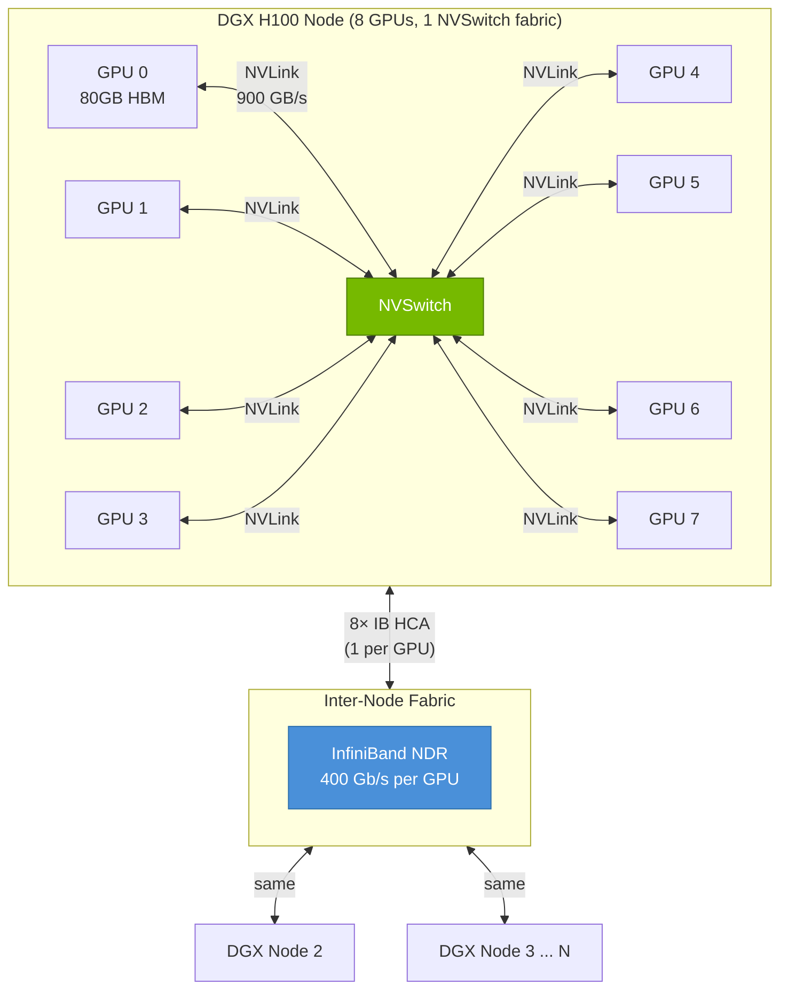
```mermaid
graph TD
    subgraph DGX["DGX H100 Node (8 GPUs, 1 NVSwitch fabric)"]
        G0["GPU 0\n80GB HBM"] <-->|NVLink\n900 GB/s| NVS["NVSwitch"]
        G1["GPU 1"] <-->|NVLink| NVS
        G2["GPU 2"] <-->|NVLink| NVS
        G3["GPU 3"] <-->|NVLink| NVS
        NVS <-->|NVLink| G4["GPU 4"]
        NVS <-->|NVLink| G5["GPU 5"]
        NVS <-->|NVLink| G6["GPU 6"]
        NVS <-->|NVLink| G7["GPU 7"]
    end

    subgraph Fabric["Inter-Node Fabric"]
        IB["InfiniBand NDR\n400 Gb/s per GPU"]
    end

    DGX <-->|"8× IB HCA\n(1 per GPU)"| Fabric
    Fabric <-->|same| DGX2["DGX Node 2"]
    Fabric <-->|same| DGX3["DGX Node 3 ... N"]

    style NVS fill:#76b900,color:#fff,stroke:#4a7a00
    style IB fill:#4a90d9,color:#fff,stroke:#2c6fad
```

**Bandwidth hierarchy (H100 cluster):**
- **Intra-node (NVLink):** 900 GB/s bidirectional — treat as shared memory
- **Inter-node (InfiniBand NDR):** ~50 GB/s per GPU — the multicomputer bottleneck
- **Ratio: 18:1** — communication locality is paramount; always prefer intra-node collectives

### 8.2 3D / 4D Parallelism in LLM Training

Modern frameworks (Megatron-LM, DeepSpeed, PyTorch FSDP) compose multiple parallelism axes:

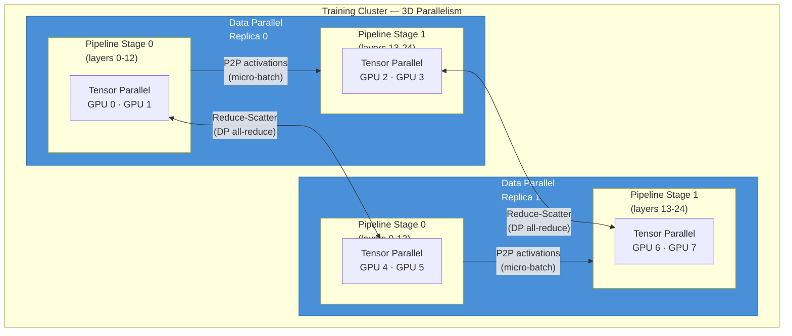
```mermaid
graph TD
    subgraph Cluster["Training Cluster — 3D Parallelism"]
        subgraph DP["Data Parallel\nReplica 0"]
            subgraph PP0["Pipeline Stage 0\n(layers 0-12)"]
                TP0["Tensor Parallel\nGPU 0 · GPU 1"]
            end
            subgraph PP1["Pipeline Stage 1\n(layers 13-24)"]
                TP1["Tensor Parallel\nGPU 2 · GPU 3"]
            end
        end
        subgraph DP2["Data Parallel\nReplica 1"]
            subgraph PP2["Pipeline Stage 0\n(layers 0-12)"]
                TP2["Tensor Parallel\nGPU 4 · GPU 5"]
            end
            subgraph PP3["Pipeline Stage 1\n(layers 13-24)"]
                TP3["Tensor Parallel\nGPU 6 · GPU 7"]
            end
        end
    end

    TP0 <-->|"Reduce-Scatter\n(DP all-reduce)"| TP2
    TP1 <-->|"Reduce-Scatter\n(DP all-reduce)"| TP3
    PP0 -->|"P2P activations\n(micro-batch)"| PP1
    PP2 -->|"P2P activations\n(micro-batch)"| PP3

    style DP fill:#4a90d9,color:#fff,stroke:#2c6fad
    style DP2 fill:#4a90d9,color:#fff,stroke:#2c6fad
```

### 8.3 Inference Serving — Multicomputer Constraints

LLM inference introduces different multicomputer trade-offs than training:

| Phase | Bottleneck | Strategy |
|---|---|---|
| **Prefill** (prompt processing) | Compute-bound (matrix multiply) | Tensor parallel across GPUs; batch requests |
| **Decode** (token generation) | Memory-bandwidth-bound (KV cache reads) | Pipeline or replicate; KV cache offloading |
| **KV Cache transfer** | Network bandwidth (disaggregated prefill/decode) | Prefill-Decode disaggregation (PD separation) |
| **Expert routing (MoE)** | All-to-All latency | Expert colocation; token dropping under load |

> **Disaggregated prefill/decode** (used by Zhipu AI, ByteDance, Lepton) physically separates prefill nodes (high FLOPS) from decode nodes (high HBM bandwidth). This is a pure multicomputer architecture applied at the inference layer.

### 8.4 Collective Communication at LLM Scale

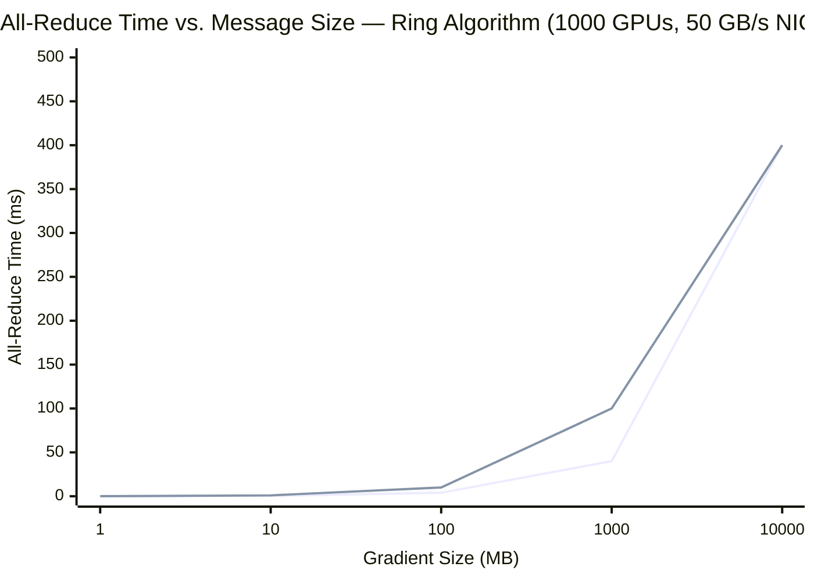
```mermaid
xychart-beta
    title "All-Reduce Time vs. Message Size — Ring Algorithm (1000 GPUs, 50 GB/s NIC)"
    x-axis "Gradient Size (MB)" [1, 10, 100, 1000, 10000]
    y-axis "All-Reduce Time (ms)" 0 --> 500
    line "Ring All-Reduce"   [0.04, 0.4, 4.0, 40, 400]
    line "Tree All-Reduce"   [0.10, 1.0, 10,  100, 400]
```

- **Ring all-reduce** sends `2(N-1)/N × M` bytes per GPU regardless of N — scales well
- **Tree all-reduce** has O(log N) steps but O(N) bandwidth — degrades at scale
- **NCCL / RCCL** select the algorithm per message size and topology automatically

---

## 9. L6+ Design Trade-offs

### 9.1 When to choose multicomputer architecture

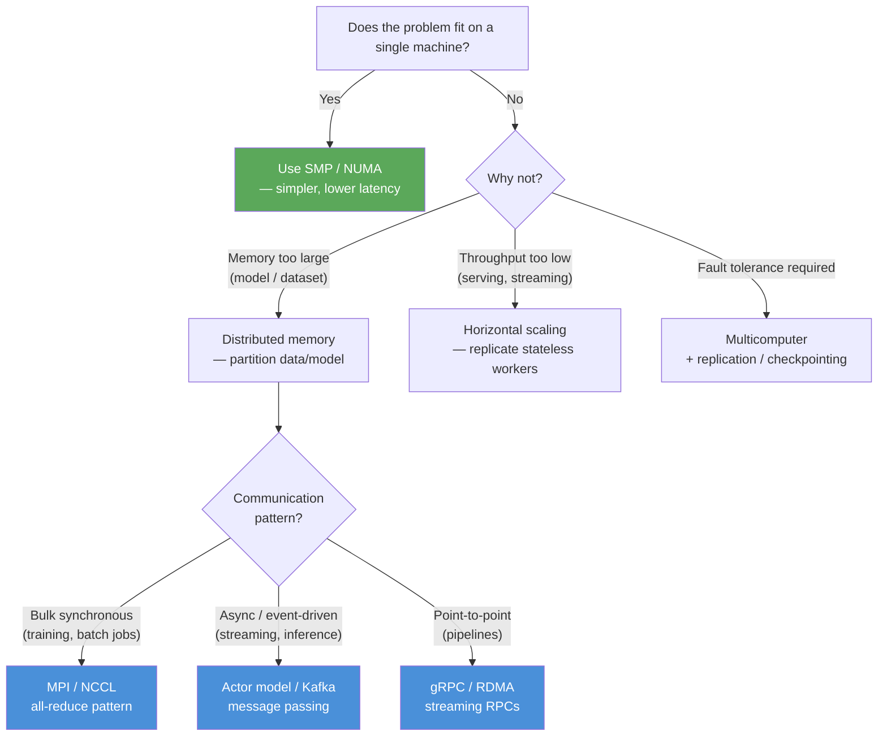
```mermaid
flowchart TD
    A["Does the problem fit on a single machine?"] -->|Yes| B["Use SMP / NUMA\n— simpler, lower latency"]
    A -->|No| C{Why not?}
    C -->|"Memory too large\n(model / dataset)"| D["Distributed memory\n— partition data/model"]
    C -->|"Throughput too low\n(serving, streaming)"| E["Horizontal scaling\n— replicate stateless workers"]
    C -->|"Fault tolerance required"| F["Multicomputer\n+ replication / checkpointing"]

    D --> G{Communication\npattern?}
    G -->|"Bulk synchronous\n(training, batch jobs)"| G1["MPI / NCCL\nall-reduce pattern"]
    G -->|"Async / event-driven\n(streaming, inference)"| G2["Actor model / Kafka\nmessage passing"]
    G -->|"Point-to-point\n(pipelines)"| G3["gRPC / RDMA\nstreaming RPCs"]

    style B fill:#5ba85a,color:#fff
    style G1 fill:#4a90d9,color:#fff
    style G2 fill:#4a90d9,color:#fff
    style G3 fill:#4a90d9,color:#fff
```

### 9.2 The 8 Fallacies of Distributed Computing (applied)

Every multicomputer system is subject to Peter Deutsch's fallacies — treat these as a checklist:

| Fallacy | Reality at L6+ Scale |
|---|---|
| The network is reliable | Plan for packet loss, NIC failures, rack-level outages |
| Latency is zero | α in the α-β model is never zero; budget µs per hop |
| Bandwidth is infinite | All-reduce over 10K GPUs saturates 400G IB links |
| The network is secure | Zero-trust between nodes; encrypt inter-node traffic |
| Topology doesn't change | Node failures, maintenance windows, spot preemptions |
| There is one administrator | Multi-tenant clusters share fabric — noisy neighbours |
| Transport cost is zero | Egress fees, cross-AZ bandwidth charges matter at scale |
| The network is homogeneous | Mixed GPU generations, mixed NIC speeds in a single job |

### 9.3 Checkpointing Strategy

Long-running multicomputer jobs (LLM training: weeks) require robust checkpointing:

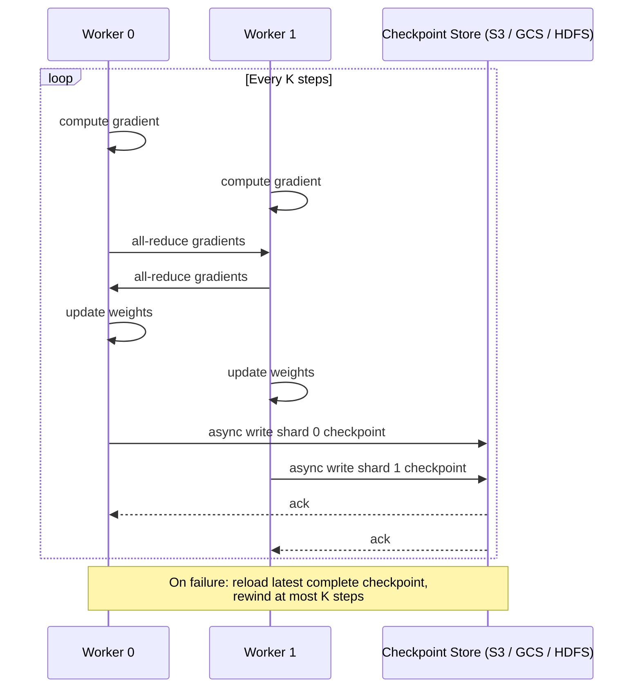
```mermaid
sequenceDiagram
    participant W0 as Worker 0
    participant W1 as Worker 1
    participant CS as Checkpoint Store (S3 / GCS / HDFS)

    loop Every K steps
        W0->>W0: compute gradient
        W1->>W1: compute gradient
        W0->>W1: all-reduce gradients
        W1->>W0: all-reduce gradients
        W0->>W0: update weights
        W1->>W1: update weights
        W0->>CS: async write shard 0 checkpoint
        W1->>CS: async write shard 1 checkpoint
        CS-->>W0: ack
        CS-->>W1: ack
    end

    Note over W0,CS: On failure: reload latest complete checkpoint,<br/>rewind at most K steps
```

**Strategies by cost:**
- **Full checkpoint:** snapshot all weights — safe, expensive for 100B+ param models
- **Sharded checkpoint:** each worker saves its own shard — parallelises I/O, requires all-gather on resume
- **Async checkpoint (Google Pathways / PyTorch AsyncSaver):** checkpoint in background while training continues — near-zero overhead
- **Redundant in-memory checkpoint (Gemini):** keep a copy on a buddy node's CPU RAM — sub-second recovery

---

## 10. Key Decision Framework

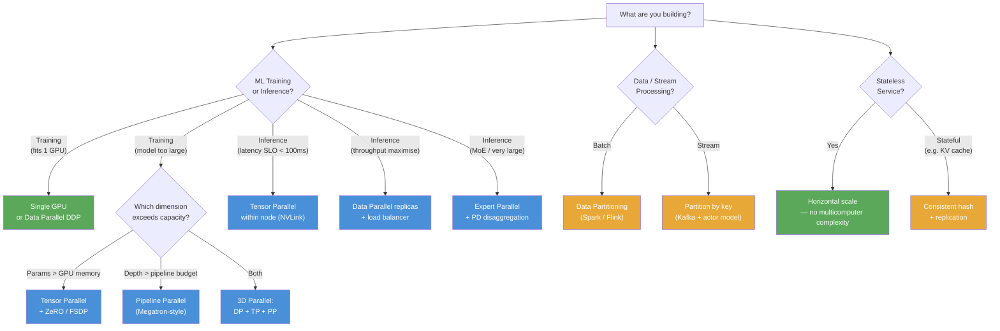
```mermaid
flowchart TD
    START["What are you building?"] --> ML{ML Training\nor Inference?}

    ML -->|"Training\n(fits 1 GPU)"| T1["Single GPU\nor Data Parallel DDP"]
    ML -->|"Training\n(model too large)"| T2{Which dimension\nexceeds capacity?}
    T2 -->|"Params > GPU memory"| T2a["Tensor Parallel\n+ ZeRO / FSDP"]
    T2 -->|"Depth > pipeline budget"| T2b["Pipeline Parallel\n(Megatron-style)"]
    T2 -->|"Both"| T2c["3D Parallel:\nDP + TP + PP"]

    ML -->|"Inference\n(latency SLO < 100ms)"| I1["Tensor Parallel\nwithin node (NVLink)"]
    ML -->|"Inference\n(throughput maximise)"| I2["Data Parallel replicas\n+ load balancer"]
    ML -->|"Inference\n(MoE / very large)"| I3["Expert Parallel\n+ PD disaggregation"]

    START --> DS{Data / Stream\nProcessing?}
    DS -->|"Batch"| DS1["Data Partitioning\n(Spark / Flink)"]
    DS -->|"Stream"| DS2["Partition by key\n(Kafka + actor model)"]

    START --> SVC{Stateless\nService?}
    SVC -->|Yes| SVC1["Horizontal scale\n— no multicomputer complexity"]
    SVC -->|"Stateful\n(e.g. KV cache)"| SVC2["Consistent hash\n+ replication"]

    style T1 fill:#5ba85a,color:#fff
    style T2a fill:#4a90d9,color:#fff
    style T2b fill:#4a90d9,color:#fff
    style T2c fill:#4a90d9,color:#fff
    style I1 fill:#4a90d9,color:#fff
    style I2 fill:#4a90d9,color:#fff
    style I3 fill:#4a90d9,color:#fff
    style DS1 fill:#e8a838,color:#fff
    style DS2 fill:#e8a838,color:#fff
    style SVC1 fill:#5ba85a,color:#fff
    style SVC2 fill:#e8a838,color:#fff
```

---

## 11. Further Reading

| Topic | Link |
|---|---|
| CMU 15-418 Parallel Computer Architecture | http://15418.courses.cs.cmu.edu/fall2017/ |
| MPI Standard | https://www.mpi-forum.org/docs/ |
| NCCL (NVIDIA Collective Communications Library) | https://docs.nvidia.com/deeplearning/nccl/user-guide/docs/index.html |
| Megatron-LM: 3D Parallelism paper | https://arxiv.org/abs/2104.04473 |
| DeepSpeed ZeRO paper | https://arxiv.org/abs/1910.02054 |
| Pathways: Google's next-gen ML infrastructure | https://arxiv.org/abs/2203.12533 |
| Orca: Continuous batching for LLM serving | https://www.usenix.org/conference/osdi22/presentation/yu |
| PD disaggregation (Splitwise) | https://arxiv.org/abs/2311.18677 |
| The α-β communication model | https://htor.inf.ethz.ch/publications/img/hoefler-modeling.pdf |
| Reliable, Scalable and Maintainable Systems (Google SRE) | https://sre.google/sre-book/table-of-contents/ |

