# Process Communication

> **Audience:** L6+ engineers designing inter-process communication (IPC) and distributed messaging pipelines.  
> **Context:** Chapter 4 of the parallel programming series — how independent processes coordinate without shared memory.

---

## Table of Contents

1. [What is Process Communication?](#1-what-is-process-communication)
2. [CSP — The Theoretical Foundation](#2-csp--the-theoretical-foundation)
3. [IPC Mechanism Spectrum](#3-ipc-mechanism-spectrum)
4. [Channel-Based Communication](#4-channel-based-communication)
5. [Pipeline Parallelism via Channels](#5-pipeline-parallelism-via-channels)
6. [Producer-Consumer: Reactive Package Shipping](#6-producer-consumer-reactive-package-shipping)
7. [Backpressure & Flow Control](#7-backpressure--flow-control)
8. [Process Communication in the LLM Era](#8-process-communication-in-the-llm-era)
9. [L6+ Design Trade-offs](#9-l6-design-trade-offs)
10. [Key Decision Framework](#10-key-decision-framework)
11. [Further Reading](#11-further-reading)

---

## 1. What is Process Communication?

Processes are isolated units of execution — each has its own address space and cannot directly read another's memory. **Process communication** is the set of mechanisms by which they coordinate, share data, and synchronise.

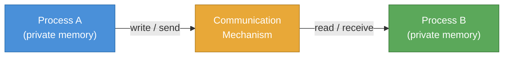

The core tension:
- **Shared memory** (multiprocessor) — fast, but requires locks; blast radius is the entire machine
- **Message passing** (multicomputer / IPC) — explicit, safer isolation, composable pipelines

> For L6+, the question is never *"which mechanism works?"* — it's *"which mechanism's failure modes and scaling properties are acceptable for this system?"*

---

## 2. CSP — The Theoretical Foundation

**Communicating Sequential Processes (CSP)**, introduced by Tony Hoare (1978), is the mathematical foundation for channel-based IPC.

> *"It is a member of the family of mathematical theories of concurrency known as process algebras, or process calculi, based on message passing via channels."*  
> — [Wikipedia: CSP](https://en.wikipedia.org/wiki/Communicating_sequential_processes)

**Core CSP primitives:**

| Primitive | Meaning |
|---|---|
| `P ! v` | Process P sends value `v` on a channel |
| `P ? x` | Process P receives a value into `x` from a channel |
| `P ‖ Q` | P and Q run in parallel |
| `P → Q` | P must complete before Q starts (sequence) |
| `P □ Q` | External choice — whoever sends first wins |

**Why it matters today:**
- Go's goroutines + channels are a direct implementation of CSP
- Kotlin's `kotlinx.coroutines` channels follow CSP semantics
- Clojure's `core.async` is a CSP library for the JVM
- Erlang/Elixir processes and `GenStage` are CSP-inspired
- LLM inference pipelines (prefill → decode → detokenise) are pipelines of CSP processes

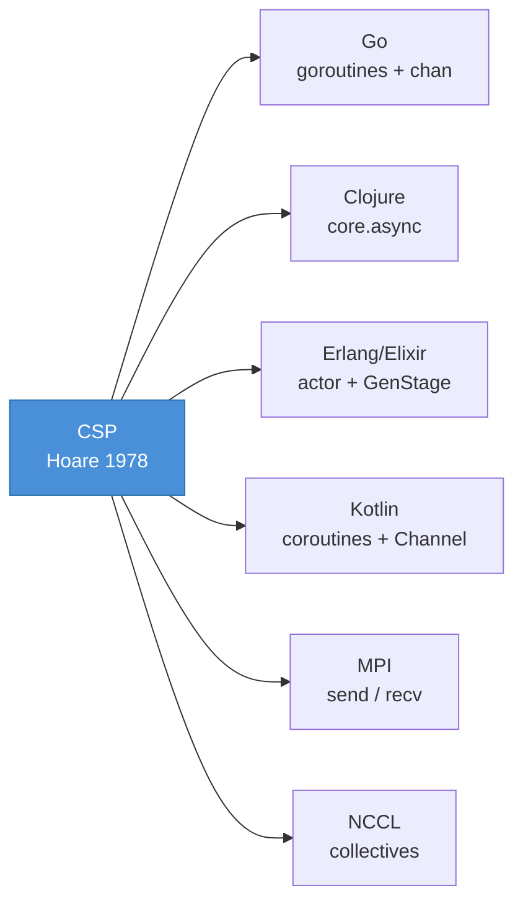

---

## 3. IPC Mechanism Spectrum

[How do two JVM processes talk to one another?](https://stackoverflow.com/a/10942526/432903)

The answer is: *it depends on latency requirements, data volume, and failure semantics*.

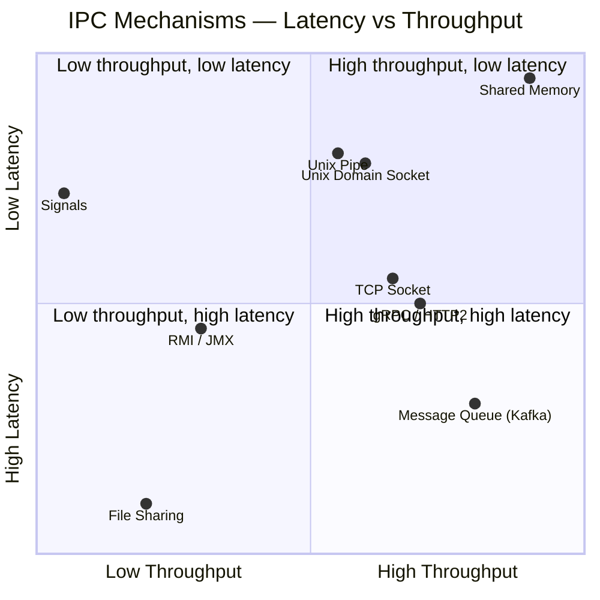

| Mechanism | Latency | Throughput | Persistence | Best For |
|---|---|---|---|---|
| **Shared memory** | ns | TB/s | No | Intra-machine, same-host GPU↔CPU |
| **Unix pipe / FIFO** | µs | ~GB/s | No | Shell pipelines, co-located processes |
| **Unix domain socket** | µs | ~GB/s | No | Local IPC (Docker sidecar, gRPC over UDS) |
| **TCP socket** | µs–ms | ~GB/s | No | General networked IPC |
| **gRPC / HTTP2** | µs–ms | ~GB/s | No | Service-to-service RPC; streaming |
| **Message queue (Kafka)** | ms | TB/day | Yes (log) | Event-driven, fan-out, replay |
| **In-process channel (Go/Clojure)** | ns–µs | ~GB/s | No | Goroutine/coroutine coordination |
| **RMI / JMX** | ms | Low | No | JVM management, not hot-path |
| **File sharing** | ms–s | Disk bound | Yes | Batch hand-off, checkpoints |
| **Signals** | µs | Minimal (1 int) | No | OS-level notification only |

---

## 4. Channel-Based Communication

### 4.1 Go Channels (CSP)

Channels are first-class typed conduits. The `select` statement implements non-blocking multi-channel dispatch — equivalent to CSP's external choice (`□`).

```go
// parallel_sum.go — two goroutines, one channel, reduce by receive
func sum(array []int, ch chan int) {
    s := 0
    for _, v := range array { s += v }
    ch <- s  // send
}

func main() {
    array := []int{1, 2, ..., 20}
    ch := make(chan int)

    go sum(array[:len(array)/2], ch)   // goroutine A
    go sum(array[len(array)/2:], ch)   // goroutine B

    x, y := <-ch, <-ch                // receive both — order non-deterministic
    fmt.Println(x + y)                 // 210
}
```

Non-blocking select with a `default` branch prevents goroutine starvation:

```go
// warehouse_units_flow_non_blocking.go
select {
case pkg := <-packagesStream:
    fmt.Println("received package", pkg)
case sig := <-signalsStream:
    fmt.Println("received signal", sig)
default:
    fmt.Println("no activity")   // never blocks
}
```

### 4.2 Clojure core.async Channels

`core.async` brings CSP channels to the JVM. `async/thread` runs blocking work on a thread pool; `go` blocks use lightweight state-machine continuations.

```clojure
;; reactive-package-shipping/core.clj
(def in-chan  (async/chan))
(def out-chan (async/chan))

;; 8 parallel consumers — each takes from in-chan, ships, puts to out-chan
(defn shipping-consumers [num-consumers]
  (dotimes [_ num-consumers]
    (async/thread
      (while true
        (let [package (async/<!! in-chan)  ; blocking take
              result  (ship-it package)]
          (async/>!! out-chan result))))))  ; blocking put

;; single aggregator drains out-chan
(defn shipping-aggregator []
  (async/thread
    (while true
      (println (async/<!! out-chan)))))
```

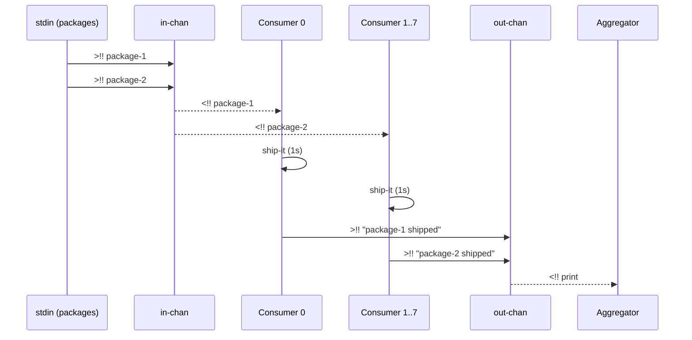

---

## 5. Pipeline Parallelism via Channels

A **pipeline** chains processes where each stage consumes from its upstream channel and produces to its downstream channel. This is the CSP `P ‖ Q ‖ R` composition pattern.

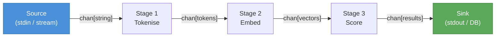

Go prime sieve — an archetypal CSP pipeline where each stage filters composites:

```go
// primes_sieve.go
primeStream := make(chan int)

go func() {
    for n := 0; n < 1000; n++ {
        if IsPrime(n) {
            primeStream <- n   // produce
        }
    }
    close(primeStream)
}()

for p := range primeStream {   // consume
    println(p)
}
```

**Pipeline properties:**
- **Throughput** = min(stage throughput) — the slowest stage is the bottleneck
- **Latency** = sum(stage latencies) — each item passes all stages
- **Parallelism** = fan-out at each stage independently

---

## 6. Producer-Consumer: Reactive Package Shipping

The warehouse shipping example demonstrates a classic **bounded producer-consumer** pattern backed by core.async channels:

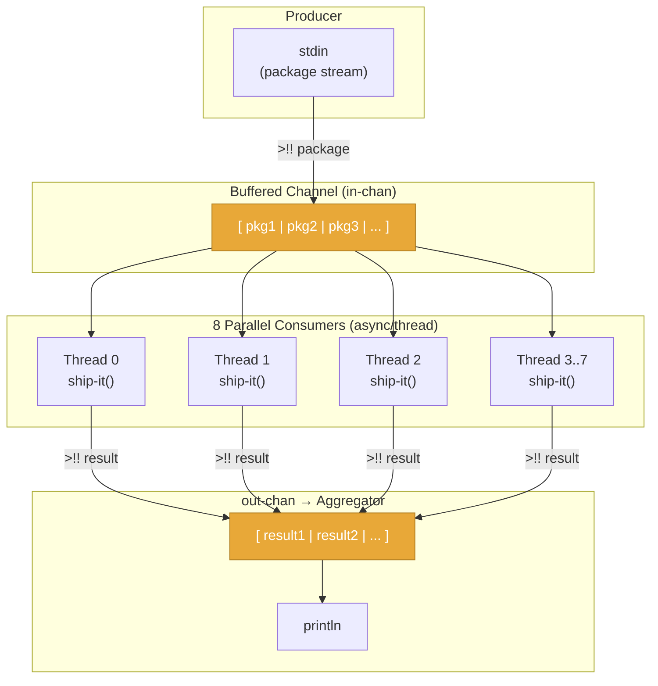

**Observed behaviour (8 consumers, 1s/package):**
- Packages are processed in parallel, not submission order
- Wall time ≈ `⌈N/8⌉ × 1s` — matches Amdahl's parallel batch formula

**Run:**
```bash
lein run async < input-events
# package-1 shipped
# package-4 shipped   ← out-of-order confirms parallelism
# package-2 shipped
```

---

## 7. Backpressure & Flow Control

An unbounded channel between a fast producer and slow consumer causes **unbounded memory growth** — the channel becomes an implicit heap buffer.

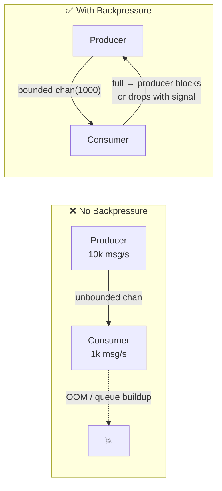

| Strategy | Mechanism | Risk |
|---|---|---|
| **Block producer** | Bounded channel, synchronous send | Producer stalls; latency spike upstream |
| **Drop oldest** | Ring buffer / `sliding` buffer | Data loss — acceptable for metrics/logs |
| **Drop newest** | `dropping` buffer | Data loss — acceptable for non-critical events |
| **Signal upstream** | gRPC flow control / Reactive Streams | Propagates pressure through the whole pipeline |
| **Shed load** | Circuit breaker + reject with 503 | Protects system; requires client retry |

> **Akka Streams and Reactive Streams** (RS spec, implemented by RxJava, Project Reactor, Akka) standardise backpressure as a protocol: downstream signals demand to upstream, which produces at most that many elements. This prevents both starvation and overflow.

Reference: [Akka Stream Parallelism](https://doc.akka.io/docs/akka/2.5.6/scala/stream/stream-parallelism.html)

---

## 8. Process Communication in the LLM Era

LLM systems are **pipelines of processes communicating over channels** at every layer of the stack. The same primitives — channels, backpressure, fan-out, fan-in — govern throughput and latency from token generation to multi-agent orchestration.

### 8.1 LLM Inference as a CSP Pipeline

```mermaid
graph LR
    subgraph Ingress
        REQ["HTTP Request\n(prompt)"]
    end
    subgraph Scheduler["Continuous Batch Scheduler"]
        SCHED["KV Cache\nManager"]
    end
    subgraph Prefill["Prefill Workers\n(compute-bound)"]
        PF0["GPU 0..3\nAttention + FFN\n(prompt tokens)"]
    end
    subgraph KVXfer["KV Cache Transfer\n(inter-node channel)"]
        KV["RDMA / NVLink\nchan[KV tensors]"]
    end
    subgraph Decode["Decode Workers\n(memory-bw-bound)"]
        DC0["GPU 4..7\nAutoregressive\ntoken gen"]
    end
    subgraph Detok["Detokeniser"]
        DT["token → text"]
    end
    subgraph SSE["Response Stream"]
        RESP["SSE / gRPC stream\n(token-by-token)"]
    end

    REQ --> SCHED
    SCHED -->|"scheduled batch"| PF0
    PF0 -->|"KV cache"| KV
    KV --> DC0
    DC0 -->|"token id chan"| DT
    DT -->|"text chunk chan"| RESP

    style KV fill:#e8a838,color:#fff,stroke:#b07d20
    style SCHED fill:#4a90d9,color:#fff,stroke:#2c6fad
```

Each arrow is a **channel** — a typed, bounded conduit between processes. Backpressure at any stage (slow decode, KV transfer bottleneck) propagates upstream, controlling admission into the scheduler.

### 8.2 Multi-Agent Systems as Communicating Processes

Multi-agent LLM frameworks (LangGraph, AutoGen, CrewAI) are direct implementations of CSP:

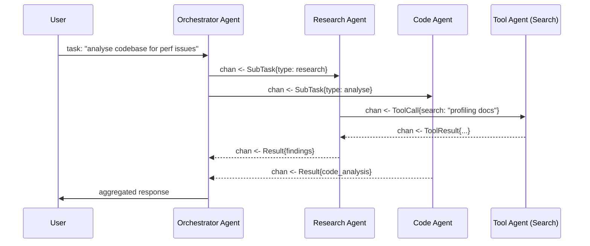

**The channel is the API.** Each agent is a CSP process; the orchestrator implements fan-out (scatter tasks) and fan-in (gather results) — identical to MPI's `scatter` / `gather` collectives.

### 8.3 Streaming Token Generation — SSE as a Channel

Server-Sent Events and gRPC server streaming are I/O-level channels:

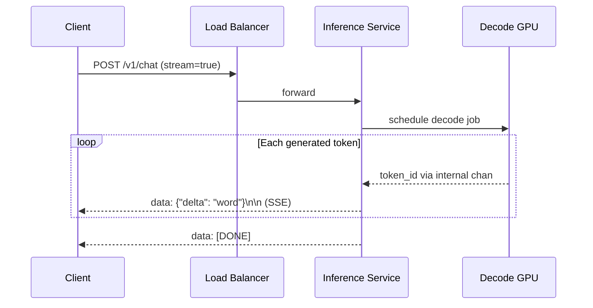

**Backpressure concern:** if the client is slow (mobile connection), the SSE write buffer fills. The inference service must either:
- **Drop the connection** (timeout) — simplest
- **Pause generation** — wastes GPU compute held idle
- **Buffer tokens in a ring buffer** with a max size — then drop-oldest if full

### 8.4 Inter-Service Communication Patterns at LLM Scale

| Pattern | Protocol | When to Use |
|---|---|---|
| **Sync RPC** | gRPC unary | Low-latency reads; < 100ms SLO |
| **Streaming RPC** | gRPC server stream | Token streaming, log tailing |
| **Event-driven** | Kafka / Pub-Sub | Audit logs, async fine-tune triggers, model eval jobs |
| **Shared KV store** | Redis / etcd | KV cache coordination, session state |
| **RDMA channel** | InfiniBand / RoCE | GPU↔GPU KV cache transfer (PD disaggregation) |
| **In-process channel** | Go chan / core.async | Co-located pipeline stages on same host |

### 8.5 KV Cache as a Distributed Channel (PD Disaggregation)

In **prefill-decode (PD) disaggregated** inference architectures, the KV cache produced by prefill nodes must be transmitted to decode nodes. This is a **point-to-point channel** between two process groups:

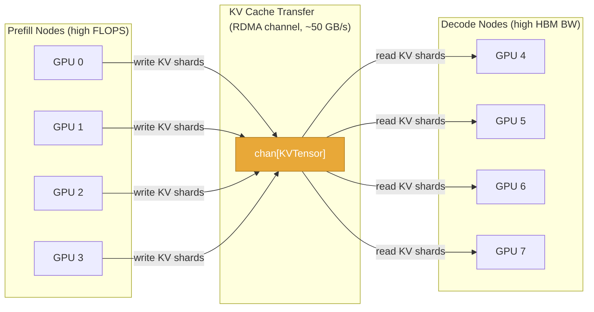

**The transfer is the bottleneck:** a 128K-token context with a 70B model produces ~14 GB of KV data per request. At 50 GB/s IB, that's 280ms of pure transfer latency before decode can start — making KV compression (quantisation to FP8/INT4) and selective transfer (sparse KV) active research areas.

---

## 9. L6+ Design Trade-offs

### 9.1 Synchronous vs. Asynchronous Communication

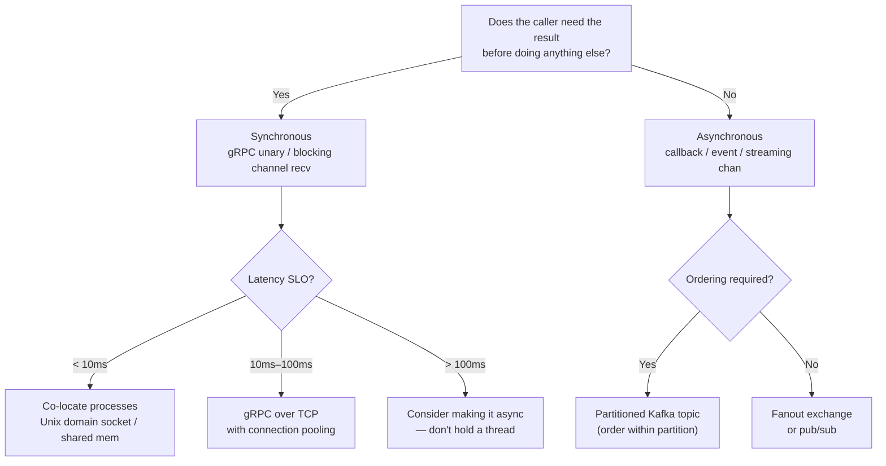

### 9.2 Channel Sizing — The Hidden Knob

A channel's buffer size is a **latency vs. memory vs. failure-masking** trade-off:

| Buffer size | Effect |
|---|---|
| `0` (unbuffered / synchronous) | Sender and receiver must rendezvous — maximum coupling, zero latency hiding |
| `1..N` (bounded) | Decouples bursts up to N; blocks when full — explicit backpressure |
| `∞` (unbounded) | Never blocks producer; OOM risk under sustained overload |

> **Rule:** always start bounded. Use unbounded only when you can prove the producer rate is always ≤ consumer rate, or data loss is acceptable.

### 9.3 Failure Modes Checklist

| Failure | Detection | Mitigation |
|---|---|---|
| **Slow consumer (queue buildup)** | Channel depth metric / consumer lag | Backpressure, scale consumers, drop policy |
| **Producer crash mid-send** | Receiver gets partial message | Framed messages with length prefix + checksum |
| **Network partition (TCP)** | Timeout / keepalive | Retry with idempotency keys; circuit breaker |
| **Channel deadlock** | Both ends waiting on each other | Timeout on all blocking ops; use `select` with `default` |
| **Hot partition (Kafka)** | Single-partition consumer lag | Re-key with higher-cardinality partition key |
| **KV cache transfer timeout** | Decode node receives partial tensor | Abort request; return 503; prefill node cleans up |

### 9.4 Observability

Every channel boundary is an observability point. Instrument:

```
channel_depth_gauge{name="in-chan"}          # queue depth
channel_send_duration_histogram              # producer-side latency
channel_recv_duration_histogram              # consumer-side latency (wait time)
consumer_lag_gauge{group, topic, partition}  # Kafka consumer lag
```

> **At L6+**, channel metrics are your first signal of cascading failures. A rising `in-chan` depth at 09:00 on a Monday is a traffic spike; a rising depth at 14:00 on idle Tuesday is a consumer bug.

---

## 10. Key Decision Framework

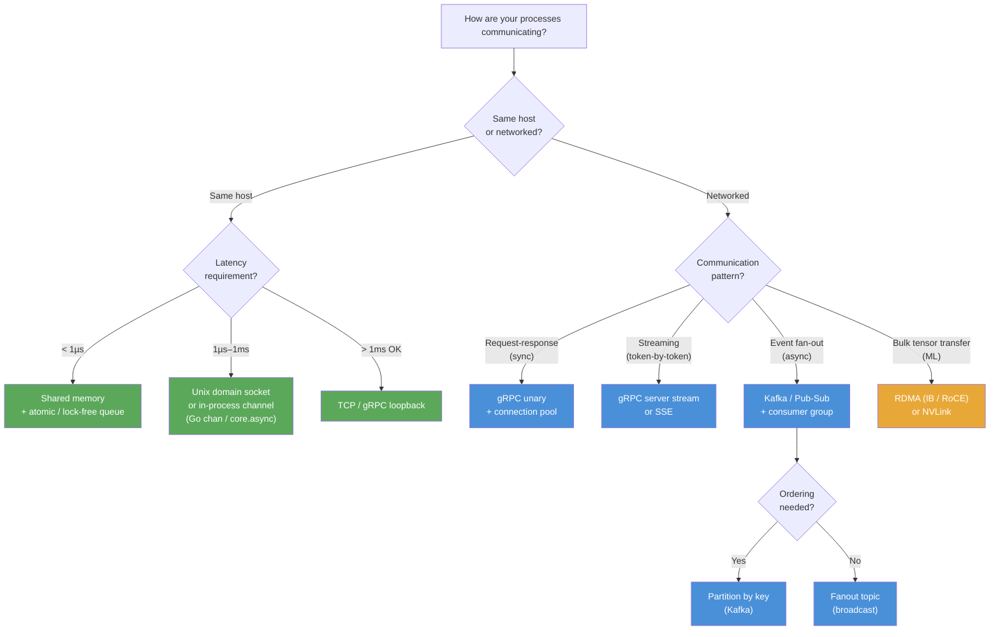

---

## 11. Further Reading

| Topic | Link |
|---|---|
| Communicating Sequential Processes — Hoare (1978) | http://www.cs.cmu.edu/afs/cs/usr/brookes/www/papers/hoare.pdf |
| CSP — Wikipedia | https://en.wikipedia.org/wiki/Communicating_sequential_processes |
| Akka Stream Parallelism | https://doc.akka.io/docs/akka/2.5.6/scala/stream/stream-parallelism.html |
| Go concurrency patterns (Pike) | https://go.dev/talks/2012/concurrency.slide |
| Clojure core.async guide | http://www.braveclojure.com/core-async/ |
| Reactive Streams specification | https://www.reactive-streams.org/ |
| Kafka: a distributed commit log | https://engineering.linkedin.com/distributed-systems/log-what-every-software-engineer-should-know-about-real-time-datas-unifying |
| Orca: continuous batching for LLM serving | https://www.usenix.org/conference/osdi22/presentation/yu |
| Splitwise: PD disaggregation | https://arxiv.org/abs/2311.18677 |
| LangGraph: agent communication model | https://langchain-ai.github.io/langgraph/ |

