# Synchronous Parallelism

> **Audience:** L6+ engineers reasoning about coordination, shared-state correctness, and synchronisation overhead at scale.  
> **Context:** Chapter 6 of the parallel programming series — how threads safely share state and synchronise progress without deadlock, livelock, or starvation.

---

## Table of Contents

1. [What is Synchronous Parallelism?](#1-what-is-synchronous-parallelism)
2. [The Java Memory Model — Why Synchronisation Exists](#2-the-java-memory-model--why-synchronisation-exists)
3. [Mutex — Exclusive Access](#3-mutex--exclusive-access)
4. [ReentrantLock — Structured Locking](#4-reentrantlock--structured-locking)
5. [Semaphore — Counted Access](#5-semaphore--counted-access)
6. [Monitor — Mutex + Condition](#6-monitor--mutex--condition)
7. [Barrier Synchronisation](#7-barrier-synchronisation)
8. [Lock Contention & Performance](#8-lock-contention--performance)
9. [Synchronisation in the LLM Era](#9-synchronisation-in-the-llm-era)
10. [L6+ Design Trade-offs](#10-l6-design-trade-offs)
11. [Key Decision Framework](#11-key-decision-framework)
12. [Further Reading](#12-further-reading)

---

## 1. What is Synchronous Parallelism?

**Synchronous parallelism** is parallelism with coordination — multiple threads execute simultaneously but must agree on ordering at certain points to maintain correctness over shared state.

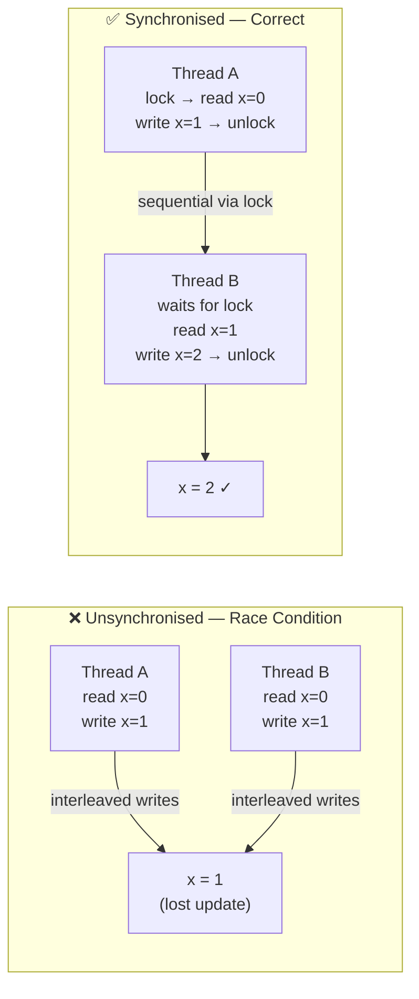

**The core trade-off:**

| | No synchronisation | Full synchronisation |
|---|---|---|
| **Throughput** | Maximum | Reduced (serialised critical sections) |
| **Correctness** | Undefined (data races) | Guaranteed |
| **Complexity** | Low | High (deadlock, priority inversion) |

> **L6+ framing:** synchronisation is a form of *intentional serialisation*. Every lock is a bottleneck you are accepting. The goal is to make critical sections as narrow as possible and to eliminate shared mutable state entirely where feasible.

---

## 2. The Java Memory Model — Why Synchronisation Exists

Without synchronisation, the JVM and CPU are free to **reorder** instructions and keep values in **per-CPU caches** — a thread's write may not be visible to another thread at all.

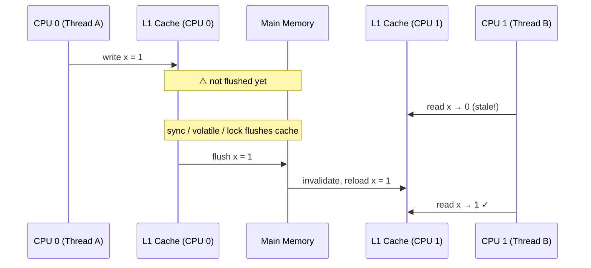

**Key JMM guarantees (`jsr-133`):**

| Mechanism | Visibility guarantee | Ordering guarantee |
|---|---|---|
| `volatile` read/write | Yes — flushes to main memory | Prevents reordering across the volatile access |
| `synchronized` block | Yes — on entry (read) and exit (write) | Full happens-before between lock/unlock pairs |
| `java.util.concurrent.locks.Lock` | Yes — equivalent to `synchronized` | Full happens-before |
| `final` field (after construction) | Yes — after object is published safely | Constructor writes visible to all readers |

References:  
- [JSR-133 FAQ — reordering](https://www.cs.umd.edu/~pugh/java/memoryModel/jsr-133-faq.html#reordering)  
- [Java 8 in Action — Chapter 11](https://livebook.manning.com/book/java-8-in-action/chapter-11/1)

---

## 3. Mutex — Exclusive Access

A **Mutex** (MUTual EXclusion) allows exactly **one** thread to own a resource at a time. All other threads block until the owner releases it.

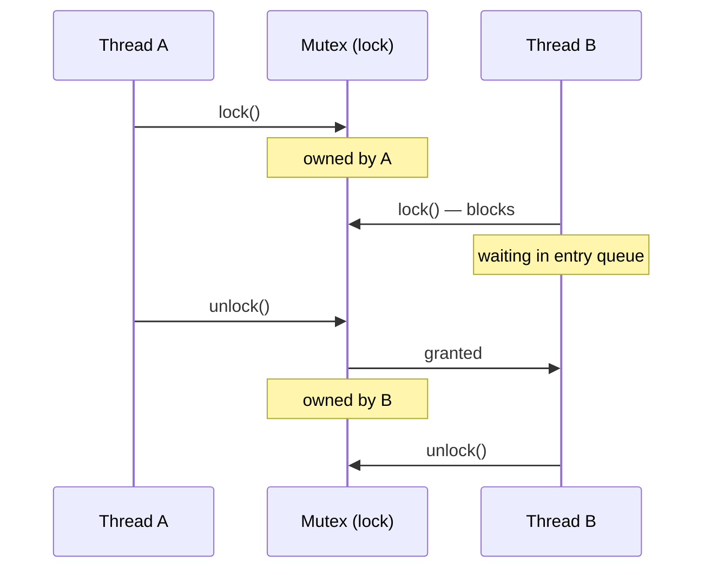

**Analogy:** a concert stage — only one artist performs at a time; others wait in the wings.

**Reentrant Mutex (Recursive Mutex):** a thread that already holds the lock can re-acquire it without deadlocking itself. The JVM's `synchronized` and `ReentrantLock` are both reentrant.

```
A non-reentrant mutex: Thread A holds lock → calls method that also tries to acquire same lock → deadlock.
A reentrant mutex:     Thread A holds lock → re-acquires → increments hold count → safe.
```

---

## 4. ReentrantLock — Structured Locking

`ReentrantLock` gives explicit, unstructured control over lock acquisition and release — spanning method boundaries if needed — unlike `synchronized` which is block-scoped.

### 4.1 The Deadlock Pattern in `ShipPackagesUsingLock`

The repo's `ShipPackagesUsingLock.java` demonstrates **lock ordering** — a critical correctness requirement:

```java
// ShipPackagesUsingLock.java
Lock listLock  = new ReentrantLock();
Lock stackLock = new ReentrantLock();

// pushToStackAsync: acquires listLock THEN stackLock
listLock.lock();
    var value = packageList.remove(packageList.size() - 1);
    stackLock.lock();
        releaseStack.push(value);
    stackLock.unlock();
listLock.unlock();

// popFromStackAsync: acquires stackLock THEN listLock  ← opposite order!
stackLock.lock();
    var value = releaseStack.pop();
    listLock.lock();             // ← DEADLOCK RISK if push holds listLock here
        packageList.add(value);
    listLock.unlock();
stackLock.unlock();
```

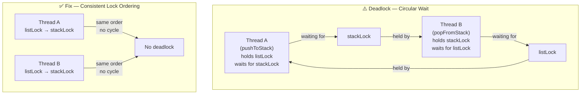

**Deadlock conditions (Coffman, 1971) — all four must hold:**

| Condition | Description | Break it by... |
|---|---|---|
| **Mutual exclusion** | Resource held exclusively | Use lock-free / immutable structures |
| **Hold and wait** | Thread holds one lock while waiting for another | Acquire all locks atomically (tryLock) |
| **No preemption** | Locks can't be forcibly taken | Use `tryLock(timeout)` with backoff |
| **Circular wait** | A → waits for B → waits for A | Enforce global lock ordering |

**`ReentrantLock` advantages over `synchronized`:**

| Feature | `synchronized` | `ReentrantLock` |
|---|---|---|
| Interruptible wait | No | `lockInterruptibly()` |
| Timed tryLock | No | `tryLock(time, unit)` |
| Fairness policy | No | `new ReentrantLock(true)` |
| Multiple conditions | No (one per object) | `lock.newCondition()` — many per lock |
| Cross-method locking | No | Yes |

---

## 5. Semaphore — Counted Access

A **Semaphore** controls access to a pool of N identical resources. It generalises a Mutex: a Mutex is a semaphore with N=1 that enforces ownership.

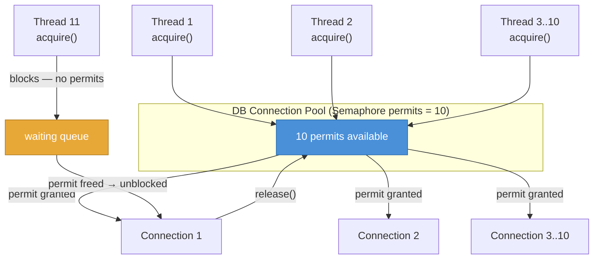

### 5.1 `DatabaseConnectionsUsingSemaphore` — Read/Write Pool

The repo models **asymmetric access**: 10 concurrent readers, 1 exclusive writer — a read/write semaphore:

```java
// DatabaseConnectionsUsingSemaphore.java
private Semaphore readLock  = new Semaphore(10);  // 10 concurrent readers
private Semaphore writeLock = new Semaphore(1);   // 1 exclusive writer

public void getWriteLock()  throws InterruptedException { writeLock.acquire(); }
public void releaseWriteLock()                          { writeLock.release(); }
public void getReadLock()   throws InterruptedException { readLock.acquire();  }
public void releaseReadLock()                           { readLock.release();  }
```

**Mutex vs. Semaphore in one line:**
```
Mutex:     exclusive-member access to a resource     (N = 1, ownership enforced)
Semaphore: N-member concurrent access to a resource  (N ≥ 1, no ownership)
```

**Real-world sizing references:**
- MongoDB `net.maxIncomingConnections` — semaphore over incoming TCP connections
- Cassandra `native_transport_max_concurrent_connections` — default unlimited (danger: unbounded)
- LLM inference server `--max-concurrent-requests` — semaphore on GPU KV cache slots

---

## 6. Monitor — Mutex + Condition

A **monitor** combines a mutex with one or more **condition variables** — threads can atomically release the lock and wait for a signal, avoiding busy-waiting.

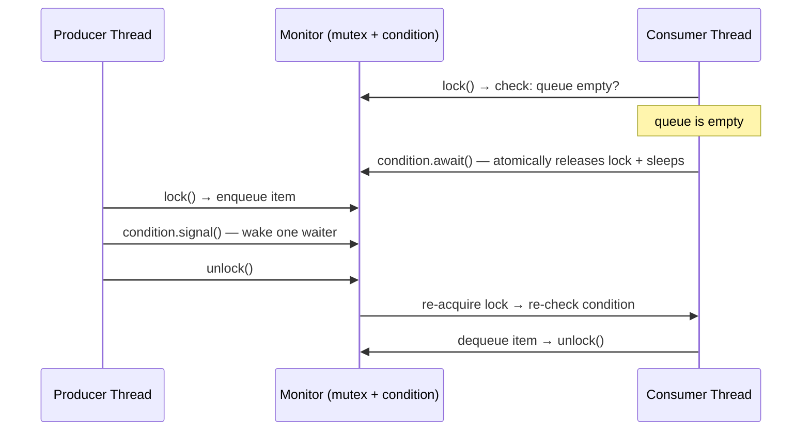

**Java monitor internals:**
- Every `Object` in the JVM is implicitly a monitor
- `synchronized (obj)` acquires the monitor lock
- `obj.wait()` → releases lock + enters **wait set**
- `obj.notify()` / `notifyAll()` → moves thread(s) from wait set to **entry set**

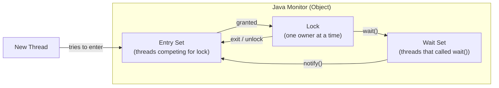

**Hoare vs. Mesa monitors:**

| | Hoare | Mesa (Java) |
|---|---|---|
| On `signal()` | Signaller yields; woken thread runs immediately | Woken thread re-enters entry set; signaller continues |
| Re-check condition? | No — guaranteed true on wake | **Yes** — always wrap `wait()` in a `while` loop |
| Simpler to implement? | No | Yes (Java uses Mesa) |

```java
// ✅ Correct Java pattern — always while, never if
synchronized (monitor) {
    while (!conditionMet()) {   // re-check after spurious wakeup
        monitor.wait();
    }
    // safe to proceed
}
```

---

## 7. Barrier Synchronisation

A **barrier** is a rendezvous point — no thread may pass until **all** participating threads have arrived. It coordinates the boundary between parallel phases.

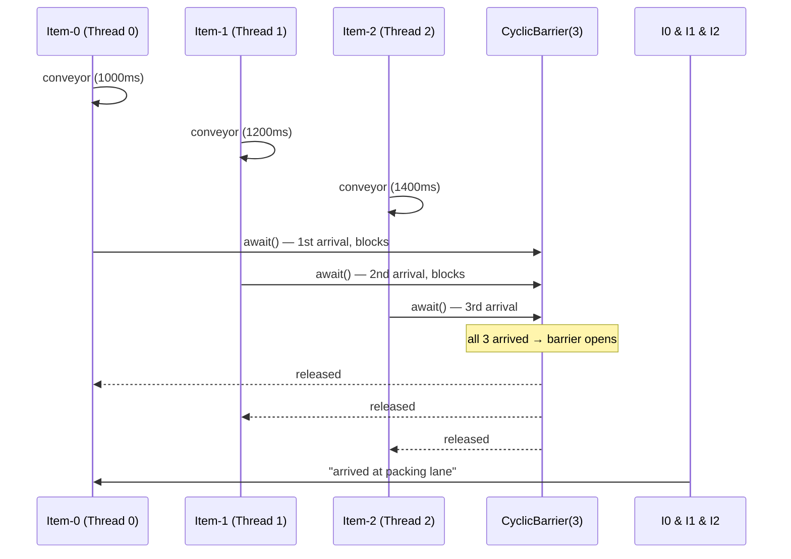

### 7.1 `PackageItemsBarrier` — Warehouse Lane

```java
// PackageItemsBarrier.java
CyclicBarrier packageBarrierWaitingForAllItems = new CyclicBarrier(NO_OF_ITEMS); // 3

// Each ItemConveyor thread:
packageBarrierWaitingForAllItems.await(); // blocks until all 3 arrive
// only then: readyToPack = true
```

### 7.2 `CyclicBarrier` vs. `CountDownLatch` vs. `Phaser`

| | `CountDownLatch` | `CyclicBarrier` | `Phaser` |
|---|---|---|---|
| **Reusable?** | No (single use) | Yes (resets after trip) | Yes (multiple phases) |
| **Who counts down?** | Any thread | Participating threads | Registered parties |
| **Barrier action?** | No | Yes — runs after all arrive | Yes (per phase) |
| **Dynamic parties?** | No | No | Yes (`register`/`deregister`) |
| **Best for** | One-shot start gun / completion | Iterative parallel phases | Variable-phase pipelines |

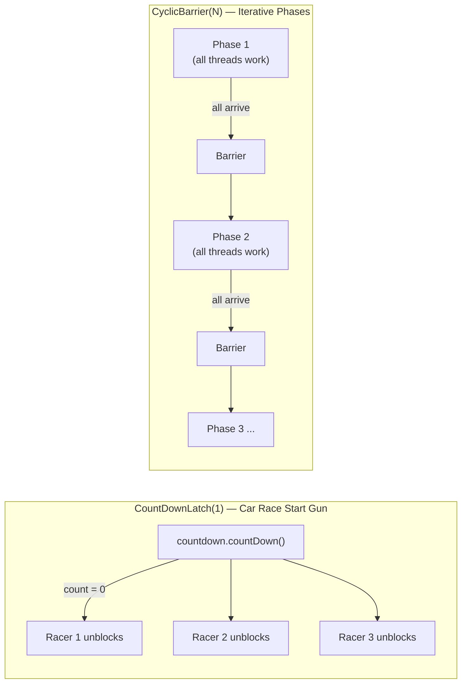

---

## 8. Lock Contention & Performance

Every synchronised section is a serialisation point. At scale, lock contention is a primary throughput killer.

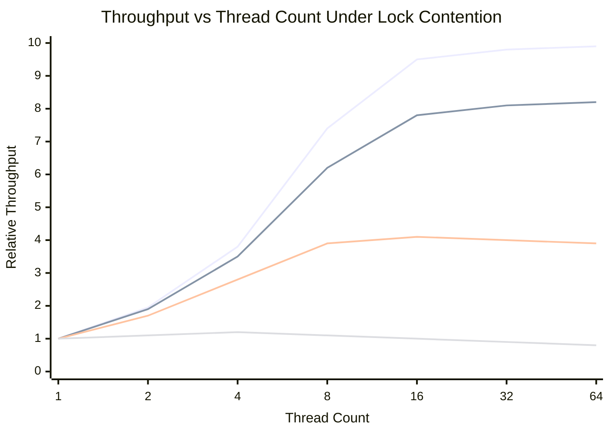

**Strategies to reduce contention:**

| Strategy | Mechanism | Trade-off |
|---|---|---|
| **Lock striping** | Partition resource into N independent locks (e.g. `ConcurrentHashMap` has 16 stripes) | Memory overhead; complexity |
| **Lock-free (CAS)** | `AtomicLong`, `AtomicReference` — compare-and-swap in hardware | Retry loops under high contention; no blocking |
| **Immutability** | Shared state is read-only — no synchronisation needed | Requires copying on update |
| **Thread-local state** | `ThreadLocal<T>` — no sharing at all | Aggregation needed at boundary |
| **Read/Write lock** | `ReentrantReadWriteLock` — many readers, one writer | Writer starvation if readers never release |
| **StampedLock** | Optimistic reads — validate without acquiring write lock | Complex API; not reentrant |

---

## 9. Synchronisation in the LLM Era

The same primitives — mutex, semaphore, barrier, monitor — appear throughout modern LLM infrastructure, often under different names.

### 9.1 KV Cache Slot Management — Semaphore

An LLM inference server's **KV cache** has a finite number of slots (proportional to GPU HBM). A semaphore gates admission:

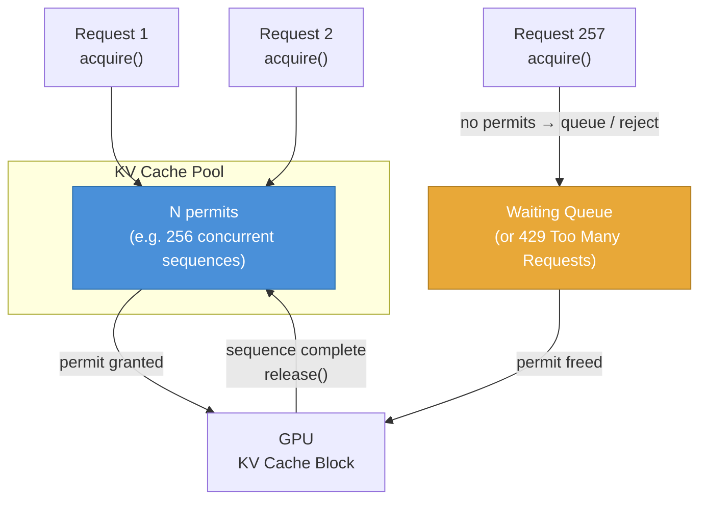

**vLLM's PagedAttention** is a virtual memory system for KV cache — it replaces a monolithic semaphore with fine-grained page allocation, analogous to how OS virtual memory replaced fixed partition allocation.

### 9.2 Batch Barrier — Continuous Batching

**Continuous batching** (Orca) removes a global barrier that legacy static batching imposed: all sequences in a batch had to finish before the next batch started. The barrier was the throughput bottleneck.

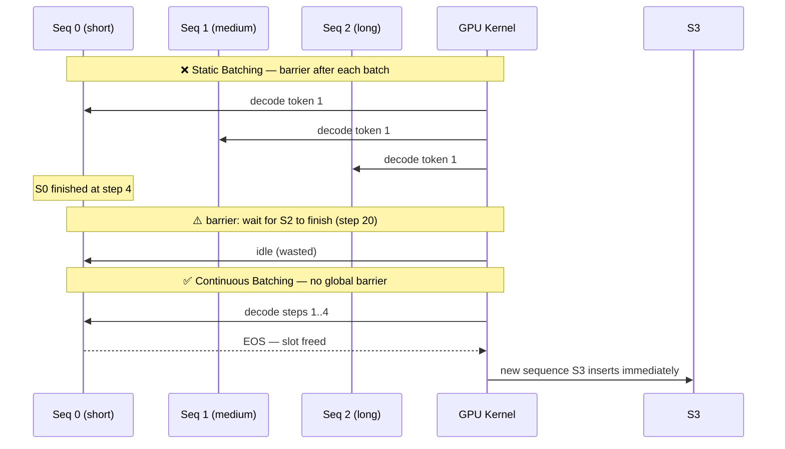

### 9.3 Gradient Synchronisation — Distributed Barrier

In **data-parallel** distributed training, all workers must synchronise gradients before the next forward pass. This is a distributed barrier + all-reduce:

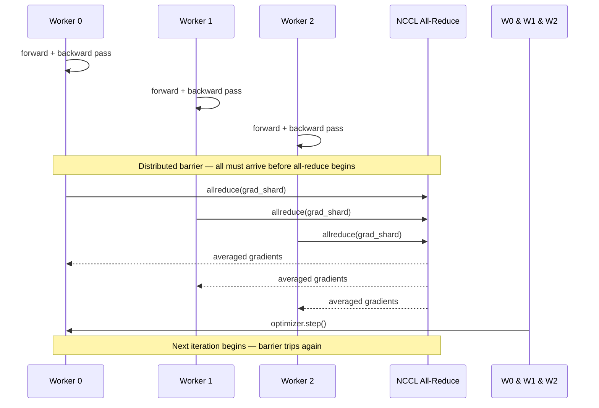

**Stragglers break the barrier:** one slow worker delays all others. Mitigations:
- **Gradient compression** (PowerSGD) — reduces all-reduce volume
- **Async SGD** — removes the barrier entirely; accepts stale gradients
- **Backup workers** (Google's approach) — redundant workers; use the fastest N-of-M

### 9.4 Tool-Call Concurrency in Agents — Semaphore + Monitor

A multi-agent LLM system calling external tools needs bounded concurrency (rate limits, cost) and result coordination:

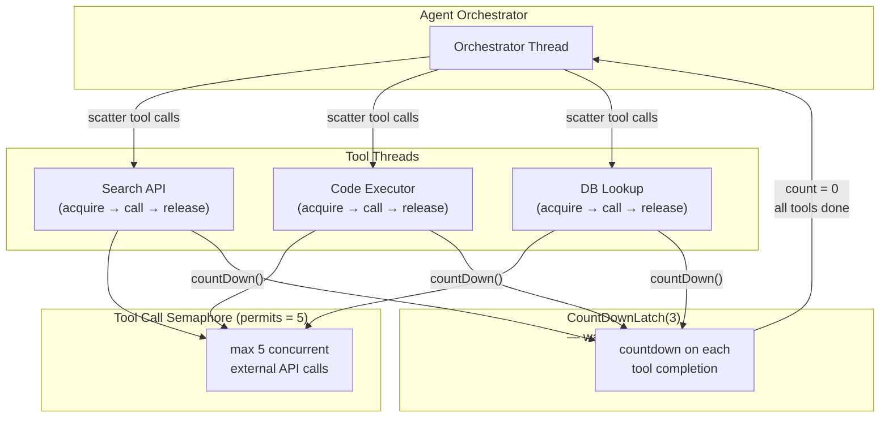

---

## 10. L6+ Design Trade-offs

### 10.1 Prefer Immutability and Isolation

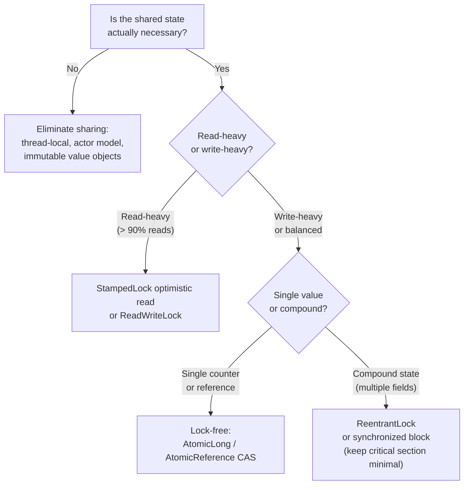

### 10.2 The Synchronisation Hierarchy — Cost vs. Strength

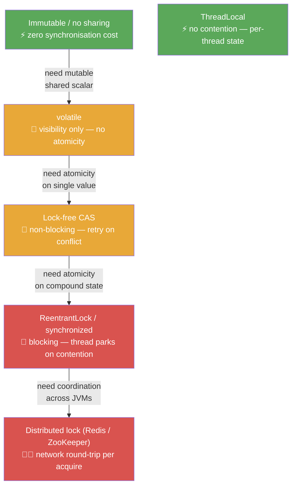

### 10.3 Failure Modes Checklist

| Failure | Cause | Detection | Fix |
|---|---|---|---|
| **Deadlock** | Circular lock acquisition order | Thread dump — BLOCKED threads in cycle | Enforce global lock ordering; use `tryLock(timeout)` |
| **Livelock** | Threads retry indefinitely, yielding to each other | CPU 100%, no progress | Randomised backoff; break symmetry |
| **Starvation** | Low-priority thread never acquires fair lock | Thread dump — one BLOCKED thread, very long | `new ReentrantLock(true)` (fair mode) |
| **Missed signal** | `notify()` before `wait()` — signal lost | Thread waits forever | Use `CountDownLatch` or check condition in `while` loop |
| **Broken barrier** | One thread in `CyclicBarrier` throws — barrier trips with exception | `BrokenBarrierException` on all | Reset barrier; handle exception; don't reuse after break |
| **Spurious wakeup** | `wait()` returns without `notify()` (JVM spec allows) | Incorrect state after wake | Always `while (!condition) wait()` — never `if` |

---

## 11. Key Decision Framework

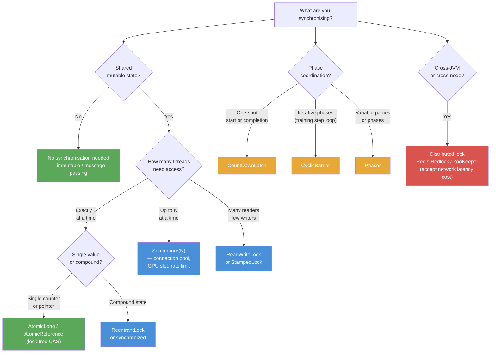

---

## 12. Further Reading

| Topic | Link |
|---|---|
| JSR-133: Java Memory Model FAQ | https://www.cs.umd.edu/~pugh/java/memoryModel/jsr-133-faq.html |
| Java 8 in Action — Ch.11 (CompletableFuture) | https://livebook.manning.com/book/java-8-in-action/chapter-11/1 |
| JVM Lock Objects | https://docs.oracle.com/javase/tutorial/essential/concurrency/newlocks.html |
| Java 8 StampedLock vs ReadWriteLock | http://blog.takipi.com/java-8-stampedlocks-vs-readwritelocks-and-synchronized/ |
| ReentrantLock and Dining Philosophers | https://dzone.com/articles/reentrantlock-and-dining-philo |
| Barrier Synchronisation — Rice University | https://cs.anu.edu.au/courses/comp8320/lectures/aux/comp422-Lecture21-Barriers.pdf |
| JVM CyclicBarrier | https://docs.oracle.com/javase/7/docs/api/java/util/concurrent/CyclicBarrier.html |
| CountDownLatch vs CyclicBarrier | https://stackoverflow.com/a/4168861/432903 |
| Orca: continuous batching (OSDI 2022) | https://www.usenix.org/conference/osdi22/presentation/yu |
| vLLM: PagedAttention | https://arxiv.org/abs/2309.06180 |
| Mutex vs Semaphore | https://blog.feabhas.com/2009/09/mutex-vs-semaphores-%E2%80%93-part-1-semaphores/ |
| Parallel Programming with Barrier Sync (JVM) | http://blogs.sourceallies.com/2012/03/parallel-programming-with-barrier-synchronization/ |

